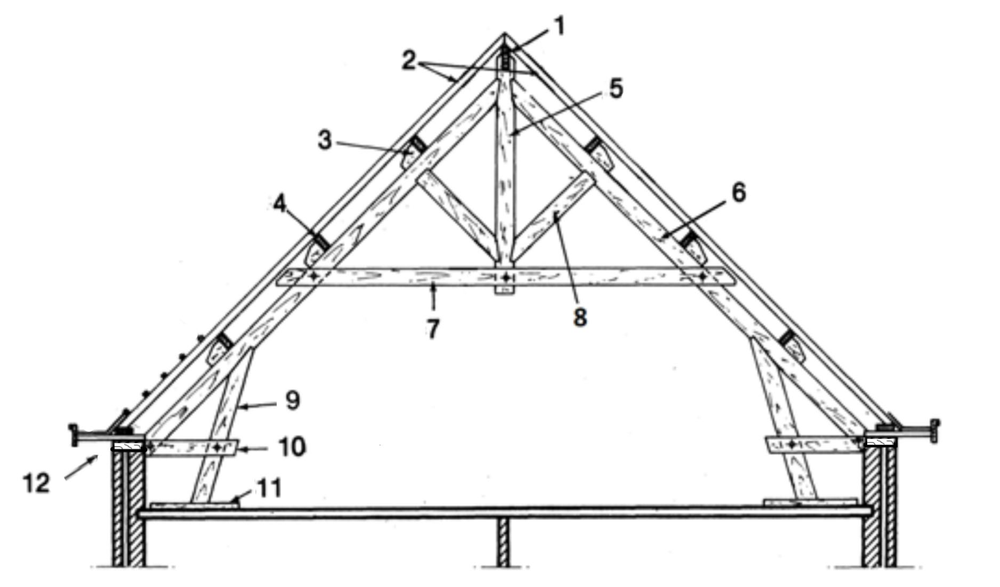
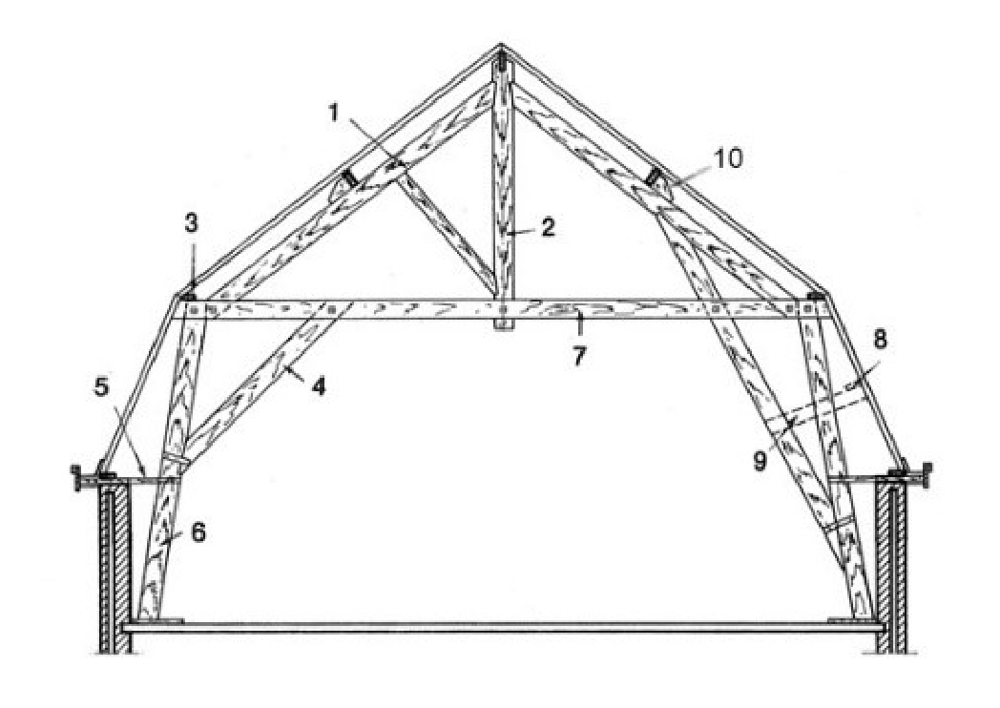
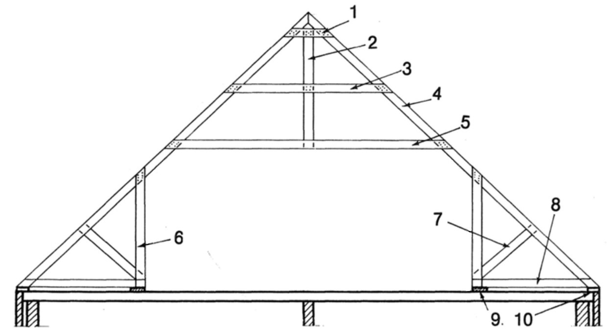

##### 24.24 Charpentes en bois [[entities/cctb|CCTB]] 01.13

**DESCRIPTION** 

**Définition / Comprend** 

Il s’agit de la fourniture (hors matériaux récupérés du même site) et la pose de tous les éléments constituant les charpentes en bois, y compris toutes les pièces assurant la liaison mécanique entre éléments de bois qui en font intrinsèquement partie. 

Il est convenu que tout ce qui est sous la sous-toiture relève du [2 T2 [[concepts/superstructures|Superstructures]]](04_2_t2_superstructures_cctb_01.13.md), tandis que la sous-toiture et tout ce qui est au-dessus est décrit dans le 3 T3 [[concepts/travaux-de-toiture|Travaux de Toiture]]. 

Il existe quelques exceptions à cette règle générale : 

- Le descriptif général du bois est repris dans le [2 T2 [[concepts/superstructures|Superstructures]]](04_2_t2_superstructures_cctb_01.13.md), y compris pour les contre-lattages, lattages, liteaux, …; 

- Les choix liés aux contre-lattes, lattes, … sont définis dans le 3 T3 [[concepts/travaux-de-toiture|Travaux de Toiture]]; 

- Les panneaux isolants autoportants sont repris dans le 3 T3 [[concepts/travaux-de-toiture|Travaux de Toiture]]. 

**Remarques importantes** 

Les éventuels travaux de démolition de la charpente existante sont compris dans un élément séparé (voir 06 Travaux de stabilisation et de déconstruction.) 

**MATÉRIAUX** 

La terminologie des charpentes se rapporte aux définitions du [Buildwise Métré 2.13] 

**Charpente traditionnelle** 

**Légende :** 

1. faîtière (voir élément [24.13 Poutres et barres en bois](511_24.13_poutres_et_barres_en_bois_cctb_01.07.md)) 

2. chevrons (voir élément [24.13 Poutres et barres en bois](511_24.13_poutres_et_barres_en_bois_cctb_01.07.md)) 

3. échantignolle (voir élément [24.13 Poutres et barres en bois](511_24.13_poutres_et_barres_en_bois_cctb_01.07.md)) 

4. panne (voir élément [24.13 Poutres et barres en bois](511_24.13_poutres_et_barres_en_bois_cctb_01.07.md)) 

5. poinçon (voir élément [24.13 Poutres et barres en bois](511_24.13_poutres_et_barres_en_bois_cctb_01.07.md)) 

6. arbalétrier (voir élément [24.13 Poutres et barres en bois](511_24.13_poutres_et_barres_en_bois_cctb_01.07.md)) 

7. entrait (voir élément [24.13 Poutres et barres en bois](511_24.13_poutres_et_barres_en_bois_cctb_01.07.md)) 

8. contre-fiche (voir élément [24.13 Poutres et barres en bois](511_24.13_poutres_et_barres_en_bois_cctb_01.07.md)) 

9. jambe de force ou arbalétrier inférieur (voir élément [24.13 Poutres et barres en bois](511_24.13_poutres_et_barres_en_bois_cctb_01.07.md)) 

10. faux entrait (voir élément [24.13 Poutres et barres en bois](511_24.13_poutres_et_barres_en_bois_cctb_01.07.md)) 

11. semelle (voir élément [24.11 Eléments d'assise en bois](500_24.11_eléments_dassise_en_bois_cctb_01.04.md)) 

12. sablière (voir élément [24.11 Eléments d'assise en bois](500_24.11_eléments_dassise_en_bois_cctb_01.04.md)) 

**Charpente traditionnelle** 

**Légende :** 

1. arbalétrier supérieur (voir élément [24.13 Poutres et barres en bois](511_24.13_poutres_et_barres_en_bois_cctb_01.07.md)) 

2. poinçon retroussé (voir élément [24.13 Poutres et barres en bois](511_24.13_poutres_et_barres_en_bois_cctb_01.07.md)) 

3. panne de brisis (voir élément [24.13 Poutres et barres en bois](511_24.13_poutres_et_barres_en_bois_cctb_01.07.md)) 

4. aisselier (voir élément [24.13 Poutres et barres en bois](511_24.13_poutres_et_barres_en_bois_cctb_01.07.md)) 

5. tasseau (voir élément [24.13 Poutres et barres en bois](511_24.13_poutres_et_barres_en_bois_cctb_01.07.md)) 

6. arbalétrier inférieur (voir élément [24.13 Poutres et barres en bois](511_24.13_poutres_et_barres_en_bois_cctb_01.07.md) 

7. faux-entrait (voir élément [24.13 Poutres et barres en bois](511_24.13_poutres_et_barres_en_bois_cctb_01.07.md)) 

8. panne (voir élément [24.13 Poutres et barres en bois](511_24.13_poutres_et_barres_en_bois_cctb_01.07.md))

9. écharpe ou contre-fiche (voir élément [24.13 Poutres et barres en bois](511_24.13_poutres_et_barres_en_bois_cctb_01.07.md)) 

10. échantignolle (voir élément [24.13 Poutres et barres en bois](511_24.13_poutres_et_barres_en_bois_cctb_01.07.md)) 

**Charpente traditionnelle** 

**Légende :** 

1. gousset (voir élément [24.13 Poutres et barres en bois](511_24.13_poutres_et_barres_en_bois_cctb_01.07.md)) 

2. poinçon (voir élément [24.13 Poutres et barres en bois](511_24.13_poutres_et_barres_en_bois_cctb_01.07.md)) 

3. entrait secondaire (voir élément [24.13 Poutres et barres en bois](511_24.13_poutres_et_barres_en_bois_cctb_01.07.md)) 

4. arbalétrier (voir élément [24.13 Poutres et barres en bois](511_24.13_poutres_et_barres_en_bois_cctb_01.07.md)) 

5. entrait (voir élément [24.13 Poutres et barres en bois](511_24.13_poutres_et_barres_en_bois_cctb_01.07.md)) 

6. poteau (voir élément [24.13 Poutres et barres en bois](511_24.13_poutres_et_barres_en_bois_cctb_01.07.md)) 

7. contre-fiche (voir élément [24.13 Poutres et barres en bois](511_24.13_poutres_et_barres_en_bois_cctb_01.07.md)) 

8. faux-entrait (voir élément [24.13 Poutres et barres en bois](511_24.13_poutres_et_barres_en_bois_cctb_01.07.md)) 

9. semelle (si ponctuel) ou lisse de pose (si continu) (voir élément [24.11 Eléments d'assise en bois](500_24.11_eléments_dassise_en_bois_cctb_01.04.md)) 

10. sablière (voir élément [24.11 Eléments d'assise en bois](500_24.11_eléments_dassise_en_bois_cctb_01.04.md)) 

Les échelles de corniches sont reprises dans les éléments 31.33 Eléments de support particuliers en bois 

**Tolérance pour les éléments neufs** 

Le plan indique les dimensions nominales des pièces de bois à utiliser. Ces dimensions sont indiquées par une relation a/b où a indique l’épaisseur et b la largeur conformément aux normes [NBN 219-02, Bois sciés

- Bois résineux de Belgique

- Dimensions nominales], [NBN 219-03, Bois sciés

- Bois résineux importés du Nord

- Dimensions nominales] et [NBN EN 1313-1] ainsi que [NBN EN 1313-[2](04_2_t2_superstructures_cctb_01.13.md)] pour les bois sciés. 

Les classes de tolérance des bois de structure de section massive sont définies dans la [NBN EN 336] (les mesures sont effectuées à 20% d’humidité en masse). 

- Classe 1: pour les sections ≤ 100 mm : (-1;+3) mm et pour les sections >100 mm : (-[2](04_2_t2_superstructures_cctb_01.13.md);+4) mm 

•

- Classe [2](04_2_t2_superstructures_cctb_01.13.md): pour les sections ≤ 100 mm : (-1;+1) mm et pour les sections >100 mm : (-1,5;+1,5) mm 

Le niveau de tolérance est fixé en fonction du niveau de finition exigé par le maître d’ouvrage. 

Les classes de tolérance des bois de structure de sections lamellées collées sont définies dans la norme [NBN EN 14080] (les mesures sont effectuées à 12% d’humidité du bois). 

Les écarts admissibles des sections transversales sont : 

- Largeur de la section : (-[2](04_2_t2_superstructures_cctb_01.13.md);+2) mm 

- Hauteur de la section : 

≤ 400 mm : (-[2](04_2_t2_superstructures_cctb_01.13.md);+3) mm 

> 400 mm : (-0,5;+1) % 

- Longueur :  ≤ [2](04_2_t2_superstructures_cctb_01.13.md),0 m : (-2;+2) mm 

[2](04_2_t2_superstructures_cctb_01.13.md),0 < l ≤ 20 m : (-0,1;+0,1) % > 20 m : (-20;+20) mm 

Tous les éléments satisfont à la classe de tolérance [2](04_2_t2_superstructures_cctb_01.13.md) de la [NBN EN 336] et à la [NBN EN 1313 série]. 

Pour les produits en bois lamellé collé, les exigences précisées dans la [NBN EN 14080] sont d’application. 

**Tolérance pour les éléments de réemploi** 

Les tolérances pour les éléments de réemploi en bois massif ne s’appliquent pas aux éléments individuels mais au plan de toiture et des sols de combles mis en œuvre. 

Pour les éléments composites et lamellés collés, les tolérances des matériaux neufs sont d’application. 

**Résistance** 

Les éléments de charpentes sont calculés conformément à la norme [NBN EN 1995-1-1]. Il y a lieu de vérifier qu’aucun des états limites à considérer n’est dépassé. Toutes les situations du projet, y compris dans les phases de construction, et tous les cas de charges à prévoir pour les constructions sont pris en compte. 

Il convient donc de contrôler si, aux états limites ultimes, la résistance des pièces de bois et des assemblages n’est pas franchie et si, aux états limites de service, leurs déformations relatives n’excèdent pas les critères fixés par la [NBN EN 1995-1-1] ou tout autre exigence supplémentaire donnée dans ce cahier des charges.  Les actions sont déterminées conformément à l’Eurocode 1 [NBN EN 1991 série] et les combinaisons des charges sont effectuées conformément à la [NBN EN 1990]. 

La qualité mécanique des bois est conforme aux hypothèses de calcul. Pour les éléments de réemploi, cette conformité est justifiée sur base de la [NBN B 16-520] ou la [NBN EN 14081 série] ou un autre procédé à valider par le maître d’ouvrage sur base des critères d’acceptabilité du chapitre 02.42.1 Critères d'acceptabilité. 

**Essence & Qualité du bois** 

Le bois mis en œuvre est sain et conforme aux prescriptions du cahier des charges. Il est de qualité définie dans la [NBN EN 14081 série]. Il convient à tout point de vue pour l'application qui lui est destinée. 

Le bois des éléments de charpentes préfabriquées ou assemblées sur place, livré sur chantier est suffisamment sec, conformément aux [STS 04.1] et à la [NBN EN 14250] : son humidité au moment de la mise en œuvre est < 22 %. Le bois est stocké dans un endroit couvert et ventilé, isolé du sol et protégé de l’humidité. 

Les normes [NBN EN 1313-1] et [NBN EN 1313-[2](04_2_t2_superstructures_cctb_01.13.md)] spécifient les dimensions préférentielles et écartsadmissibles pour les bois sciés résineux et feuillus.

Les pièces en bois lamellé collé sont conformes aux prescriptions de la norme [NBN EN 14080]. Les pièces en bois abouté satisfont à la norme [NBN EN 335]. Elles répondent à l’exigence complémentaire de traitement contre les insectes et les champignons par un procédé conforme aux [STS 04 série] et adapté à la classe d’emploi. 

Pour les éléments de réemploi, le traitement initial n’est considéré que s’il dispose d’une déclaration d’aptitude à l'utilisation suivant les prescriptions de l'élément 02.42.1 Critères d'acceptabilité. Si les éléments ne disposent pas de cette déclaration, un traitement par badigeonnage, aspersion ou trempage est effectué pour les bois dont la classe de durabilité n’est pas suffisante, suivant qu’ils sont réutilisés in situ ou non. 

**Les connecteurs métalliques** 

Les pièces et les plaques en acier reçoivent un traitement de protection contre la corrosion adapté à la classe de service, ou sont exécutées en acier inoxydable. La protection minimale énoncée dans la [NBN EN 1995-1-1] est résumée dans le tableau ci-dessous. 

|**Classes de service**|**1**|**[2](04_2_t2_superstructures_cctb_01.13.md)**|**3**|
|---|---|---|---|
|Clous et vis d’un diamètre ≤ 4 mm|néant|Fe/Zn 12 ca|Fe/Zn 25 ca|
|Boulons,goujons, clous et vis d’un diamètre >4 mm|néant|néant|Fe/Zn 25 ca|
|Agrafes|Fe/Zn 12 ca|Fe/Zn 12 ca|Inox|
|Plaques perforées et plaques d’acier d’une épaisseur ≤3 mm|Fe/Zn 12 ca|Fe/Zn 12 ca|Inox|
|Plaques d’acier d’une épaisseur de 3 à 5 mm|néant|Fe/Zn 12 ca|Fe/Zn 25 ca|
|Plaques d’acier d’une épaisseur de > 5 mm|néant|néant|Fe/Zn 25 ca|
|Lors du zingage à chaud, le Z275 remplace le Fe/Zn 12 c,||||

Les agrafes : Les exigences en matière de dimensions, tolérances et matériau relèvent de la [NBN EN 14592]. Le dos de l’agrafe présente une longueur > 6 x Ø. Les valeurs de calcul de la résistance au cisaillement sont conformes à la [NBN EN 1995-1-1]. Les règles relatives aux assemblages réalisés à l’aide de pointes sont d’application pour les agrafes. Ces dernières sont considérées comme deux pointes d’un diamètre égal à la patte de l’agrafe, pour autant que l’angle formé par le dos et le sens des fibres sous le dos soit > 30 °. Si cette condition n’est pas vérifiée, la résistance transversale doit être réduite d’un facteur 0,7. 

- Les boulons : Les boulons utilisés sont en acier laminé de qualité 4.6 au minimum. Les dimensions relèvent de la [NBN EN 14592]. 12 mm ≤ Ø ≤ 30 mm. Les boulons sont montés avec des rondelles d’un Ø ≥ D = 3 *Ø (Ø = le diamètre de la tige filetée du boulon) ou avec des plaquettes carrées de côté a = 3 * Ø. L’épaisseur de ces plaquettes de répartition ≥ 0,3 *Ø . Les distances minimales entre les boulons d’une même file, entre files et entre boulons et extrémités de la pièce de bois sont indiquées dans la norme [NBN EN 1995-1-1]. Le diamètre des trous ne peut dépasser que d’un mm celui du boulon. Dans une plaque d’acier, le diamètre des trous prévus pour les boulons ne peut pas être supérieur de plus de [2](04_2_t2_superstructures_cctb_01.13.md) mm ou de 0,1 d à celui des boulons (la plus grande des deux valeurs). 

- Les goujons : Les goujons sont en acier laminé, conformément aux prescriptions des normes [NBN EN 10025 série] ou [NBN EN 10149 série]. Ils présentent une qualité d’acier S235 au minimum, suivant la [NBN EN 10025 série], et une élasticité (A80) de 16% au moins. La [NBN EN 14592] définit dimensions et tolérances, limitées à –0/+0,1 mm. 6 mm ≤ Ø ≤ 30 mm. Ces goujons ne présentent ni tête ni filetage, mais leurs extrémités sont légèrement biseautées. Ils présentent une longueur égale à l’épaisseur totale des pièces de bois à assembler. Les goujons sont insérés par force dans des trous forés au préalable et dont le diamètre ne dépasse pas le leur. Si des plaques d’acier sont utilisées, le diamètre de leur trou n’est pas supérieur de plus d’un mm à celui du goujon. Tout assemblage par goujons comporte au moins 4 goujons, qui sont complétés par des boulons afin de résister à l’influence d’efforts secondaires qui s’exercent dans l’axe du goujon. Les distances entre goujons et par rapport aux extrémités de la pièce de bois sont indiquées dans la [NBN EN

1995-1-1]. Les calculs de résistance au cisaillement s’effectuent de la même manière que pour les boulons, mais les valeurs σ et p pour des efforts parallèles aux fibres du bois sont : 

- Pour les résineux 

   - Cisaillement simple pièce centrale : σ = 4 N/mm²;  p=23 N/mm² 

   - Cisaillement simple pièce latérale :  σ = 5.5 N/mm²;  p=33 N/mm² 

   - Cisaillement double pièce centrale :  σ = 8.5 N/mm²;  p=51 N/mm² 

- Pour les feuillus: 

   - Cisaillement simple pièce centrale : σ = 5 N/mm²;  p=27 N/mm² 

   - Cisaillement simple Pièce latérale :  σ = 6.5 N/mm²;  p=39 N/mm² 

   - Cisaillement double pièce centrale :  σ = 10 N/mm²;  p=60 N/mm² 

Si la direction de l’effort forme un angle α avec les fibres du bois, un facteur de correction k est appliqué. k=1-α/360 où α représente l’angle entre la direction de l’effort et les fibres (α ≤ 90°). L’effort que peut reprendre une file de n goujons équivaut à l’effort unitaire multiplié par leur nombre. 

- Les vis et tirefonds :  Les vis satisfont aux prescriptions de la [NBN EN 14592]. Le diamètre extérieur de la partie profilée mesure de [2](04_2_t2_superstructures_cctb_01.13.md),4 mm minimum à 24 mm maximum. Vis et tirefonds d’un Ø > 6 mm sont insérés dans des trous préforés d’un Ø = 0,7 * d sur la longueur du filetage et égal à d sur la longueur de la partie non filetée (fût). Toutes les prescriptions relatives aux vis exposées dans les paragraphes suivants s’appliquent également aux tirefonds. Les distances minimales entre les vis d’une même file et entre les vis et les extrémités de la pièce de bois sont indiquées dans la [NBN EN 1995-1-1]. Les assemblages vissés sont des assemblages simples. Pour une combinaison d’actions de cas A, l’effort admissible (N) dans le sens des fibres du bois se calcule comme suit, pour autant que la longueur de fixation s soit supérieure à 8d : Fa= 4.a.d (≤ 17 d²) où: a = l’épaisseur de la pièce de bois à visser en mm d = le diamètre du fût de la vis en mm. Pour les cas de charges B et C, la valeur obtenue est respectivement multipliée par un facteur 1,15 et 1,5. Si dans l’assemblage considéré, la direction de l’effort forme un angle α avec les fibres du bois et si le Ø de la vis est > 10 mm, un facteur de correction k est appliqué. Ce dernier est égal à 1- α/360, où α représente l’angle entre le sens des fibres et la direction de l’effort (0 < α ≤ 90°). Pour des longueurs de fixation comprises entre 4d < s < 8d, les valeurs de résistance sont obtenues par interpolation linéaire de la résistance pour s = 8 * d. Toutefois, pour des longueurs de fixation inférieures à 4 * d, la résistance n’est plus prise en compte. Un assemblage vissé comporte deux vis au minimum. L’effort repris par une file de n vis est égal à la valeur unitaire multipliée par le nombre efficace de vis neff. Si n < 10, neff = 10 si n > 10, neff = 10 + 2/3(n-10). Si des goussets métalliques sont utilisés, la contrainte limite sur le bois peut être multipliée par 1,25, de telle sorte que la formule devient: Fa = 1,25 *17 * d² 

Pour les vis sollicitées axialement, la résistance à l’arrachement des vis s’entend pour du bois sec et est indépendante de l’humidité du bois au moment du vissage. La résistance admissible à l’arrachement en N par mm de longueur utile sg de la partie filetée s’exprime comme suit : Fa = 3 * sg .d où : d = le Ø de la partie filetée en mm, sg = la profondeur de vissage de la partie filetée en mm. 

- Crampons, anneaux simples ou double face et boulons : Les caractéristiques relatives au matériau et aux dimensions relèvent de la [NBN EN 912]. Les anneaux appartiennent aux types A ou B et les crampons, aux types C, D ou E. Les anneaux double face sont placés dans une gorge fraisée au préalable dans les pièces de bois à assembler. Ce fraisage doit s’effectuer à l’aide d’un outil spécial afin d’éviter tout jeu entre l’anneau et le bois. La pénétration des dents du crampon dans le bois s’obtient par le serrage d’un boulon, muni de plaquettes de répartition de grandes dimensions, et passé à travers l’axe du crampon. Les crampons à double denture munis de dents sur leurs deux faces sont destinés aux assemblages bois sur bois. Ils sont percés en leur centre pour permettre le passage du boulon qui n’entre toutefois pas en contact avec le crampon. Crampon à simple denture : Les crampons munis de dents sur une seule de leurs faces sont principalement utilisés pour des assemblages bois / métal, mais peuvent également être employés par paire, pour former un

joint entre deux pièces de bois. Ils présentent en leur centre une ouverture aux bords renforcés qui entrent en contact avec le boulon. Boulons de serrage : afin d’assurer la pénétration des dents dans le bois, le crampon doit recevoir une pression indirecte, par l’intermédiaire du boulon de serrage. 

- Les connecteurs à plaque métallique emboutie sont conformes à la [NBN EN 14545]. Les assemblages utilisant des connecteurs à plaque métallique emboutie sont réservés aux constructions qui subissent principalement une charge statique. Si l’humidité du bois est > 22 % en service, le facteur kmod de classe de service 3 s’applique aux connecteurs. Les connecteurs assemblés par soudure doivent couvrir au minimum [2](04_2_t2_superstructures_cctb_01.13.md)/3 de la hauteur de pointe h. 

- Les colles sont de type structurel et répondent aux prescriptions de la [NBN EN 301] pour les colles UF, MUF et RF. Les colles PU satisfont aux exigences de la [NBN EN 15425]. Elles sont de préférence appliquées en usine. Etant donné que les assemblages collés présentent en général une résistance supérieure à celle du bois, les calculs visent à limiter la tension de cisaillement dans le bois. 

Les connecteurs métalliques de réemploi sont acceptés sur base d’une note de calcul justifiée. 

**Fermes et fermettes** 

Les fermes et fermettes industrialisées répondent aux prescriptions de la [NBN EN 14250]. Elles sont traitées contre les insectes et les champignons par un procédé décrit dans les [STS 04 série] et choisi en fonction de la classe d’emploi, conformément à la [NBN EN 335]. 

**EXÉCUTION / MISE EN ŒUVRE** 

La mise en œuvre et les tolérances de placement sont conformes aux [STS 31]. 

Si le bois se trouve en contact direct avec les maçonneries, béton et mortier, il reçoit un traitement de préservation adapté avec la classe d’emploi 3 (selon [NBN EN 335]). 

L’entreposage et la manutention des éléments de charpenteries sont effectués sans engendrer de déformation ni d’exposition à l’eau liquide. Que les éléments soient entreposés verticalement ou horizontalement, ils doivent être suffisamment soutenus afin de ne subir ni dommage ni déformation. Les éléments de charpentes sont protégés des intempéries et ventilés. En outre, il faut éviter tout contact des éléments avec le sol ou la végétation. 

Les charpentes sont fixées dans les sablières ou dans le gros œuvre afin de reprendre les efforts du poids de la toiture et des surcharges telles que la neige, charge d’exploitation, ..., les efforts horizontaux et verticaux dus au vent. 

**DOCUMENTS DE RÉFÉRENCE** 

**Matériau** 

[NIT 127, Ecarts admissibles sur les dimensions] 

[Buildwise Métré 2.13, Charpente en bois] 

[NBN EN 336, Bois de structure - Dimensions, écarts admissibles] 

[NBN 219-02, Bois sciés

- Bois résineux de Belgique

- Dimensions nominales] 

[NBN 219-03, Bois sciés

- Bois résineux importés du Nord

- Dimensions nominales] 

[NBN EN 1313-1, Bois ronds et bois sciés

- Ecarts admissibles et dimensions préférentielles

- Partie 1 : Bois sciés résineux] 

[NBN EN 1313-[2](04_2_t2_superstructures_cctb_01.13.md), Bois ronds et bois sciés

- Ecarts admissibles et dimensions préférentielles

- Partie [2](04_2_t2_superstructures_cctb_01.13.md): Bois sciés feuillus] 

[NBN EN 14080, Structures en bois

- Bois lamellé collé et bois massif reconstitué

- Exigences] 

[NBN EN 1995-1-1, Eurocode 5: Conception et calcul des structures en bois

- Partie 1-1 : Généralités

- Règles communes et règles pour les bâtiments (+AC:2006)] 

[NBN EN 1991 série, Eurocode 1 : Actions sur les structures]

[NBN EN 1990, Eurocodes structuraux - Eurocodes: Bases de calcul des structures] 

[NBN EN 14081-1:2016+A1, Structures en bois

- Bois de structure à section rectangulaire classé pour sa résistance

- Partie 1 : Exigences générales] 

[STS 04.1, Bois et panneaux à base de bois : bois de structure] 

[NBN EN 14592, Structures en bois

- Eléments de fixation de type tige

- Exigences] 

[NBN EN 10025 série, Produits laminés à chaud en aciers de construction] 

[NBN EN 10149 série, Produits plats laminés à chaud en aciers à haute limite d'élasticité pour formage à froid] 

[NBN EN 912, Organes d'assemblage pour le bois - Spécifications des assembleurs pour bois] 

[NBN EN 14545, Structures en bois

- Connecteurs

- Exigences] 

[NBN EN 301, Adhésifs de nature phénolique et aminoplaste, pour structures portantes en bois - Classification et exigences de performance] 

[NBN EN 15425, Adhésifs

- Adhésifs polyuréthane monocomposants (PUR) pour structures portantes en bois

- Classification et exigences de performance] 

[NBN EN 14250, Structure en bois - Exigences de produit relatives aux éléments de structures préfabriqués utilisant des connecteurs à plaque métallique emboutie] 

[NBN EN 335, Durabilité du bois et des matériaux à base de bois - Classes d'emploi: définitions, application au bois massif et aux matériaux à base de bois] 

[STS 23, Structures en bois]
