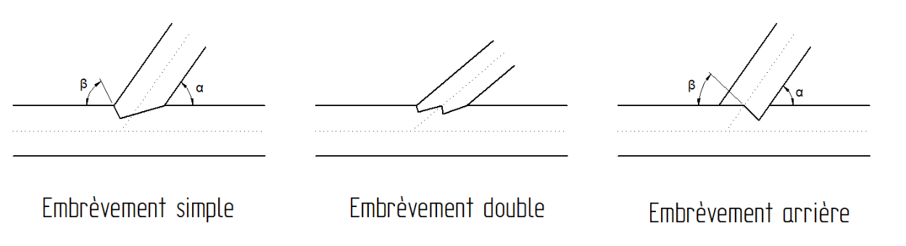
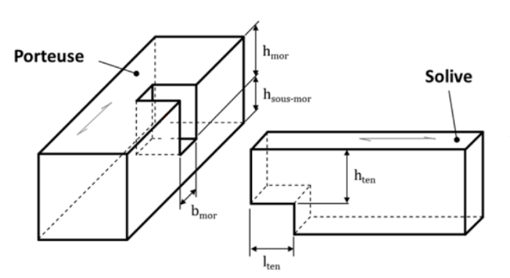
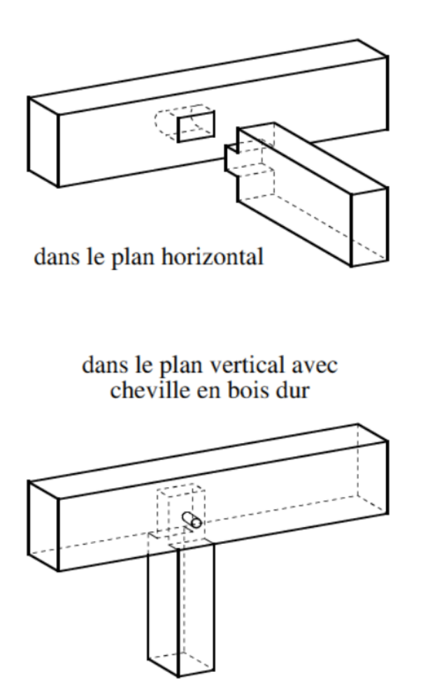
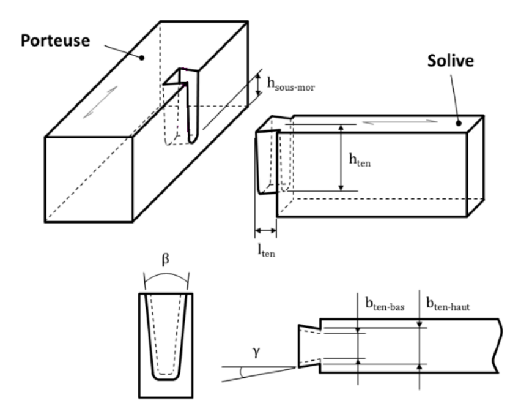

##### 24.41.1 Assemblages traditionnels (bois/bois) [[entities/cctb|CCTB]] 01.11 

**EXÉCUTION / MISE EN ŒUVRE** 

Les deux éléments assemblés sont mis en œuvre à la teneur en humidité d’équilibre qu’ils ont en service. 

###### 24.41.1 a Assemblages traditionnels (bois/bois) - embrèvements [[entities/cctb|CCTB]] 01.07 

**DESCRIPTION** 

**Définition / Comprend** 

Il s’agit d’un assemblage par contact entre deux pièces formant un angle aigu entre elles. 

**EXÉCUTION / MISE EN ŒUVRE** 

**Prescriptions générales** 

Trois types d’embrèvements sont possibles : 

Un assemblage par embrèvement demande une grande précision d’usinage pour garantir le bon transfert des efforts et éviter tout fendage de la pièce amenant l’effort. 

**Embrèvement simple :** 

Angle d’entaille : β = 90° - α /2  avec une tolérance de +/- 5°. 

**Embrèvement arrière :** 

Angle β = 90° - α avec une tolérance de +/- 5°. 

Un jeu de 1 à 2 mm est prévu au niveau de l’arrête supérieure de la poutre horizontale. 

**Embrèvement double :** 

L’embrèvement double est une combinaison entre l’embrèvement simple et l’embrèvement arrière. Leurs exigences sont donc d’application. 

Type d’embrèvement : simple / arrière / double 

Profondeur d’entaille : voir plan (par défaut) / *** 

**MESURAGE** 

- unité de mesure: 

- (par défaut) / pc 

_**(Soit par défaut)**_ 

1.     – 

**(Soit)** 

2.3.  pc 

- code de mesurage: 

Compris (par défaut) / Quantité nette 

**(Soit par défaut)** 

1.     Compris dans l’article de référence*** 

**(Soit)** 

2.3. Quantité nette : Le nombre d’assemblages à embrèvement ayant les mêmes dimensions est compatibilisé. 

**nature du marché:** 

PM (par défaut) / QF / QP 

_**(Soit par défaut)**_ 

1.     PM 

**(Soit)** 

2.     QF 

_**(Soit)**_ 

3.     QP 

**AIDE** 

**Embrèvement simple :** 

Avantages : 

- rapport capacité portante / profondeur d’entaille optimisé, 

- simplicité d’exécution.

Inconvénient : 

- longueur d’avant bois nécessaire importante. 

**Embrèvement arrière :** 

Avantages : 

- longueur d’avant bois nécessaire réduite, 

- simplicité d’exécution. 

Inconvénient : 

- rapport capacité portante / profondeur d’entaille important. 

**Embrèvement double :** 

Avantages : 

- longueur d’avant bois nécessaire réduite, 

- rapport capacité portante / profondeur d’entaille important. 

Inconvénient : 

- difficulté d’exécution. 

###### 24.41.1 b Assemblages traditionnels (bois/bois) - tenons et mortaises [[entities/cctb|CCTB]] 01.07 

**DESCRIPTION** 

**Définition / Comprend** 

Il s’agit d’un assemblage traditionnel par contact entre deux pièces formant généralement un angle compris entre 45° et 135°. Une des pièces est taillée en tenon (partie mâle) et vient s’encastrer dans une entaille appelée mortaise (partie femelle). 

Des exemples sont présentés sur les photos ci-dessous : 

**EXÉCUTION / MISE EN ŒUVRE** 

**Prescriptions générales** 

Le tenon est situé dans la solive, la mortaise dans la porteuse. La solive est au maximum aussi large que la porteuse. 

Les zones chargées par l’assemblage sont exemptes de défauts rédhibitoires pouvant réduire leurs capacités portantes (nœuds, pentes de fil >20°, etc.) 

La hauteur du tenon est au minimum égale à la moitié de la hauteur de la solive. Le tenon peut être débouchant en partie supérieure ou avec mordâne. Dans le cas d’un tenon avec mordâne, la hauteur de la partie centrale du tenon est supérieure au tiers de la hauteur de la solive. 

La nécessité d’un renfort au risque de fendage doit être étudiée. 

Hauteur du tenon : à déterminer par l’entreprise (par défaut) / voir plan / *** 

La largeur du tenon est égale à la largeur de la solive. 

La longueur du tenon est comprise entre 40 et 80mm et est supérieure au tiers de la largeur de la porteuse. 

Longueur du tenon : à déterminer par l’entreprise (par défaut) / voir plan / *** 

La hauteur sous mortaise est au minimum égale au quart de la hauteur de la porteuse 

Hauteur sous mortaise : à déterminer par l’entreprise (par défaut) / voir plan / ***

L’appui du tenon sur la mortaise est réalisé sans jeu. Un jeu de 2mm est prévu entre l’extrémité du tenon et le fond de la mortaise. Les autres jeux sont limités à 2mm maximum. 

MESURAGE 

**unité de mesure:** 

- (par défaut) / pc 

_**(Soit par défaut)**_ 

1.     – 

**(Soit)** 

2.3.  pc 

**code de mesurage:** 

Compris (par défaut) / Quantité nette 

_**(Soit par défaut)**_ 

1.     Compris dans l’article de référence *** 

**(Soit)** 

2.3. Quantité nette : Le nombre d’assemblages à embrèvement ayant les mêmes dimensions est compatibilisé. 

- nature du marché: 

PM (par défaut) / QF / QP 

_**(Soit par défaut)**_ 

1.     PM 

**(Soit)** 

**2.     QF** 

**(Soit)** 

**3.     QP** 

**AIDE** 

Le contact au niveau de l’appui du tenon sur la mortaise doit être assuré. Il peut l’être soit par les charges permanentes, soit par un organe d’assemblage. 

Les organes d’assemblages peuvent être en bois durs et sec (teneur en humidité <15%) ou métalliques. 

Si une résistance au feu est requise, les organes d’assemblages métalliques sont rendus invisibles par des dispositions constructives ou par bouchonnage ([24.42.4a Finitions d'assemblages - bouchonnage](563_24.42.4_finitions_dassemblages_cctb_01.07.md)). 

[24.41.1 c Assemblages traditionnels (bois/bois) - queues d'aronde [[entities/cctb|CCTB]] 01.11](558_24.41.1_assemblages_traditionnels_boisbois_cctb_01.11.md)

**EXÉCUTION / MISE EN ŒUVRE** 

**Prescriptions générales**

Le tenon est situé dans la solive, la mortaise dans la porteuse. La solive est au maximum aussi large que la porteuse. 

Les deux éléments assemblés sont mis en œuvre à la teneur en d’humidité d’équilibre qu’ils ont en service. 

Les zones chargées par l’assemblages sont exemptes de défauts rédhibitoires pouvant réduire leurs capacités portantes (nœuds, pentes de fil >20°, etc.) 

La hauteur du tenon est au minimum égale à 60% de la hauteur de la solive. Le tenon est débouchant en partie supérieure. 

La plus grande largeur du tenon (partie supérieure) est au minimum de 80% de la largeur de la solive. 

La plus petite largeur du tenon (partie inférieure) est au minimum de 50% de la largeur de la solive. 

La longueur du tenon est comprise entre 25 et 80mm. 

L’angle entre les deux côtés latéraux du tenon est compris entre 4° et 20°. 

L’angle entre les côtés latéraux du tenon et l’axe longitudinal de la solive est compris entre 10° et 20°. 

La hauteur sous mortaise est au minimum égale au quart de la hauteur de la porteuse 

Géométrie de l’assemblage : à déterminer par l’entreprise (par défaut) / voir plan / *** 

Les jeux sont limités à 2mm maximum. 

**MESURAGE** 

**unité de mesure:** 

- (par défaut) / pc 

_**(Soit par défaut)**_ 

1.     – 

_**(Soit)**_ 

2.3.  pc 

**code de mesurage:** 

Compris (par défaut) / Quantité nette 

_**(Soit par défaut)**_ 

1.     Compris dans l’article de référence ***

**(Soit)** 

2.3. Quantité nette : Le nombre d’assemblages à embrèvement ayant les mêmes dimensions est compatibilisé. 

**nature du marché:** 

PM (par défaut) / QF / QP 

_**(Soit par défaut)**_ 

1.     PM 

**(Soit)** 

**2.     QF** 

**(Soit)** 

**3.     QP** 

###### 24.41.1 d Assemblages traditionnels (bois/bois) - traits de Jupiter [[entities/cctb|CCTB]] 01.07 DESCRIPTION 

**Définition / Comprend** 

L’assemblage à trait de Jupiter est un assemblage qui lie deux éléments en bois bout à bout. 

EXÉCUTION / MISE EN ŒUVRE 

**Prescriptions générales** 

La longueur de l’assemblage est comprise entre 3 et 3,5 fois la hauteur de la pièce. 

Il est possible d’utiliser une clé de forme rectangulaire et deux clés taillées en sifflet afin de bloquer l’assemblage. 

La hauteur des abouts est comprise entre 15% et 20% de la hauteur de la pièce. 

Géométrie de l’assemblage : à déterminer par l’entreprise (par défaut) / voir plan / *** 

MESURAGE 

**unité de mesure:** 

- (par défaut) / pc 

_**(Soit par défaut)**_ 

**1.     –** 

**(Soit)** 

**2.3.  pc** 

**code de mesurage:** 

Compris (par défaut) / Quantité nette 

_**(Soit par défaut)**_ 

1.     Compris dans l’article de référence *** 

**(Soit)** 

2.3. Quantité nette : Le nombre d’assemblages à embrèvement ayant les mêmes dimensions est compatibilisé. 

- nature du marché: 

PM (par défaut) / QF / QP 

_**(Soit par défaut)**_

**1.     PM** 

_**(Soit)**_ 

**2.     QF** 

_**(Soit)**_ 

3.     QP 

**AIDE** 

La complexité des assemblages par trait de Jupiter et la grande perte de matière qu’ils induisent, du fait de leur longueur, fait qu’ils sont rarement la solution optimale du point de vue économique.
