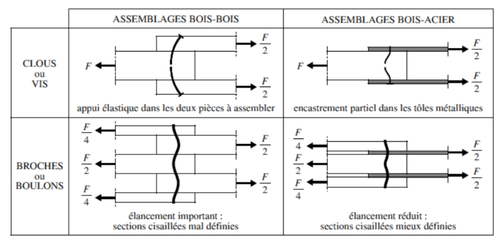
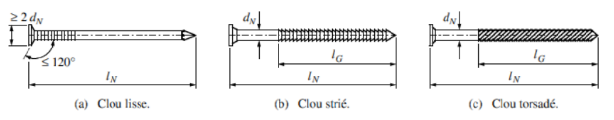
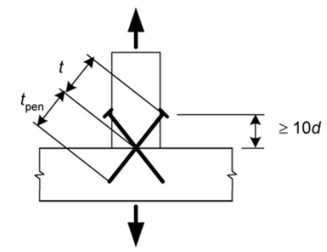
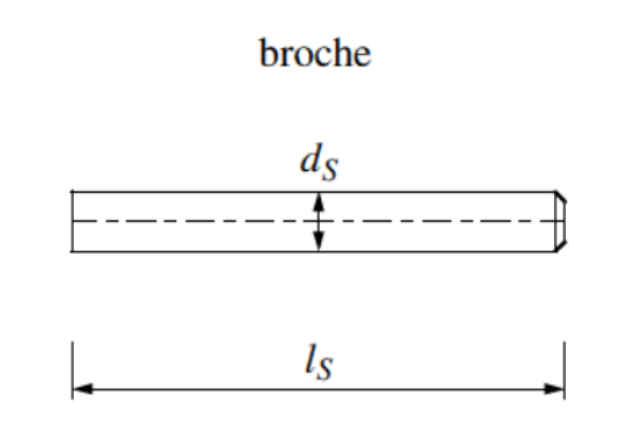
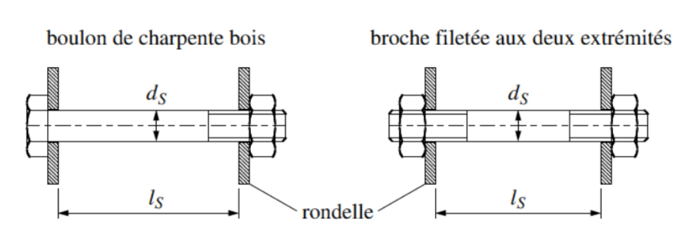
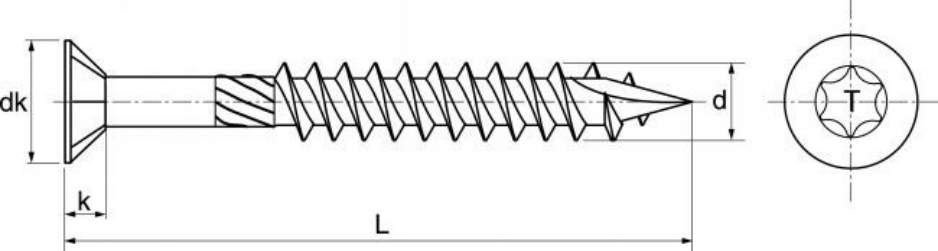
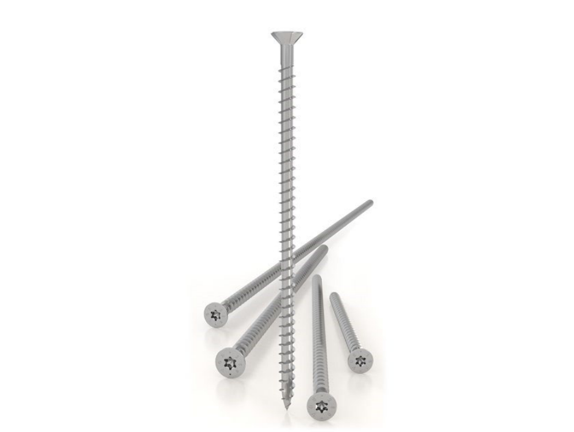
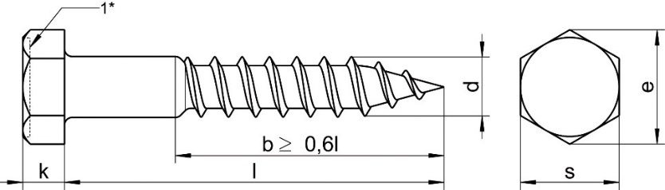

##### 24.42.1 Assemblages par tiges [[entities/cctb|CCTB]] 01.07 

**DESCRIPTION** 

**Définition / Comprend** 

Il s’agit de moyens de fixation qui permettent d’assurer des liaisons mécaniques bois-bois ou boismétal. 

Cette appellation englobe les clous (pointes), agrafes, vis, tire-fond, broches et boulons. 

**MATÉRIAUX** 

**Tolérances et dimensions** 

Les connecteurs par tiges doivent respecter les tolérances suivantes : 

|**Dimension**|**Ecart négatif**|**Ecart positif**|**Précision de la**|
|---|---|---|---|
||**maximum**|**maximum**|**mesure**|
|Longueur|- 2,5%|+ 2,5%|± 1%|
|Diamètre|- 2,5%|+ 2,5%|± 1%|
|Aire de la section transversale|- 5%|+ 5%|± 1%|

Autres dimensions - 5% + 5% ± 1% 

[24.42.1 a Assemblages par tiges - clous [[entities/cctb|CCTB]] 01.11](560_24.42.1_assemblages_par_tiges_cctb_01.07.md)

**DESCRIPTION** 

**Définition / Comprend** 

Il s’agit d’un assembleur par pointe. Il existe différents types de clous, schématisés ci-dessous : 

**Remarques importantes** 

Les clous utilisés respectent en tout point la norme harmonisée [NBN EN 14592] et disposent du marquage CE suivant celle-ci. 

L’étude d’une connexion par clous se fait soit par calculs suivant les principes décrits dans l’Eurocode 5 ([NBN EN 1995-1-1]) et ses annexes, soit sur base d’essais réalisés conformément à la [NBN EN 1380]. 

**MATÉRIAUX** 

**Caractéristiques générales** 

**Géométrie** 

Les clous sont lisses (par défaut) / striés (annelés) / torsadés. 

Un clou lisse ne peut être utilisé pour reprendre des charges axiales permanente ou de long terme. 

Les clous annelés ou torsadés peuvent reprendre des charges axiales sauf s’ils sont installés en bout de fil. 

Diamètre nominal des clous d selon [NBN EN 14592] : *** 

Le diamètre nominal des clous est compris entre 1,9 mm et 8 mm. 

Longueur du clou l selon [NBN EN 14592] : *** 

Matériau constituant les clous : acier au carbone ou acier allié (par défaut) / acier inoxydable 

**(Soit par défaut)** 

Acier au carbone ou acier allié 

Nuance d’acier selon [NBN EN ISO 898-1]: fu = *** et fy = *** 

Mesure de protection contre la corrosion selon [NBN EN 10346] : aucune / Z275 (par défaut) / Z350 / *** 

Cette mesure peut être remplacée par une mesure présentant un degré de protection contre la corrosion similaire ou supérieure. 

**(Soit)** 

Acier inoxydable 

Nuance d’acier inoxydable selon [NBN EN ISO 3506-1] : A2-50 (par défaut) / A2-70 / A4-50 / A4-70 / ***

**EXÉCUTION / MISE EN ŒUVRE** 

**Prescriptions générales** 

Sauf spécification contraire au cahier spécial des charges, les clous sont enfoncés perpendiculairement au fil et à une profondeur telle que les surfaces des têtes de clous affleurent la surface du bois. 

Un assemblage est composé d’au moins deux clous. 

**Assemblages lardés** 

Sauf autre prescription au cahier spécial des charges, le clouage lardé est réalisé tel qu’indiqué sur le schéma ci-contre, provenant de l’Eurocode 5 ([NBN EN 1995-1-1]). 

**Préperçage des éléments en bois** 

Le préperçage des éléments en bois est obligatoire lorsqu’au minimum une des deux conditions suivantes est remplie : 

- La masse volumique du bois est supérieure à 500kg/m³ ; 

- Le diamètre de la pointe est supérieur à 6mm. 

Le diamètre de préperçage est compris entre 0.6 et 0.8 fois le diamètre du clou. 

**Pénétration minimale dans la dernière pièce** 

La longueur de pénétration minimale d’un clou dans la dernière pièce est de 8 fois son diamètre. Si le clou est annelé ou torsadé, cette longueur peut être ramenée à 6 fois le diamètre. 

**Espacements** 

Les distances minimales entre deux clous ou entre un clou et la rive de l’élément en fonction de l’orientation du fil du bois décrites dans l’Eurocode 5 ([NBN EN 1995-1-1]) sont respectées. 

**Clouage en bout de fil** 

Lorsqu’un clouage en bout de fil doit être exécuté, les mesures suivantes doivent être respectées : 

- les pointes lisses ne peuvent être utilisées que dans les structures secondaires ; 

- pour les autres structures, les clous seront soit annelés, soit torsadés ; 

- la capacité résistante est prise comme étant le tiers de celle qu’aurait le même clou installé perpendiculairement au fil ; 

- minimum trois clous sont installés dans l’assemblage ; 

- les clous sont chargés uniquement latéralement ; 

- la pénétration minimale dans la dernière pièce est au minimum égale à 10 fois le diamètre du clou ; 

- l’assemblage est en classe d’emploi 1 ou 2. 

**Disposition des clous** 

Sauf indication contraire au cahier spécial des charges, les clous sont placés alternativement de part et d’autre des lignes de répartition théorique et de telle façon à ce que deux clous successifs ne

soient pas plantés dans la même fibre de bois. Le décalage par rapport à la ligne de répartition est au moins d’un diamètre. 

**MESURAGE** 

**unité de mesure:** 

- (par défaut) / pc 

_**(Soit par défaut)**_ 

1.     – 

_**(Soit)**_ 

2.3.  pc 

- code de mesurage: 

Compris (par défaut) / Quantité nette 

_**(Soit par défaut)**_ 

1.     Compris dans l’article de référence *** 

**(Soit)** 

- 2.3. Quantité nette : Le nombre d’assemblages à embrèvement ayant les mêmes dimensions est compatibilisé. 

**nature du marché:** 

PM (par défaut) / QF / QP 

_**(Soit par défaut)**_ 

1.     PM 

_**(Soit)**_ 

2.     QF 

_**(Soit)**_ 

3.     QP 

###### 24.42.1 b Assemblages par tiges - broches [[entities/cctb|CCTB]] 01.11 

**DESCRIPTION** 

**Définition / Comprend** 

Il s’agit de tiges cylindriques lisses de 6 à 30mm de diamètre et ne comportant pas de tête intégrée. Une broche est schématisée ci-dessous : 

**Remarques importantes**

Les broches utilisées respectent en tout point la norme harmonisée [NBN EN 14592] et disposent du marquage CE suivant celle-ci. 

L’étude d’une connexion par broche se fait soit par calculs suivant les principes décrits dans l’Eurocode 5 ([NBN EN 1995-1-1]), soit sur base d’essais réalisés conformément à la [NBN EN 1380]. 

**MATÉRIAUX** 

**Caractéristiques générales** 

Diamètre des broches : 6mm / 8 mm / 10mm (par défaut) / 12mm / 16mm/ 20mm / *** 

Matériau constituant les broches : acier au carbone ou acier allié (par défaut) / acier inoxydable 

**(Soit par défaut)** 

**Acier au carbone ou acier allié** 

Nuance d’acier selon [NBN EN ISO 898-1] : S235 (par défaut) / S355 / *** 

Mesure de protection contre la corrosion selon [NBN EN 10346] : aucune / Z275 (par défaut) / Z350 / *** 

Cette mesure peut être remplacée par une mesure présentant un degré de protection contre la corrosion similaire ou supérieure. 

**(Soit)** 

Acier inoxydable 

Nuance d’acier inoxydable selon [NBN EN ISO 3506-1] : A2 (par défaut) / A4 / *** 

**Tolérances** 

La tolérance sur le diamètre de la broche est de -0/+0,1mm selon l’Eurocode 5 ([NBN EN 1995-1-1]). 

**EXÉCUTION / MISE EN ŒUVRE** 

**Prescriptions générales** 

**Pré-percement des éléments** 

Le préperçage des éléments est obligatoire, et le diamètre des avant-trous dans les éléments en bois est égal au diamètre de la broche. 

Dans le cas d’un assemblage bois/acier, les éléments sont percés séparément. L’acier est percé avec un trou de diamètre d = dbroche+1 mm. 

L’assemblage est couturé par un ou plusieurs boulon(s) à son extrémité lorsque la longueur de l’assemblage est plus grande que la hauteur de la section. 

**Espacements et distances** 

Les espacements et distances minimuaux à respecter sont renseignés dans l’Eurocode 5 [NBN EN 1995-1-1], au _tableau 8.5 – espacements et distances minimaux pour les broches_ . 

**MESURAGE** 

**unité de mesure:** 

- (par défaut) / pc 

_**(Soit par défaut)**_ 

**1.     –** 

**(Soit)** 

**2.3.  pc** 

**code de mesurage:** 

Compris (par défaut) / Quantité nette

**(Soit par défaut)** 

1.     Compris dans l’article de référence *** 

**(Soit)** 

2.3. Quantité nette : Le nombre d’assemblages à embrèvement ayant les mêmes dimensions est compatibilisé. 

**nature du marché:** 

PM (par défaut) / QF / QP 

_**(Soit par défaut)**_ 

**1.     PM** 

**(Soit)** 

**2.     QF** 

**(Soit)** 

**3.     QP** 

[24.42.1 c Assemblages par tiges - boulons [[entities/cctb|CCTB]] 01.11](560_24.42.1_assemblages_par_tiges_cctb_01.07.md)

**DESCRIPTION** 

**Définition / Comprend** 

Il s’agit d’un élément de fixation métallique cylindrique comportant une tête intégrée à une extrémité et une partie filetée destinée à recevoir un écrou à l’autre extrémité. Leur diamètre est compris entre 6 mm et 30 mm. 

Un boulon est composé de l’ensemble Vis + Ecrou + 2 Rondelles. 

**Remarques importantes** 

Les boulons utilisés respectent en tout point la norme harmonisée [NBN EN 14592] et disposent du marquage CE suivant celle-ci. 

L’étude d’une connexion par boulons se fait soit par calculs suivant les principes décrits dans l’Eurocode 5 ([NBN EN 1995-1-1]), soit sur base d’essais réalisés conformément à la [NBN EN 1380]. 

**MATÉRIAUX** 

**Caractéristiques générales** 

Diamètre des boulons : M8 / M10 / M12 (par défaut) / M16 / M20 / M24 / *** 

Longueur des boulons : *** 

Matériau constituant les boulons : acier au carbone ou acier allié (par défaut) / acier inoxydable 

_**(Soit par défaut)**_ 

Acier au carbone ou acier allié

Nuance d’acier selon [NBN EN ISO 898-1] : 4.8 (par défaut) / 5.6 / 8.8 / 10.9 / *** 

Mesure de protection contre la corrosion selon [NBN EN 10346] : aucune / Z275 (par défaut) / Z350 / *** 

Cette mesure peut être remplacée par une mesure présentant un degré de protection contre la corrosion similaire ou supérieure. 

**(Soit)** 

Acier inoxydable 

Nuance d’acier inoxydable selon [NBN EN ISO 3506-1] : A2 (par défaut) / A4 / *** 

Suivant la [NBN EN 14592], la tolérance sur le diamètre des boulons est de +/- 2,5 % de la valeur déclarée. 

**EXÉCUTION / MISE EN ŒUVRE** 

**Prescriptions générales** 

**Espacements et distances** 

Les espacements et distances minimaux à respecter sont renseigner dans l’Eurocode 5 [NBN EN 1995-1-1], au _tableau 8.4 – espacements et distances minimaux pour les boulons._ 

**Positionnement** 

La position du boulon par rapport à son emplacement théorique doit être exacte à 5mm près. 

**Pré percement des éléments** 

Les trous de boulons dans le bois ont un diamètre qui n’est pas supérieur de plus de 1 mm à celui du boulon.  Les trous de boulons dans les plaques métalliques ont un diamètre qui n’est pas supérieur de plus de 2 mm ou 0.1d (en considérant la valeur maximale) à celui du boulon. 

**Rondelles** 

Une rondelle est placée entre la tête du boulon et la pièce en bois. Une deuxième rondelle est placée entre l’écrou et la pièce en bois. Les rondelles ont un diamètre minimum de 3d (souvent 3,5d à 4d) et une épaisseur minimale de 0,3d. 

**Ajustement des boulons** 

Les boulons sont ajustés de telle sorte que les éléments s’assemblent précisément. 

Dans le cas où, lors de l’installation des boulons, le bois n’a pas atteint sa teneur en humidité d’équilibre, les boulons sont resserrés lorsque le bois a atteint sa teneur en humidité d’équilibre. 

**MESURAGE** 

**unité de mesure:** 

- (par défaut) / pc 

_**(Soit par défaut)**_ 

1.     – 

**(Soit)** 

**2.3.  pc** 

**code de mesurage:** 

Compris (par défaut) / Quantité nette 

**(Soit par défaut)** 

1.     Compris dans l’article de référence *** 

**(Soit)**

2.3. Quantité nette : Le nombre d’assemblages à embrèvement ayant les mêmes dimensions est compatibilisé. 

**nature du marché:** 

PM (par défaut) / QF / QP 

_**(Soit par défaut)**_ 

1.     PM 

_**(Soit)**_ 

2.     QF 

_**(Soit)**_ 

3.     QP 

###### 24.42.1 d Assemblages par tiges - vis [[entities/cctb|CCTB]] 01.11 

**DESCRIPTION** 

**Définition / Comprend** 

Il s’agit des différentes sortes de vis de charpente ; chacune de celles-ci a une application bien spécifique. Les résistances et les raideurs des vis sont très variables et peuvent atteindre des valeurs relativement élevées. 

Les plus courantes sont les vis auto-taraudeuses à tête fraisée : 

Les vis à filetage total sont aussi de plus en plus utilisées

La connexion d’éléments en acier avec du bois n’est pas possible avec toutes les vis et est liée à  des prescriptions de mise en œuvre particulières. 

On veille à se référer aux documents techniques et prescriptions fournies par le fabricant (entre-axes, règle de pré-perçage, règles de mise en œuvre, etc.). 

**Remarques importantes** 

Les vis utilisées respectent en tout point la norme harmonisée [NBN EN 14592] et disposent du marquage CE suivant celle-ci. 

L’étude d’une connexion par vis se fait soit par calculs suivant les principes décrits dans l’Eurocode 5 ([NBN EN 1995-1-1]), soit sur base d’essais réalisés conformément à la [NBN EN 1380]. 

**MATÉRIAUX** 

**Caractéristiques générales** 

**Géométrie** 

Forme de la tête : conique (par défaut) / demi-ronde / carrée / hexagonale / *** 

Longueur de la vis : *** 

Longueur du filetage : *** 

Diamètre nominale (diamètre extérieur du filetage), d : *** 

Diamètre de la partie lisse : *** 

Diamètre de la tête de vis : *** 

Matériau constituant les vis : acier au carbone ou acier allié (par défaut) / acier inoxydable 

**(Soit par défaut)** 

Acier au carbone ou acier allié 

Nuance d’acier selon [NBN EN ISO 898-1] : fu = *** / fy = *** 

Mesure de protection contre la corrosion selon [NBN EN 10346] pour une galvanisation : aucune / Z275 (par défaut) / Z350 / ***

**(Soit)** 

Acier inoxydable 

Nuance d’acier inoxydable selon [NBN EN ISO 3506-1] : A2 (par défaut) / A4 / *** 

**EXÉCUTION / MISE EN ŒUVRE** 

**Prescriptions générales** 

**Préperçage des éléments** 

Pour les vis dans les résineux avec un diamètre de partie lisse ≤ 6mm, les avant-trous ne sont pas exigés. Si un avant trou est réalisé, il est plus petit que 80% du diamètre nominal de la vis. 

Pour toutes les vis dans les bois feuillus et pour celles dans les bois résineux dont le diamètre de la partie lisse est supérieur à 6mm, un avant-trou est exigé, avec les exigences suivantes : 

- Le trou de guidage de la partie lisse a le même diamètre et la même longueur que la partie lisse de la vis. 

- Le trou de guidage pour la partie filetée a un diamètre compris entre 65 et 75% du diamètre de la partie lisse. 

Si la masse volumique d’un des éléments en bois assemblés dépasse 500kg/m³, le diamètre d’avant trou est déterminé par essais. 

**Pénétration minimale des vis** 

Les exigences de pénétration dépendent du mode de chargement de la vis. Si la vis est soumise à une combinaison de charges axiale et latérale, les exigences des deux modes de chargement doivent être satisfaites. 

Vis chargées latéralementSauf spécification contraire au cahier spécial des charges ou dans l’étude de l’assemblage, la partie lisse pénètre l’élément contenant la pointe d’au minimum 4 fois le diamètre de la partie lisse. 

Vis chargées axialementLa longueur de pénétration minimale de la partie filetée dans l’élément contenant la pointe est de 6 fois le diamètre extérieur de la partie filetée. 

**Espacements et distances** 

Les exigences d’espacements des vis entre elles et de distances de celles-ci par rapport aux bords des éléments dépendent du mode de chargement de la vis. Si les vis sont soumises à une combinaison de charges axiale et latérale, les exigences des deux modes de chargement doivent être satisfaites. 

**Vis chargées latéralement** 

- Si les vis ont un diamètre inférieur ou égal à 6mm, les espacements et distances prescrites à l’article [24.42.1a](560_24.42.1_assemblages_par_tiges_cctb_01.07.md) Assemblages par tiges

- clous doivent être suivies. 

- Si les vis ont un diamètre supérieur à 6mm, les espacements et distances prescrites à l’article [24.42.1c](560_24.42.1_assemblages_par_tiges_cctb_01.07.md) Assemblages par tiges

- boulons doivent être suivies. 

Vis chargées axialement 

Les espacements et distances pour les vis chargées axialement sont données au _tableau 8.6 de l’annexe 1_ à l’Eurocode 5 ([NBN EN 1995-1-1/A1]). 

**Ajustement des vis** 

Les vis sont ajustées de telle sorte que les éléments s’assemblent précisément. 

Dans le cas où, lors de l’installation des vis le bois n’a pas atteint sa teneur en humidité d’équilibre, les vis sont resserrées lorsque le bois a atteint sa teneur en humidité d’équilibre. 

MESURAGE 

- unité de mesure: 

- (par défaut) / pc

**(Soit par défaut)** 

**1.     –** 

**(Soit)** 

**2.3.  pc** 

**code de mesurage:** 

Compris (par défaut) / Quantité nette 

_**(Soit par défaut)**_ 

1.     Compris dans l’article de référence *** 

**(Soit)** 

2.3. Quantité nette : Le nombre d’assemblages à embrèvement ayant les mêmes dimensions est compatibilisé. 

**nature du marché:** 

PM (par défaut) / QF / QP 

_**(Soit par défaut)**_ 

1.     PM 

**(Soit)** 

**2.     QF** 

_**(Soit)**_ 

3.     QP 

**AIDE** 

Attention à l’auteur de projet sur le fait que les règles de calcul pour les vis chargées axialement de l’Eurocode 5 ([NBN EN 1995-1-1]) ont été modifiées par l’annexe 1 à celui-ci ([NBN EN 1995-1-1/A1]) publiée en 2008. 

###### 24.42.1 e Assemblages par tiges - tire-fonds [[entities/cctb|CCTB]] 01.11 

**DESCRIPTION** 

**Définition / Comprend** 

Il s’agit d’un cas particulier de vis. Les tire-fond sont composés d’une partie lisse et d’une partie filetée, le diamètre de la partie lisse étant égal au diamètre extérieur du filetage. La tête des tire-fond 

est généralement hexagonale ou carrée. 

**Remarques importantes** 

Les tire-fond utilisés respectent en tout point la norme harmonisée [NBN EN 14592] et disposent du marquage CE suivant celle-ci. 

L’étude d’une connexion par tire-fond se fait soit par calculs suivant les principes décrits dans l’Eurocode 5 ([NBN EN 1995-1-1]), soit sur base d’essais réalisés conformément à la [NBN EN 1380].

**MATÉRIAUX** 

**Caractéristiques générales** 

**Géométrie** 

Forme de la tête : hexagonale (par défaut) / carrée / *** 

Longueur des tire-fond : *** 

Longueur du filetage : *** 

Diamètre nominale (diamètre extérieur du filetage et de la partie lisse), d : *** 

Diamètre de la tête des tire-fond : *** 

Matériau constituant les tire-fond : acier au carbone ou acier allié (par défaut) / acier inoxydable 

_**(Soit par défaut)**_ 

Acier au carbone ou acier allié 

Nuance d’acier selon [NBN EN ISO 898-1] : 4.8 (par défaut) / 5.6 / 8.8 / 10.9 / *** 

Mesure de protection contre la corrosion selon [NBN EN 10346] pour une galvanisation : aucune / Z275 (par défaut) / Z350 / *** 

_**(Soit)**_ 

Acier inoxydable 

Nuance d’acier inoxydable selon [NBN EN ISO 3506-1] : A2 (par défaut) / A4 / *** 

**EXÉCUTION / MISE EN ŒUVRE** 

**Prescriptions générales** 

**Préperçage des éléments** 

Pour les tire-fonds dans les résineux avec un diamètre ≤ 6mm, les avant-trous ne sont pas exigés. Pour tous les tire-fonds dans les bois feuillus et pour celles dans les bois résineux dont le diamètre est supérieur à 6mm, un avant-trou est nécessaire, avec les exigences suivantes : 

- Le trou de guidage a le même diamètre et la même longueur que les tire-fonds. 

Si la masse volumique d’un des éléments en bois assemblés dépasse 500kg/m³, le diamètre d’avant trou est déterminé par essais. 

**Pénétration minimale des tire-fonds** 

Les exigences de pénétration dépendent du mode de chargement des tire-fonds. Si les tire-fonds sont soumis à une combinaison de charges axiale et latérale, les exigences des deux modes de chargement doivent être satisfaites. 

Tire-fonds chargés latéralement 

Sauf spécification contraire au cahier spécial des charges ou dans l’étude de l’assemblage, la partie lisse pénètre l’élément contenant la pointe d’au minimum 4 fois le diamètre nominal. 

Tire-fonds chargés axialement 

La longueur de pénétration minimale de la partie filetée dans l’élément contenant la pointe est de 6 fois le diamètre nominal. 

**Espacements et distances** 

Les exigences d’espacements des tire-fonds entre eux et de distances de ceux-ci par rapport aux bords des éléments dépendent du mode de chargement des tire-fond. Si les tire-fonds sont soumis à une combinaison de charges axiale et latérale, les exigences des deux modes de chargement doivent être satisfaites. 

Tire-fonds chargés latéralement

- Si les tire-fonds ont un diamètre inférieur ou égal à 6mm, les espacements et distances prescrits à l’article [24.42.1a](560_24.42.1_assemblages_par_tiges_cctb_01.07.md) Assemblages par tiges

- clous sont suivis. 

- Si les tire-fonds ont un diamètre supérieur à 6mm, les espacements et distances prescrits à l’article [24.42.1c](560_24.42.1_assemblages_par_tiges_cctb_01.07.md) Assemblages par tiges

- boulons sont suivis. 

Tire-fonds chargés axialement 

Les espacements et distances pour les tire-fonds chargés axialement sont données au _tableau 8.6 de l’annexe 1_ à l’Eurocode 5 ([NBN EN 1995-1-1/A1]). 

**Ajustement des tire-fonds** 

Les tire-fonds sont ajustés de telle sorte que les éléments s’assemblent précisément. 

Dans le cas où, lors de l’installation des tire-fonds le bois n’a pas atteint sa teneur en humidité d’équilibre, les tire-fonds sont resserrés lorsque le bois a atteint sa teneur en humidité d’équilibre. 

**MESURAGE** 

**unité de mesure:** 

- (par défaut) / pc 

_**(Soit par défaut)**_ 

1.     – 

**(Soit)** 

2.3.  pc 

**code de mesurage:** 

Compris (par défaut) / Quantité nette 

_**(Soit par défaut)**_ 

1.     Compris dans l’article de référence *** 

**(Soit)** 

2.3. Quantité nette : Le nombre d’assemblages à embrèvement ayant les mêmes dimensions est compatibilisé. 

**nature du marché:** 

PM (par défaut) / QF / QP 

_**(Soit par défaut)**_ 

1.     PM 

**(Soit)** 

2.     QF 

**(Soit)** 

3.     QP 

###### 24.42.1 f Assemblages par tiges - agrafes [[entities/cctb|CCTB]] 01.11 

**DESCRIPTION** 

**Définition / Comprend** 

Il s’agit de pièces de métal en forme de U formées de tiges de sections circulaires, rectangulaires ou ovales et présentant des extrémités pointues. 

**Remarques importantes** 

Les agrafes utilisées respectent en tout point la norme harmonisée [NBN EN 14592] et disposent du marquage CE suivant celle-ci.

L’étude d’une connexion par agrafes se fait soit par calculs suivant les principes décrits dans l’Eurocode 5 ([NBN EN 1995-1-1]), soit sur base d’essais réalisés conformément à la [NBN EN 1381]. 

**MATÉRIAUX** 

**Caractéristiques générales** 

**Géométrie** 

La géométrie des agrafes respecte les prescriptions de la [NBN EN 14592], §6.2.3 

Le diamètre équivalent se détermine suivant la forme de la section de la pointe de l’agrafe avec les instructions de [NBN EN 14592], §6.2.3, points a) et b). 

Forme des pointes d’agrafes : circulaire / elliptique / rectangulaire / carrée 

Diamètre équivalent minimum des pointes d’agrafe (d) : *** 

Largeur minimale de la tête d’agrafe (min. 6d) : *** 

Longueur des pointes (max. 65d) : *** 

Matériau constituant les agrafes : acier au carbone ou acier allié (par défaut) / acier inoxydable 

**(Soit par défaut)** 

Acier au carbone ou acier allié 

Nuance d’acier selon [NBN EN ISO 898-1] : fu = *** et fy = *** 

Mesure de protection contre la corrosion selon [NBN EN 10346] : aucune / Z275 (par défaut) / Z350 / *** 

Cette mesure peut être remplacée par une mesure présentant un degré de protection contre la corrosion similaire ou supérieure. 

**(Soit)** 

Acier inoxydable 

Nuance d’acier inoxydable selon [NBN EN ISO 3506-1] :A2 (par défaut) / A4 / *** 

**EXÉCUTION / MISE EN ŒUVRE** 

**Prescriptions générales** 

Sauf spécification contraire au cahier spécial des charges, les agrafes sont enfoncées perpendiculairement au fil et à une profondeur telle que les surfaces des têtes d’agrafes affleurent la surface du bois. 

Un assemblage est composé d’au moins deux agrafes. 

**Pénétration minimale dans la dernière pièce** 

La longueur de pénétration minimale d’une agrafe dans la dernière pièce est de 14 fois son diamètre. 

**Espacements** 

Les distances minimales entre deux agrafes ou entre une agrafe et la rive de l’élément en fonction de l’orientation du fil du bois décrites dans l’Eurocode 5 ([NBN EN 1995-1-1]) sont respectées. 

**Agrafage en bout de fil** 

- l’agrafage en bout de fil ne peut être utilisé que dans les structures secondaires ; 

- la capacité résistante est prise comme étant le tiers de celle qu’a la même agrafe installée perpendiculairement au fil ; 

- minimum trois agrafes sont installées dans l’assemblage ; 

- les agrafes sont chargées latéralement uniquement ; 

- l’assemblage est en classe d’emploi 1 ou 2.

**Disposition des agrafes** 

Sauf indication contraire au cahier spécial des charges, les agrafes sont placées de telle façon que leurs têtes fassent un angle compris entre 30° et 60° avec le fil du bois. 

**MESURAGE** 

**unité de mesure:** 

- (par défaut) / pc 

_**(Soit par défaut)**_ 

1.     – 

**(Soit)** 

**2.3.  pc** 

**code de mesurage:** 

Compris (par défaut) / Quantité nette 

_**(Soit par défaut)**_ 

1.     Compris dans l’article de référence *** 

**(Soit)** 

2.3. Quantité nette : Le nombre d’assemblages à embrèvement ayant les mêmes dimensions est compatibilisé. 

**nature du marché:** 

PM (par défaut) / QF / QP 

_**(Soit par défaut)**_ 

1.     PM 

**(Soit)** 

**2.     QF** 

**(Soit)** 

**3.     QP**
