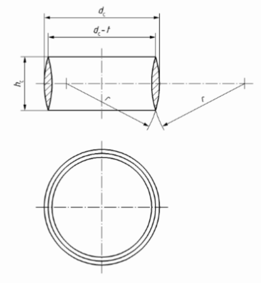
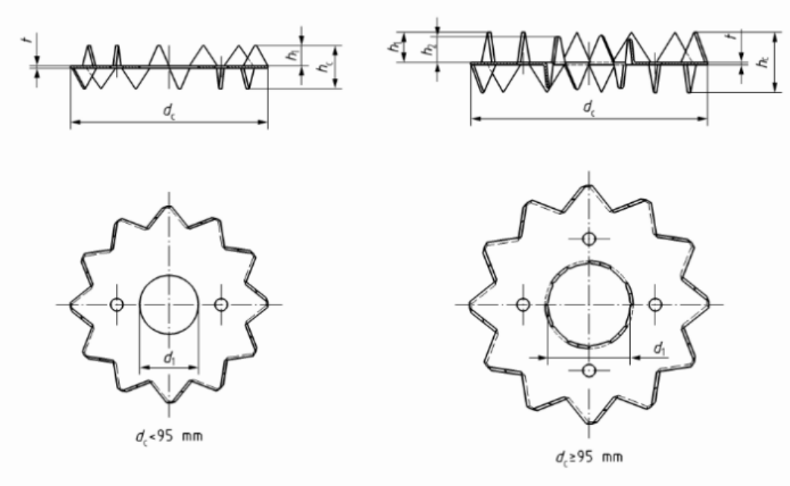
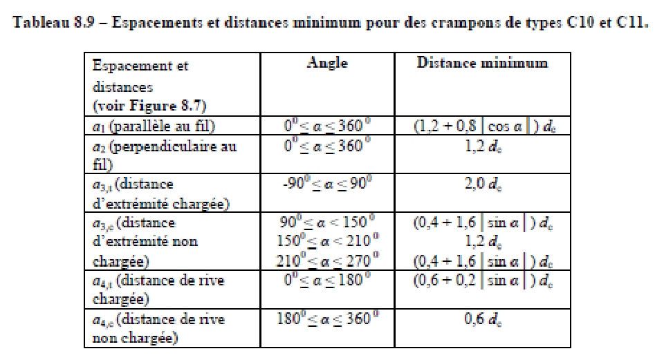
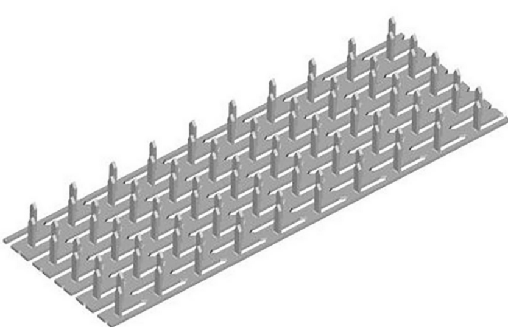

##### 24.42.2 Connecteurs de surface [[entities/cctb|CCTB]] 01.07 

**MATÉRIAUX** 

**Tolérances et dimensions** 

Les connecteurs de surfaces doivent respecter les tolérances suivantes : 

|**Dimension**|**Ecart négatif**|**Ecart positif**|**Précision de la**|
|---|---|---|---|
||**maximum**|**maximum**|**mesure**|
|Longueur ou largeur ≤ 100mm|- 1mm|+ 2mm|+/- 0,5mm|
|Longueur ou largeur > 100mm|- 1%|+ 2%|+/- 0,5mm|
|Diamètre|v. [NBN EN 912], ou - 2,5%| v.[NBN EN 912], ou + 2,5%|+/- 1%|
|Epaisseur|v. tolérances|du matériaux|+/- 1%|
|Autres dimensions ≤ 30mm|- 0,75mm|+ 0,75mm|+/- 1%|
|Autres dimensions > 30mm|- 2,5%|+ 2,5%|+/- 1%|

###### 24.42.2 a Connecteurs de surface - anneaux [[entities/cctb|CCTB]] 01.12

**DESCRIPTION** 

**Définition / Comprend** 

Il s’agit de dispositifs qui peuvent être soit formés comme un anneau fermé ou un anneau coupé en un endroit de sa circonférence et inséré dans chaque face de contact de deux éléments en bois adjacents, soit constitués d’une plaque circulaire avec une bride le long de la circonférence d’un côté de la plaque et s’insérant dans la face de contact d’un seul des deux éléments en bois adjacents. 

Un exemple d’anneau (type A1) est présenté ci-dessous : 

**Remarques importantes** 

Les anneaux sont marqués CE suivant la [NBN EN 14545]. 

**MATÉRIAUX** 

**Caractéristiques générales** 

Les anneaux répondent aux prescriptions décrites dans les normes [NBN EN 14545] et [NBN EN 912]. 

La géométrie et le matériau constitutif de l’anneau sont décrits dans la [NBN EN 912]. Celle-ci définit 6 types d’anneaux double face (numéroté de A1 à A6) et 4 types d’anneaux simple face (numéroté de B1 à B4). 

Type d’anneau : A1 / A2 / A3 / A4 / A5 / A6 / B1 / B2 / B3 / B4 

Dans la pratique, les anneaux de types A1 et B1 sont les plus faciles à trouver. 

Diamètre  (selon [NBN EN 912]) : *** 

Les mesures de protection à prendre pour éviter la corrosion des anneaux doivent être choisies en fonction de la classe d’emploi dans laquelle l’anneau est installé et des essences de bois avec lesquelles il est en contact. 

**EXÉCUTION / MISE EN ŒUVRE** 

**Prescriptions générales** 

Les espacements et distances minimaux à respecter ont été modifiés par l’amendement 2 de l’Eurocode 5 ([NBN EN 1995-1-1/A2]). Le tableau suivant, provenant de cette annexe est d’application : 

Le dimensionnement d’un assemblage par anneau est réalisé conformément aux prescriptions de l’Eurocode 5 ([NBN EN 1995-1-1]).

Un usinage préalable est réalisé pour installer les anneaux. Ils sont montés sans jeu. La profondeur des logements est supérieure de plus de 2 mm à la profondeur de pénétration. 

**MESURAGE** 

**unité de mesure:** 

- (par défaut) / pc 

_**(Soit par défaut)**_ 

1.     – 

**(Soit)** 

2.3.  pc 

**code de mesurage:** 

Compris (par défaut) / Quantité nette 

_**(Soit par défaut)**_ 

1.     Compris dans l’article de référence *** 

**(Soit)** 

2.3. Quantité nette : Le nombre d’assemblages à embrèvement ayant les mêmes dimensions est compatibilisé. 

**nature du marché:** 

PM (par défaut) / QF / QP 

_**(Soit par défaut)**_ 

1.     PM 

_**(Soit)**_ 

2.     QF 

_**(Soit)**_ 

3.     QP 

###### 24.42.2 b Connecteurs de surface - crampons [[entities/cctb|CCTB]] 01.11 

**DESCRIPTION** 

**Définition / Comprend** 

Il s’agit d’assembleurs constitués d’une plaque avec, sur ses bords, des dents triangulaires ou des pointes. Un crampon peut être double face ou simple face. 

Un exemple de crampon (type C1) est présenté ci-dessous :

**Remarques importantes** 

Les crampons sont marqués CE suivant la [NBN EN 14545]. 

**MATÉRIAUX** 

**Caractéristiques générales** 

Les crampons répondent aux prescriptions décrites dans les normes [NBN EN 14545] et [NBN EN 912]. 

La géométrie et le matériau constitutif du crampon sont décrits dans la [NBN EN 912]. Celle-ci définit 11 types de crampons, numéroté de C1 à C11. 

Type de crampon : C1 / C2 / C3 / C4 / C5 / C6 / C7 / C8 / C9 / C10 / C11 

Dans la pratique, les crampons de types C1 à C5, C10 et C11 sont les plus faciles à trouver. 

Diamètre  (selon [NBN EN 912]) : *** 

Les mesures de protection à prendre pour éviter la corrosion des crampons doivent être choisies en fonction de la classe d’emploi dans laquelle l’anneau est installé et des essences de bois avec lesquelles il est en contact. 

Protection contre la corrosion : aucune / Z275 ou équivalent (par défaut) / Z350 ou équivalent 

**EXÉCUTION / MISE EN ŒUVRE** 

**Prescriptions générales** 

Les espacements et distances minimaux à respecter pour les crampons de type C1 à C9 ont été modifiés par l’annexe 2 à l’Eurocode 5 ([NBN EN 1995-1-1/A2]). 

Pour les crampons de type C10 et C11, les distances et espacements minimaux suivants doivent être respectés :

Le dimensionnement d’un assemblage par crampon est réalisé conformément aux prescriptions de l’Eurocode 5 ([NBN EN 1995-1-1]) et ses annexes. 

Les crampons simple face (C2, C4, C7, C9, C11) sont mis en œuvre à l’aide d’une presse ou d’un vérin hydraulique ou à l’aide d’une cale en bois dur et d’une masse. La pénétration du crampon dans le bois doit être complète. Si les crampons sont montés en atelier, les mesures sont prises afin de les maintenir durant le transport, éventuellement à l’aide d’une ou deux pointes. 

L’installation d’un crampon double face (C1, C3, C5, C6, C8, C10) se fait par enfoncement des dents lors de l’assemblage des pièces entre elles à l‘aide d‘une presse hydraulique ou d‘une clé. Une fois le serrage effectué, l‘assemblage est réalisé. 

Les crampons sont autorisés uniquement dans les résineux et en dehors des zones de forte nodosité. 

Du fait de l’épaisseur de la plaque de base des crampons, il est autorisé de fraiser légèrement le bois pour éviter d’avoir un espace entre les pièces. 

**MESURAGE** 

- unité de mesure: 

- (par défaut) / pc 

_**(Soit par défaut)**_ 

1.     – 

**(Soit)** 

2.3.  pc 

- code de mesurage: 

Compris (par défaut) / Quantité nette 

**(Soit par défaut)** 

1.     Compris dans l’article de référence *** 

**(Soit)** 

2.3. Quantité nette : Le nombre d’assemblages à embrèvement ayant les mêmes dimensions est compatibilisé. 

- nature du marché: 

PM (par défaut) / QF / QP 

_**(Soit par défaut)**_ 

1.     PM

_**(Soit)**_ 

**2.     QF** 

_**(Soit)**_ 

**3.     QP** 

###### 24.42.2 c Connecteurs de surface - plaques dentées [[entities/cctb|CCTB]] 01.11 

**DESCRIPTION** 

**Définition / Comprend** 

Il s’agit de plaques métalliques munies de dents intégrées poinçonnées formant un angle de 90° par rapport à la base de la plaque et utilisées pour connecter deux (ou plus) pièces de bois de la même épaisseur et dans le même plan. 

Un exemple de plaques dentées est présenté ci-dessous : 

**Remarques importantes** 

Les plaques dentées respectent les impositions de la norme [NBN EN 14545] et sont marquées CE suivant celle-ci. Elles sont souvent appelées plaques embouties. 

**MATÉRIAUX** 

**Caractéristiques générales** 

Les plaques dentées sont fabriquées à partir d’une tôle d’acier ayant une épaisseur de 0,9mm minimum et 3mm maximum. La tolérance relative à l’épaisseur de la tôle doit être conforme à la [NBN EN 10143] pour l’acier doux ou à la [NBN EN ISO 9445 série] pour l’acier inoxydable. 

Épaisseur de la tôle d’acier : 1 mm (par défaut) / 1,5mm / 2mm / 2,5mm / *** 

Dimensions de la plaque (longueur x largeur) : *** x *** mm 

Matériau constituant les plaques dentées : S250GD (par défaut) / 1.4401 / 1.4404 / *** 

Acier S250GD selon [NBN EN 10346], aciers inoxydables (1.4401 et 1.4404) selon [NBN EN 100882]. 

**Résistance mécanique :** 

Capacité d’ancrage caractéristique minimum de la plaque avec masse volumique caractéristique du bois ρk = 350 kg/m³  : ***MPa 

Capacité résistante caractéristique minimum en traction de la plaque : ft,0 = 360 N/mm ; ft,90 = 230 N/mm (par défaut) / *** N/mm

Capacité résistante caractéristique minimum en compression de la plaque: fc,0 = 240 N/mm ; fc, 90 160N/mm  (par défaut) / *** N/mm 

Capacité résistante caractéristique minimum en cisaillement de la plaque : fv,o = 97 N/mm; fv,90 80N/mm (par défaut) / *** N/mm 

**Rigidité de l’assemblage :** 

Module de glissement  kser de la plaque avec masse volumique moyenne du bois ρm = 350 kg/m³ : 4,5 N/mm³ (par défaut) / *** MPa 

Des mesures de protection contre la corrosion sont nécessaires pour des plaques dentées.  Au minimum, un revêtement par immersion à chaud en zinc Z275 double face est prescrit. Des mesures plus importantes peuvent êtes nécessaires dans les cas suivants : 

- En cas de conditions d’ambiance défavorable : classe d’emploi 3 ou plus, prévoir de l’acier inoxydable ; 

- En cas de présence d’essence de bois corrosives ; 

- En cas d’ambiance polluée. 

Mesure de protection contre la corrosion : Z275 (par défaut) / Z350 / *** 

Des mesures de protection reconnues comme étant équivalente à la mesure prescrite sont acceptées. 

**EXÉCUTION / MISE EN ŒUVRE** 

**Prescriptions générales** 

Les assemblages par plaques dentées doivent comprendre des plaques dentées de même type et de même orientation positionnées sur chaque côté des éléments de bois. 

L’installation de la plaque par presse à plateau est privilégiée. Si cela a été prévu lors du dimensionnement de l’assemblage, la mise en place par presse à rouleau est autorisée. 

Le pré enfoncement de la plaque au marteau est proscrit. 

Le taux d’humidité des bois lors de l’installation de l’assemblage est au plus près de la teneur en humidité que le bois a tout au long de sa durée de vie, et n’est jamais supérieur à 22%. 

**MESURAGE** 

**unité de mesure:** 

- (par défaut) / pc 

_**(Soit par défaut)**_ 

1.     – 

**(Soit)** 

2.3.  pc 

**code de mesurage:** 

Compris (par défaut) / Quantité nette 

**(Soit par défaut)** 

1.     Compris dans l’article de référence *** 

**(Soit)** 

2.3. Quantité nette : Le nombre d’assemblages à embrèvement ayant les mêmes dimensions est compatibilisé. 

**nature du marché:** 

PM (par défaut) / QF / QP

_**(Soit par défaut)**_ 

**1.     PM** 

_**(Soit)**_ 

2.     QF 

**(Soit)** 

3.     QP
