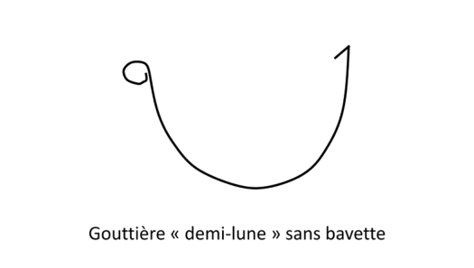
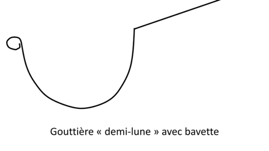
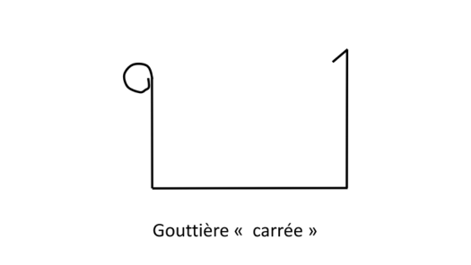
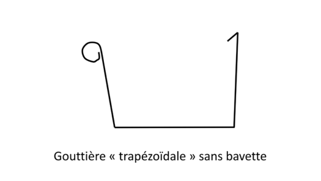
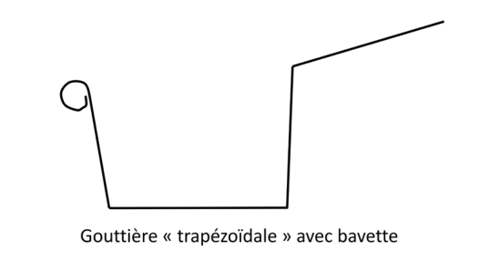
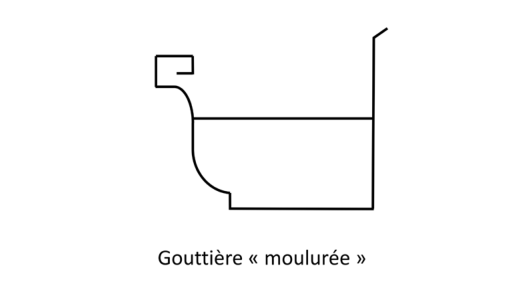
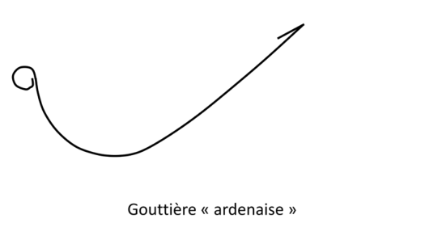
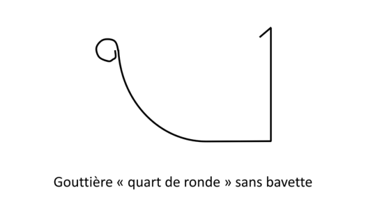
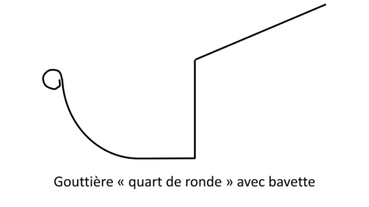

#### 33.2 Gouttières pendantes [[entities/cctb|CCTB]] 01.11

**DESCRIPTION** 

**Définition / Comprend** 

Cet élément concerne les gouttières pendantes préfabriquées. 

Chaque poste des différents articles comprend notamment : les crochets de gouttières, les renforts nécessaires, les pièces d'extrémité, les pièces d'assemblage, les éléments de transition, les angles, les joints de dilatation, les raccordements aux descentes d'eau pluviale, les avaloirs et les travaux de soudage éventuels. 

**Définitions :** 

- **Section de gouttière** : la surface d'eau que la gouttière peut contenir, quand elle est représentée en coupe. 

- **Développé** : la largeur totale de feuille destinée à réaliser l'élément de gouttière. 

Les abréviations suivantes y sont spécifiquement applicables : 

- **Cu** : Cuivre (symbole chimique) 

- **PE** : Polyéthylène 

- **PVC** : Polychlorure de vinyle 

- **Zn** : Zinc (symbole chimique)

**MATÉRIAUX** 

Les gouttières sont exemptes de défauts de matériau ou de fabrication qui risquent de nuire à leur résistance, à la pureté de leur forme et à leur durabilité. Tous les éléments de gouttière et les accessoires sont assortis et proviennent du même fournisseur que celui du système. Les colliers de gouttière et leurs moyens de fixation répondent à la [NBN EN 1462]. 

Ci-dessous, se trouvent les schémas des gouttières décrites dans les différents articles du présent élément : 

**EXÉCUTION / MISE EN ŒUVRE** 

L'exécution se fait selon les directives données par le fournisseur du système. 

Le placement des gouttières se fait de préférence après la couverture de la toiture ; dans le cas contraire, des précautions doivent être prises pour protéger la gouttière. Par ailleurs, entre le placement de la gouttière et celui des descentes d'eau pluviale, des précautions doivent être prises afin d'éviter que l'eau pluviale ne coule sur les murs. 

Les éléments de gouttière sont posés de manière rectiligne avec, de préférence, une pente minimale de 2 mm/m et dans les plus grandes longueurs possibles (si cela ne peut être le cas, la section de la gouttière doit être calculée et adaptée en conséquence). Une seule pièce d'ajustage est plaçable par about de gouttière d'une longueur ≥ de 80 cm. Le porte-à-faux de la gouttière pendante ne dépasse pas une demi-longueur d'écartement entre deux crochets. 

Les solins sont supportés sur toute leur surface par le voligeage. 

La suspension à l'aide des crochets de gouttière assure une rigidité suffisante et la libre dilatation. Les gouttières sont soutenues par un nombre suffisant de crochets régulièrement espacés. 

Pour les gouttières qui sont assemblées par soudage, la soudure se fait avec un matériau compatible. Les recouvrements des éléments de gouttière sont soigneusement soudés et sont de minimum 2 à 3 cm. Les soudures longitudinales sont exclues. 

Au cours de la pose des recouvrements de toiture, toutes les précautions sont prises pour que les gouttières pendantes ne soient pas endommagées ou trop sollicitées. 

**CONTRÔLES** 

Tous les éléments qui sont endommagés pendant ou avant leur exécution sont refusés. 

**DOCUMENTS DE RÉFÉRENCE** 

**Matériau** 

[NBN EN 1462, Crochets de gouttières pendantes - Exigences et méthodes d'essai] 

**Exécution** 

[NIT 175, Toitures en tuiles de terre cuite. Conception - Mise en oeuvre (remplacée par la NIT 240, sauf pour ce qui concerne les ouvrages de raccord).] 

[NIT 266, Couvertures et bardages métalliques à joints debout et à tasseaux] 

[NIT 186, Toitures en tuiles plates : conception et mise en oeuvre (+ Addendum 1997) (remplacée par la NIT 240, sauf pour ce qui concerne les ouvrages de raccord).] 

[NIT 202, Toitures en tuiles de béton. Conception et mise en oeuvre (remplacée par la NIT 240, sauf pour ce qui concerne les ouvrages de raccord).] 

[NIT 219, Toitures en ardoises : Conception et exécution des ouvrages de raccord.] 

[NIT 225, Toitures en plaques ondulées de fibres-ciment : Matériaux

- Composition

- Réalisation.] 

[NIT 240, Toitures en tuiles (remplace les NIT 175, 186 et 202, sauf pour ce qui concerne les ouvrages de raccord)]

[NIT 244, Les ouvrages de raccord des toitures plates : principes généraux (remplace la NIT 191) (+ correctifs de février 2015).] 

**AIDE** 

Certaines dimensions de gouttières existent en standard. Néanmoins, le développé de celles-ci variant parfois de 10 mm d'un fabricant à l'autre, elles n'ont pas été listées dans le cahier des charges type. C'est pourquoi le choix par défaut proposé est la "section minimale nécessaire".
