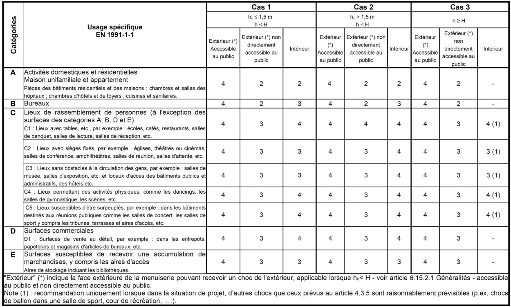

#### 41.4 Systèmes de façades [[entities/cctb|CCTB]] 01.11

**DESCRIPTION** 

**Définition / Comprend** 

Il s’agit de la fourniture et la pose de tous les éléments constituant les systèmes de façades, y compris toutes les pièces qui en font intrinsèquement partie. 

Une façade légère est une façade extérieure d´un bâtiment généralement constituée de métal, de bois ou de PVC, comportant des éléments de structure horizontaux et verticaux assemblés entre eux et fixés à la structure porteuse du bâtiment comportant des remplissages de sorte à constituer une enveloppe continue et légère, qui assure elle-même ou en complément de la structure du bâtiment, l´ensemble des fonctions d´un mur extérieur. Elle ne participe pas à la stabilité du bâtiment.

On distingue généralement, en fonction de la position de la façade légère par rapport au nez de plancher et aux ouvrages verticaux de structure d’une construction les façades rideaux (par défaut) (constituées d’une ou plusieurs parois, situées entièrement en avant des nez de planchers) / les façades semi-rideaux (façades multi-parois dont la paroi extérieure est située en avant des nez de planchers et dont la paroi intérieure est insérée entre deux planchers consécutifs) / les façades panneaux (façades mono ou multi parois insérées entièrement entre les planchers) / ***. 

**Remarques importantes** 

- Il est possible que certains de ces éléments soient décrits dans des articles éléments séparés ([42 [[concepts/vitrages-exterieurs-et-elements-de-remplissage|Vitrages Extérieurs et Éléments de Remplissage]]](166_42_vitrages_extérieurs_et_éléments_de_remplissage_cctb_01.11.md), [41.72 Quincailleries](121_41.72_quincailleries_cctb_01.11.md) …). Toutefois, sauf indication contraire dans le métré récapitulatif, ils sont toujours compris dans le prix unitaire. 

- Les éventuels travaux de démolition des systèmes de façades existants, sont compris dans un élément séparé (voir 06.35.1 Démontages de menuiseries et vitrages extérieurs). 

**MATÉRIAUX** 

La description de l’élément « Systèmes de façades légères » contient les informations suivantes : 

- un ensemble de profilés de résistance compatibles les uns avec les autres, en ce compris leurs techniques d'assemblage et d'étanchéisation (profilé, assemblage montant-traverses, joint de dilatation, assemblage des cadres), 

- un ensemble de profilés accessoires 

- un ensemble d'accessoires, 

- le ou les éléments de remplissage, 

- une technique d'étanchéité à l'air et à l'eau comprenant 

   - les préformés d'étanchéité 

   - la technique de drainage et de ventilation des feuillures 

   - les dispositions complémentaires d’étanchéité 

   - l’étanchéité des angles des profilés d'étanchéité 

   - tout autre dispositif d'étanchéité ou d'étanchéisation (bavettes, rejet d'eau, compartimentage….), 

- une quincaillerie identifiée par une marque et une série, 

- une technique de pose des éléments de remplissage comprenant 

   - le calage des éléments de remplissage et les accessoires 

   - l'étanchéité des éléments de remplissage par mastic ou préformés 

- une technique de reprise des mouvements : joint de dilatation et joint de montage et leur étanchéisation, 

- tous les autres composants : grille de ventilation … 

L'entrepreneur soumet, avant l'exécution, à l'approbation du maître d’ouvrage et de l’auteur de projet : 

- les notes de calcul nécessaires, les certificats de garantie et autres marquage, … 

- les dessins de détail et bordereaux de commande, 

- les échantillons et/ou les prototypes des différentes composantes. Cet échantillon reste à la disposition de l’auteur de projet ou du maître de l’ouvrage jusqu'à la réception provisoire. 

- une carte de couleurs de la gamme des couleurs livrées par le fabricant (profilés de support, parcloses …). 

Les performances générales des façades rideaux sont établies sur la base de la norme de produit [NBN EN 13830:2015+A1]. Les niveaux d’exigences y afférant sont repris dans la [NBN B 25-002-1]. 

**Perméabilité à l'air, étanchéité à l'eau, résistance au vent** 

Les façades rideaux satisfont aux critères minimums de performance générale en matière de perméabilité à l'air, d'étanchéité à l'eau, de résistance aux actions du vent, tels que mentionnés dans les tableaux 29 (façades rideaux avec parties fixes), 30 (façades rideaux comportant des parties ouvrantes uniquement) et 31 (façades rideaux comportant des parties fixes et ouvrantes) du §5.2.3.1.4 de la [NBN B 25-002-1].

Par défaut, et sans autre spécification dans le cahier spécial des charges, pour les performances d’étanchéité à l’air et à l’eau ainsi que la résistance au vent, on se réfère aux tableaux 29, 30 ou 31 de la [NBN B 25-002-1] suivant que la façade rideau ne comporte que des parties fixes, que des parties ouvrantes ou des parties fixes et parties ouvrantes en fonction de la rugosité de terrain (exposition) et de la hauteur du bâtiment (0-10 mètres, 10-18 mètres, 18-25 mètres, 25-50 mètres, 50-100 mètres et > 100 mètres). 

La norme [NBN B 25-002-1] propose un tableau reprenant uniquement les niveaux de performances des façades rideaux. Ceux-ci tiennent compte des facteurs d’influence et d’utilisation suivants : 

- La hauteur de référence du bâtiment Ze 

- La vitesse de référence du vent vb0 

- La catégorie de rugosité de terrain 

- La classe d’exposition au vent (définie dans la norme [NBN B 25-002-1]) 

Le choix des classes est donné au tableau suivant. 

|•La classe d’exposition Le choix des classes est donné|au vent (définie dans la au tableau suivant.|au vent (définie dans la au tableau suivant.|norme [NBN B 25-002-|norme [NBN B 25-002-|1])|1])|
|---|---|---|---|---|---|---|
|Classe d'exposition au vent|Classe CW3||Classe CW4||Classe CW5||
|Perméabilité à l’air [NBN EN 12152]|A3||A3||A4||
|Étanchéité à l’eau [NBN EN 12154]|R5|300 Pa|R6|450 Pa|R7|600 Pa|
|Résistance mécanique au vent [NBN EN 13116]| Charge caractéristique de vent : wK= 0,80 x ce(z)qref 50ans. cp Charge accrue de vent wU= 1,25 x ce(z)qref 50ans.cp||||||
|Classe d'exposition au vent|Classe CW6||Classe CW7||Classe CW8||
|Perméabilité à l’air [NBN EN 12152]|A4||A4||A4||
|Étanchéité à l’eau [NBN EN 12154]|RE 750|750 Pa|RE 900|900 Pa|RE 1050|1050 Pa|
|Résistance mécanique au vent [NBN EN 13116]| Charge caractéristique de vent : wK= 0,80 x ce(z)qref 50ans. cp Charge accrue de vent wU= 1,25 x ce(z)qref 50ans.cp||||||

Pour des éléments de façades non protégés contre l’eau ruisselante (fenêtre dans le même plan que la façade sans protection contre l'eau ruisselante ou avec à sa partie supérieure un rejet d'eau < 20 mm), la classe de pression d’essai supérieure à celle prescrite dans le tableau ci-dessus est exigée. 

Pour les classes d'exposition CW 3 et CW [4](04_4_t4_fermetures_finitions_extérieures_cctb_01.13.md), pour des locaux avec air conditionné, la perméabilité à l'air classe A4 est toujours exigée. 

Lorsque la hauteur de référence du bâtiment est supérieure à 100 m, les essais d'étanchéité à l'eau sous pression d'air dynamique et projection d'eau suivant la norme [NBN EN 13050] sont recommandés. 

En ce qui concerne les façades rideaux conçues avec des parties ouvrantes, le choix des classes air, eau, vent pour les fenêtres (§ [41.1](06_41.1_fenêtres_et_portes-fenêtres_cctb_01.13.md)) est applicable à ces dernières. 

**Effort de manœuvre pour les parties ouvrantes** 

Par défaut, et sans autre spécification dans le cahier spécial des charges, les performances relatives aux efforts de manœuvre des parties ouvrantes intégrées dans les façades rideaux sont définies en fonction de l’utilisation du bâtiment au titre [41.1 Fenêtres et portes-fenêtres](06_41.1_fenêtres_et_portes-fenêtres_cctb_01.13.md). 

**Performances d’abus d’utilisation pour les parties ouvrantes** 

Par défaut, sans spécification dans le cahier spécial des charges, les performances d’efforts de résistance aux abus d’utilisation des parties ouvrantes intégrées dans les façades rideaux sont définies en fonction de l’utilisation du bâtiment suivant la [NBN EN 13115] au titre [41.1 Fenêtres et portes-fenêtres](06_41.1_fenêtres_et_portes-fenêtres_cctb_01.13.md). 

**Économie d’énergie et performances thermiques**

Par défaut, et sans spécification dans le cahier spécial des charges, les performances énergétiques sont au moins conformes aux réglementations régionales. 

Les performances thermiques sont établies par calcul sur la base de la norme [NBN EN ISO 12631] ou par essais. Les valeurs Ucw des façades sont communiquées à l'auteur de projet et, le cas échéant, au responsable [[concepts/peb|PEB]]. A défaut, le détail (valeur Up des panneaux, valeur Ug des vitrages et valeur UTJ des nœuds, matériaux et épaisseurs) est communiqué à l'auteur de projet et, le cas échéant, au responsable PEB. 

Pour ce qui concerne le contrôle solaire (facteur solaire et transmission lumineuse), on se réfère au descriptif de la section [42 [[concepts/vitrages-exterieurs-et-elements-de-remplissage|Vitrages Extérieurs et Éléments de Remplissage]]](166_42_vitrages_extérieurs_et_éléments_de_remplissage_cctb_01.11.md). 

Le cas échéant, le cahier spécial des charges mentionne également si une étude de risque de condensation doit être réalisée (conformément à la norme [NBN B 25-002-1]). 

**Prestations acoustiques** 

Les performances acoustiques des bâtiments sont gérées par 3 normes principales à savoir : 

- la norme [NBN S 01-400-1] pour les immeubles d’habitation. Celle-ci prévoit 2 qualités de confort acoustique : un « confort acoustique normal » et un « confort acoustique supérieur ». Toutes les exigences sont données pour le bâtiment parachevé. 

- la norme [NBN S 01-400-2] pour les bâtiments scolaires. Toutes les exigences sont données pour le bâtiment parachevé 

- la norme [NBN S 01-400] pour les autres bâtiments. Pour les bâtiments non concernés par les normes [NBN S 01-400-1] et [NBN S 01-400-2] pour lesquelles les exigences sont formulées dans la [NBN S 01-400], exigences minimales ("lettre en indice") et recommandées ("lettre en exposant") pour l'isolation acoustique sont exprimées sous forme de "catégories belges = V dans le cas des façades », ceci en fonction d'expositions particulières reprises au tableau concerné de la norme [NBN S 01-400]. 

Un calcul acoustique à partir du spectre de mesure permet le passage aux indices définis dans les différentes normes de classification. 

Remarques 

- Les exigences acoustiques décrites dans la [NBN S 01-400] sont en cours d’adaptation ainsi que la manière de les exprimer. Il est prévu d'utiliser une nomenclature telle que définie dans les normes [NBN EN ISO 717-1] et [NBN EN ISO 717-2]. 

- Les performances d'isolement acoustique in situ sont calculées par les méthodes de calculs simplifiées de la norme [NBN S 01-400-1] ou par des méthodes plus détaillées spécifiées dans la norme [NBN EN ISO 12354-3] en utilisant des paramètres géométriques et des indices d’affaiblissements acoustiques pondérés par rapport au bruit de trafic routier RAtr. 

- Les valeurs RAtr des vitrages donnés par les fabricants sont déterminées dans un laboratoire acoustique et ne sont pas égales aux valeurs RAtr des fenêtres contenant ces vitrages. 

**Résistance à l’effraction** 

Le cas échéant, le cahier spécial des charges mentionne la résistance à l’effraction de la façade rideau ou zone de la façade rideau conformément à la [NBN EN 1627]. 

Le choix de la classe de résistance à l'effraction est établi en tenant compte de ce qui suit : 

- L'évaluation des besoins en matière de protection contre l'effraction résulte d'une analyse tenant compte des facteurs objectifs ou subjectifs suivants : 

   - la situation géographique de la construction, 

   - son intégration urbaine, 

   - son accessibilité aisée ou non, 

   - la présence de système de protection complémentaire, 

   - la valeur, la taille, le nombre, l'encombrement, le poids des biens à protéger, 

   - la fonction du bâtiment, 

   - tous autres facteurs spécifiques, psychologiques et humains. 

- L'interprétation des classes de la [NBN EN 1627] :

|Classes [NBN EN 1627]|Types d'attaque|
|---|---|
|1|Un cambrioleur occasionnel essaie d'ouvrir la fenêtre, la porte ou la fermeture en utilisant la violence physique, par exemple coup de pied, coup d'épaule, soulèvement, arrachement.|
|2|Le cambrioleur occasionnel essaie en plus d'ouvrir la fenêtre, la porte ou la fermeture en utilisant des outils simples,par exemple tournevis,pince, coins.|
|3|Le cambrioleur essaie d'entrer en utilisant 2 tournevis, ouplus, et unpied de biche.|
|[4](04_4_t4_fermetures_finitions_extérieures_cctb_01.13.md)|Le cambrioleur expérimenté utilise en plus des outils tels que scie, marteau, hache, ciseau, burin,perceuse électriqueportative à batterie.|
|5|Le cambrioleur expérimenté utilise en plus des outils électriques, par exemple perceuse, scie sauteuse et sabre, meuleuse d'angle avec disque de diamètre maximum125 mm.|
|6|Le cambrioleur expérimenté utilise en plus des outils électriques puissants, par exemple, perceuse, scie sauteuse et sabre, meuleuse d'angle avec disque de diamètre maximum 230mm.|

**Résistance à l'explosion** 

Le cas échéant, le cahier spécial des charges mentionne la résistance à l'explosion de la menuiserie conformément à une des normes décrites dans la [NBN B 25-002-1] § 5.2.3.6 

**Résistance aux balles** 

Le cas échéant, le cahier spécial des charges mentionne la résistance aux balles de la menuiserie conformément à une des normes décrites dans la [NBN B 25-002-1] § 5.2.3.7 

**Sécurité en cas d’incendie** 

Les exigences de réaction au feu et de résistance au feu des menuiseries extérieures sont conformes aux lois, réglementations (fédérales, communautaires, régionales, communales) et dispositions administratives, applicables à l’utilisation finale. 

Note : Certaines dispositions réglementaires contiennent d’autres exigences que celles relatives à la résistance ou la réaction au feu. 

**La réaction au feu** 

Les exigences relatives à la réaction au feu sont reprises dans [AR 1994-07-07] fixant les "Normes de base en matière de prévention contre l'incendie et l'explosion" et ses modifications dernière édition. 

Les exigences sont reprises dans l'annexe 5/1 de cet arrêté royal pour les nouveaux bâtiments construits à partir du 1/07/2022. 

Selon cet arrêté royal, les revêtements de façades présentent les classes de réaction au feu suivantes conformément à la norme [NBN EN 13501-1] : 

- la classe D-s3, d1 pour les bâtiments bas (hauteur conventionnelle h < 10m), utilisateurs autonomes 

- la classe C-s3, d1 pour les bâtiments bas (hauteur conventionnelle h < 10m), utilisateurs non autonomes 

- la classe B-s3, d1 pour les bâtiments moyens (h ≥ 10 m) 

- la classe A2-s3, d0 pour les bâtiments élevés (h ≥ 25 m). 

La performance est attestée suivant les modalités spécifiées dans l’arrêté royal. 

Un maximum de 5 % de la surface visible des façades n’est pas soumis à cette exigence. 

Ces exigences sont valables pour tous les nouveaux bâtiments à l’exclusion des maisons unifamiliales, des bâtiments bas de moins de 100 m² et de maximum 2 étages.

Les bâtiments industriels (faisant l’objet de l’annexe 6 dudit arrêté royal) ne sont pas soumis aux exigences précitées. 

D'autres réglementations spécifiques en fonction de la destination du bâtiment peuvent compléter cet arrêté royal. Pour toute information complémentaire, le site internet du SPF Intérieur dédié à la sécurité incendie (www.besafe.be) et le site de l’Antenne-Normes Prévention incendie de Buildwise (www.normes.be/feu) peuvent être consultés. 

**Notes :** 

- Lorsque des exigences sont reprises dans les règlements officiels nationaux, régionaux ou autres, elles sont rendues obligatoires (= loi) 

- D'autres réglementations existent en fonction de la destination du bâtiment (hôpital, maisons de repos, établissements d'hébergement, etc.). Ces dernières contiennent d’autres exigences que celles concernant la réaction et la résistance au feu et différent en fonction de la Communauté ou de la Région. 

**La résistance au feu** 

Les exigences relatives à la résistance au feu sont reprises dans [AR 1994-07-07] fixant les "Normes de base en matière de prévention contre l'incendie et l'explosion" et ses modifications. Les exigences sont reprises dans les annexes 2/1, 3/1 et [4](04_4_t4_fermetures_finitions_extérieures_cctb_01.13.md)/1 de cet arrêté royal pour les nouveaux bâtiments, respectivement bas, moyens et élevés, construits à partir du 1/12/2012. 

La référence principale est la norme [NBN EN 13501-2]. La performance est attestée suivant les modalités spécifiées dans l’arrêté royal. 

**Résistance aux chocs** 

La résistance aux chocs concerne le vitrage et/ou la façade rideaux. La résistance aux chocs des vitrages est décrite dans le chapitre relatif aux vitrages. La classe de résistance aux chocs des façades rideaux est précisée ci-dessous, conformément à la norme [NBN B 25-002-1]. Les classes de résistance aux chocs intérieurs et extérieurs sont établies conformément à la norme [NBN EN 14019]. 

|Classes d’essais Choc extérieur|Hauteur de chute [mm]|Classes d’essais Choc intérieur|Hauteur de chute [mm]|
|---|---|---|---|
|E0|Pas applicable|I0|Pas applicable|
|E1|200|I1|200|
|E2|300|I2|300|
|E3|450|I3|450|
|E4|700|I4|700|
|E5|950|I5|950|

La spécification des classes de résistance aux chocs des façades suivant la norme [NBN EN 14019] est donnée au tableau suivant où : 

- h est la hauteur de référence «h » pour la hauteur de protection mesurée du côté du risque entre le niveau du sol fini et le niveau haut du dormant (traverse) de la menuiserie. 

- hc est la hauteur de chute comprise entre le niveau haut de la feuillure de la traverse en cas d’éléments fixes ou du dormant en cas d’éléments ouvrants et le niveau du sol en contrebas dont la largeur est ≥ 0,95 m 

- H est la hauteur de protection soit la hauteur jusqu’à laquelle la protection des personnes doit être assurée en fonction de conditions de projet. La hauteur H est comprise entre 0,9 et 1,2 m à partir du niveau du sol fini.

Lorsque des menuiseries intègrent des parties ouvrantes pouvant donner lieu au passage d'un corps humain et que hc > 1.5 m, il y a lieu d’équiper la baie d’un garde-corps conforme à la norme [NBN B 03-004]. 

Lorsqu'il y a possibilité d'ouvrir la fenêtre de façon limitée tout en empêchant le passage d'un corps humain (p.ex. limitateur d'ouverture), il y a lieu de tester aux chocs la menuiserie en position ouverte. 

**Endurance mécanique** 

Le cas échéant, le cahier spécial des charges mentionne la classe de résistance à l'ouverture et à la fermeture répétée à laquelle les parties ouvrantes des façades rideaux décrites dans la [NBN B 25002-1]  § 5.2.3.11. 

**Comportement entre deux climats** 

Le cas échéant, lorsque la façade est hétérogène ou posée dans un climat particulier, le comportement de la façade en ambiance différentielle sur un prototype représentatif de la façade rideau peut être vérifié suivant la procédure d'essai de la norme [NBN EN 13420]. 

La conception de la menuiserie détermine le mode opératoire à adopter. 

Sauf autre spécification dans le cahier des charges, l'essai est effectué sur une travée représentative ou un élément de façade rideau à savoir: 

- pour une façade à montants et entrevous ou à allèges : au moins deux modules en largeur et deux modules en hauteur, 

- pour une façade modulaire : au moins 2 modules en largeur et 2 en hauteur, 

- l’échantillon comprendra au moins un joint de dilatation de chaque type. 

**Profilés** 

Tous les profilés entrant dans la composition de la façade rideau proviennent d'un seul et même fabricant. Les profilés et détails de mise en œuvre sont conformes aux spécifications du fabricant et aux éléments types évalués dans le cadre de la déclaration de conformité. La note de calcul et/ou essais établis par le constructeur dans le cadre de la déclaration de conformité ou de ce chantier en particulier tient compte ou couvre toutes les données existantes en ce qui concerne les sollicitations ou les efforts et les critères de performances précités. Les dimensions des profilés sont exprimées en mm. La forme, le détail et les sections des profilés correspondent aux indications sur les plans et aux éventuels détails de principe annexés au dossier. Ils sont adaptés à la composition des éléments

fixes et/ou ouvrants, à la nature, aux dimensions et au mode de mise en œuvre des vitrages, panneaux, quincailleries, grilles de ventilations, … tels qu'ils sont prescrits. 

Les profilés en aluminium à rupture de pont thermique sont conformes aux exigences de la norme [NBN EN 14024]. La durabilité des profilés est démontrée conformément à la norme [NBN EN 14024] pour les catégories de température TC1 (-10 °C à 70 °C) (par défaut) / TC2 (-20 °C à 80 °C). La rupture de pont thermique est assurée par une barrette en ABS (par défaut) / ***. 

La composition de l’aluminium est conforme aux exigences de la [STS 52.1]. L’ambiance lors de la durée de vie de la menuiserie est en climat normal (par défaut) / climat agressif. Dans le cas de climats normaux, les alliages AW-6060 ou AW-6063 sont utilisés.  Pour des climats agressifs, l’alliage AW-6060-B est utilisé. Les alliages sont conformes à la norme [NBN EN 755-2]. 

**Produits verriers** 

(Voir section [42 [[concepts/vitrages-exterieurs-et-elements-de-remplissage|Vitrages Extérieurs et Éléments de Remplissage]]](166_42_vitrages_extérieurs_et_éléments_de_remplissage_cctb_01.11.md)). 

Les vitrages répondent aux exigences de la norme [NBN S 23-002] et sont dimensionnés vis-à-vis des charges de vent suivant les normes [NBN S 23-002-2] et [NBN S 23-002-3]. 

Les cales de support sont en matériau imputrescible et de dureté ≥ 75 ° ± 5 ° Shore A  / ***. 

**Types de façades rideaux** 

Il est fait distinction de 3 types : 

- les façades grilles : structure légère porteuse faite de composants assemblés sur site supportant des remplissages préfabriqués opaques et/ou translucides. C’est par exemple le cas des façades en VEA (vitrage extérieur attaché) 

- les façades cadres : modules préassemblés juxtaposés ayant la hauteur d’un ou plusieurs étages, comportant leurs remplissages. C’est par exemple le cas des façades VEC (Vitrage extérieur collé), 

- les façades en bande : modules préassemblés juxtaposés ayant la hauteur d’une partie d’étage, comportant leurs remplissages. C’est par exemple le cas de certaines façades en VEP (Vitrage extérieur parclosé). 

L'apparence des différents types de façades, la forme, l'aspect, la nature et la composition des parties ouvrantes et fixes sont indiqués sur les plans et/ou dans le métré détaillé. A défaut de dispositions spécifiques dans le cahier spécial des charges et/ou d’études détaillées pour la fabrication, les prescriptions ci-dessous sont respectées. Les terminologies et schémas des façades rideaux sont conformes à ceux de la norme [NBN EN 13119]. 

Dans le cas des façades rideaux comportant des éléments ouvrants, les prescriptions du titre [41.1 Fenêtres et portes-fenêtres](06_41.1_fenêtres_et_portes-fenêtres_cctb_01.13.md) sont d’application pour ces derniers notamment en ce qui concerne les éléments de quincaillerie, la conception des éléments (châssis à vantaux ouvrants, châssis composés), … 

**EXÉCUTION / MISE EN ŒUVRE** 

- La façade rideau est exécutée et mise en œuvre conformément aux prescriptions de la norme [NBN B 25-002-1] et prescriptions spécifiques à chaque système de façade précisées dans le présent cahier des charges 

- 

- Les parties ouvrantes des façades rideaux sont exécutées et mises en œuvre suivant les prescriptions de la [NIT 283] et du titre [41.1 Fenêtres et portes-fenêtres](06_41.1_fenêtres_et_portes-fenêtres_cctb_01.13.md) notamment en ce qui concerne les profilés, les éléments de remplissage, les matériaux d'étanchéité, les profils d'évacuation, les éléments de quincaillerie, les moyens d'ancrage, les profilés de raccord, les protections solaires intérieures, les [[concepts/protections-solaires-exterieures|Protections Solaires Extérieures]], … 

-

- En ce qui concerne le gros œuvre, les dimensions indiquées sur les plans et dans le métré sont celles du gros œuvre tel qu'il est exécuté et sont donc purement indicatives. L'entrepreneur est tenu de prendre lui-même les mesures sur le chantier avant de procéder à la fabrication des éléments. 

- 

- Les travaux sont exécutés par une firme spécialisée et des ouvriers qualifiés. 

**Livraison - Entreposage** 

- Les ensembles de façades rideaux ainsi que leurs accessoires sont transportés dans des circonstances qui protègent les matériaux de toute dégradation. Ils sont soigneusement amarrés. L'entreposage sur le chantier est limité au minimum et surtout ne pas excéder une semaine. Les éléments sont stockés et transportés à la verticale, protégés et espacés les uns des autres (ventilés). 

- 

- Les protections appliquées sur les profils ne sont pas enlevées avant autorisation écrite de l’auteur de projet. 

**Dimensionnement et pose du vitrage** 

Les vitrages sont dimensionnés conformément aux normes [NBN S 23-002-2] et [NBN S 23-002-3]. 

En ce qui concerne la pose du vitrage dans les ouvrants, les règles de pose de la [NIT 221] et des articles ad hoc de la section [42 [[concepts/vitrages-exterieurs-et-elements-de-remplissage|Vitrages Extérieurs et Éléments de Remplissage]]](166_42_vitrages_extérieurs_et_éléments_de_remplissage_cctb_01.11.md) sont à respecter. 

Pour ce qui est des vitrages constituant la façade rideau, les règles de pose pertinentes de la [NIT 221] sont à respecter ainsi que les règles de pose spécifiques propres au système des façades rideaux mis en œuvre. 

**Pose des ouvrants** 

En ce qui concerne la pose des ouvrants dans les façades rideaux, les règles de pose pertinentes de la [NIT 283] et les spécifications de pose du fabricant sont à respecter de même que les articles ad hoc du titre [41.1 Fenêtres et portes-fenêtres](06_41.1_fenêtres_et_portes-fenêtres_cctb_01.13.md). 

**Jonction avec le gros œuvre** 

Les possibilités présentées par le gros œuvre pour les dispositifs de fixation de la façade rideau ou des éléments de façade rideau font l’objet d’indications précises. 

Les actions de la façade sur le gros œuvre sont à communiquer avant bétonnage pour un dimensionnement et un positionnement corrects des armatures de bord. 

Si tel n'est pas le cas, les ancrages de façade sont adaptés aux dispositifs mis en place lors du bétonnage. 

Les axes d'implantation et les tolérances sur ces dispositifs sont coordonnés entre les différents intervenants à un stade précoce. 

Le cas échéant, les mouvements que les façades acceptent sont déterminés en fonction des déformations que le gros œuvre peut subir sous l’effet de chacune des sollicitations prévisibles auxquelles il est soumis. 

Les actions, leurs combinaisons, les caractéristiques de conception des matériaux et les critères d'états limites sont conformes aux normes [NBN EN 1991 série] et sont reprises dans le [Buildwise Méthode de dimensionnement Rapport 11]. 

Les dispositifs d’ancrages des façades font l’objet d’une note de calcul spécifique si la charge à reprendre dépasse les 2 kN. 

**Joints de la façade** 

La conception de la façade prévoit des joints de mouvement au droit de ceux existants dans la structure du bâtiment.

La conception de la façade prend en compte au niveau de la fixation ou du collage (VEC ou autres) les remplissages, les possibilités de mouvement des joints existants dans la structure de la façade. Les remplissages sont fixés de manière à ne pas brider les joints de la structure de la façade. 

**Joints constitutifs de la façade rideau** 

Les éléments de jonction, les produits constituant les joints sont compatibles entre eux et avec les matériaux formant leur support. Ils sont appliqués sur des surfaces propres. La continuité des joints verticaux et horizontaux est exigée. 

**CONTRÔLES** 

Les éléments de façade rideau ou leurs composants qui sont endommagés avant la pose de même que ceux qui présentent des déformations anormales ou sont endommagés par des conditions de stockage inappropriées ne peuvent pas être mis en œuvre. 

Les documents relatifs à la déclaration d'aptitude suivant 02.42.1 Critères d'acceptabilité ou aux performances exigées dans le cahier spécial des charges sont préalablement remis à l'architecte. 

**Essais** 

- Si le marquage du produit (déclaration d’aptitude du matériau) ne spécifie pas les performances requises, des essais seront systématiquement exigés. Si l'élément de façade rideau ne satisfait pas aux essais, l’auteur de projet est en droit d'imposer une nouvelle série d'essais jusqu’à obtention des performances requises. 

- Les essais sont exécutés par un laboratoire indépendant notifié, selon la norme [NBN EN 13830:2015+A1], les exigences étant celles reprises dans la norme [NBN B 25-002-1]. 

- L’élément de façade rideau testé et approuvé est marqué et conservé comme référence. Au cas où les produits ne satisfont pas aux essais, le maître de l’ouvrage en accord avec l'auteur de projet peut faire arrêter les travaux immédiatement. 

**Tolérances** 

Les tolérances dimensionnelles sont reprises dans la norme [NBN B 25-002-1]. 

**Pose** 

La dégradation des éléments de façade rideau ou de l’un de leurs composants suite au placement ou une mise en œuvre non conforme aux exigences du présent cahier des charges entraîne inévitablement son refus et soit la réparation ou le remplacement de l'élément. Les critères d’acceptation sont repris dans la norme [NBN B 25-002-1] et autres documents spécifiques aux différents composants mis en œuvre. 

**DOCUMENTS DE RÉFÉRENCE** 

**Matériau** 

[NBN B 25-002-1, Menuiserie extérieure - Partie 1: Prescription des performances générales – Fenêtres et façades rideaux] 

[NBN B 03-004, Garde-corps de bâtiments] 

[NBN S 23-002, Vitrerie] 

[NBN S 23-002-2, Vitrerie - Partie 2 : Calcul des épaisseurs de verre] 

[NBN S 23-002-3, Vitrerie - Partie 3 : Calcul des épaisseurs de verre en façade] 

[NBN EN 1627, Blocs-portes pour piétons, fenêtres, façades rideaux, grilles et fermetures

- Résistance à l'effraction

- Prescriptions et classification] 

[NBN EN 1628, Blocs-portes pour piétons, fenêtres, façades rideaux, grilles et fermetures

- Résistance à l'effraction

- Méthode d'essai pour la détermination de la résistance à la charge statique]

[NBN EN 1629, Blocs-portes pour piétons, fenêtres, façades rideaux, grilles et fermetures

- Résistance à l'effraction

- Méthode d'essai pour la détermination de la résistance à la charge dynamique] 

[NBN EN 1630, Blocs-portes pour piétons, fenêtres, façades rideaux, grilles et fermetures

- Résistance à l'effraction

- Méthode d'essai pour la détermination de la résistance aux tentatives manuelles d'effraction] 

[NBN EN 12152, Façades rideaux

- Perméabilité à l'air

- Exigences de performance et classification] 

[NBN EN 12207, Fenêtres et portes

- Perméabilité à l'air

- Classification] 

[NBN EN 12154, Façades rideaux

- Etanchéité à l'eau

- Exigences de performance et classification] 

[NBN EN 12155, Façades rideaux

- Détermination de l'étanchéité à l'eau

- Essai de laboratoire sous pression statique] 

[NBN EN 12179, Façades rideaux

- Résistance à la pression du vent

- Méthode d'essai] 

[NBN EN 13116, Façades rideaux

- Résistance au vent

- Exigences de performances] 

[NBN EN 13830:2015+A1, Façades rideaux - Norme de produit] 

[NBN EN 14024, Profilés métalliques à rupture de pont thermique

- Performances mécaniques

- Exigences, preuve et essais pour évaluation] 

[STS 52.1, Menuiseries extérieures en bois] 

[STS 52.2, Menuiseries extérieures en aluminium] 

[STS 52.3, Menuiserie extérieure en PVC] 

[NBN EN 13022-1, Verre dans la construction

- Système de vitrage extérieur collé (VEC)

- Partie 1: Produits verriers pour système VEC pour produits monolithiques et produits multiples calés] 

[NBN EN 1991 série, Eurocode 1 : Actions sur les structures] 

[Buildwise Méthode de dimensionnement Rapport 11, Application des Eurocodes à la conception des menuiseries extérieures (disponible en ligne uniquement).] 

**Exécution** 

[ETAG 002-1, Structural Sealant Glazing Systems - Part 1: Supported and Unsupported Systems] 

[ETAG 002-2, Structural Sealant Glazing Systems - Part 2 : Coated Aluminium Systems] 

[ETAG 002-3, Structural Sealant Glazing Systems - Part 3 : Systems incorporating profiles with thermal barrier] 

[NBN EN 13022-2, Verre dans la construction

- Système de vitrage extérieur collé (VEC)

- Partie 2: Règles d'assemblage] 

[NIT 283, La pose des menuiseries extérieures. Partie 1 : aspects généraux.] 

[NIT 221, La pose des vitrages en feuillure (Les NIT 214 et 221 remplacent les NIT 110 et 113).] 

[STS 56.1, Mastics d’étanchéité des façades]
