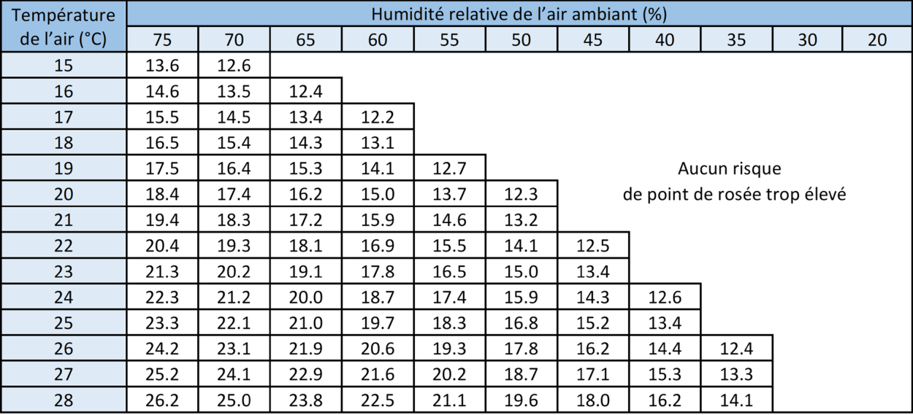

#### 53.55 Revêtements de sols souples [[entities/cctb|CCTB]] 01.12 

**DESCRIPTION** 

**Définition / Comprend**

Il s'agit de la fourniture (hors matériaux récupérés du même site) et de la pose de revêtements de sol souples résilients ou textiles en lés (linoléum, caoutchouc, PVC, textile...) ou en dalles sur une chape et/ou une aire de pose en bois ou toute autre support rigide adapté à la fixation. Les sols souples sont neufs ou de réemploi.  Conformément aux dispositions générales et/ou spécifiques du cahier spécial des charges, les prix unitaires compris dans ces postes comprennent toujours, soit selon la ventilation dans le métré récapitulatif, soit dans leur totalité : 

- la préparation de l'aire de pose, l'évacuation de tous les déchets, décombres, plâtre, graisse, etc.; 

- le contrôle préalable du taux d'humidité de l'aire de pose selon la méthode CM ; 

- l’égalisation obligatoire de la surface et son ponçage jusqu'à ce qu'elle soit bien lisse ; 

- la fourniture, la mise en place et le collage du revêtement de sol souple, le laminage des joints et des bords, la soudure (à chaud, à froid ou vulcanisation) des joints (voir § 7 de la [NIT 241]) ; 

- le nettoyage du revêtement de sol, y compris l’enlèvement du mastic superflu. 

**MATÉRIAUX** 

Les matériaux sont décrits en fonction des locaux où le revêtement est posé, les matériaux neufs livrés satisfont à la [NBN EN ISO 10874] : 

- classe 21, 22, 23 : locaux d'habitation d'usage faible à intensif (séjour, chambres à coucher, cuisine, …) ; 

- classe 31

- 32 : locaux de commerce et de bureau d'usage faible à normal ; 

- classe 33

- 34 : d'usage intensif à fort intensif (locaux communautaires, …). 

Si l’application antérieure est connue, les matériaux de sols souples de réemploi peuvent être utilisés pour des locaux de même usage ou d’usage moins contraignant. 

Les critères de performance sont établis conformément aux normes de référence précitées. Les échantillons nécessaires et la documentation avec la mention des spécifications requises pour les produits sont soumis préalablement pour approbation. 

Une nuance de couleur uniforme est garantie pour chaque local par la fourniture de rouleaux ou de carreau d'une seule et même charge. 

24 heures avant leur mise en œuvre, les rouleaux sont entreposés dans des locaux secs qui sont climatisés par l'entrepreneur à la température minimale de mise en œuvre (voir [NIT 241] §7, 15°C pour les revêtements textiles [voir [NIT 262] §7]). Tous les rouleaux sont dans la mesure du possible stockés verticalement. 

En matière de sécurité incendie, les revêtements de sol souples satisfont à certaines exigences en fonction de la destination du local dont ils font partie. (voir [NIT 241] et [NIT 262] § 4) 

Pour plus d'informations sur le choix du revêtement de sol souple, voir tableau 4 de la [NIT 241] pour les revêtements résilients et tableau 4 de la [NIT 262] pour les revêtements textiles. 

**Matériaux utilisés pour la mise en œuvre** 

Les primaires, les produits d'égalisation, les éventuels coatings pare-vapeurs et les colles correspondent à la description du § 6 de la [NIT 241] pour la pose des revêtements de sol résilients du § 6 de la [NIT 262] pour la pose des revêtements de sol textiles. 

Les produits d'égalisation donnent lieu à un faible retrait de séchage et sont compatibles avec l'aire de pose, la colle prescrite et le revêtement de sol, compte tenu des sollicitations mécaniques, physiques et chimiques attendues (nature du support, de la colle, perméabilité du revêtement de sol, sollicitations statiques et dynamiques). Les produits d'égalisation qui offrent la meilleure résistance sont ceux qui satisfont aux exigences des tests à la chaise roulante. 

Les primaires sont adaptés à la nature du support (e.a. chape), à la couche d'égalisation, à la colle et au revêtement de sol. Ils sont exempts de produits solvants, sauf si aucun autre produit équivalent n’est disponible.

Les colles sont adaptées à la nature du support et du revêtement de sol souple (tableaux 24 et 26 de la [NIT 241] pour les revêtements de sol résilients et tableaux 38 et 39 de la [NIT 262] pour les revêtements de sol textiles). Différents types de colle peuvent être appliqués : colles en dispersion, colles époxy et polyuréthanes, colle en dispersion avec ciment, colle en phase solvant … Le choix est déterminé en fonction des conseils donnés par le fabricant des revêtements de sol. Lorsque des exigences particulières sont imposées, par exemple en ce qui concerne la résistance au feu, les colles sont du même type que celles utilisées lors des essais de résistance au feu. 

**EXÉCUTION / MISE EN ŒUVRE** 

**Généralités** 

Les revêtements de sol sont posés suivant les recommandations de la [NIT 241] pour les revêtements résilients et de la [NIT 262] pour les revêtements textiles et conformément à la documentation technique accompagnant le produit. 

**Température- Taux D'humidité** 

La mise en œuvre nécessite une température minimale du support conforme aux valeurs mentionnées dans le tableau ci-dessous, dépendant des conditions ambiantes du local (cf. §7.5 de la [NIT 241] pour les revêtements résilients et §7.5 de la [NIT 262] pour les revêtements textiles). 

Au préalable à la pose, le taux d'humidité du support est mesuré à l'aide de la méthode CM et il convient de s'assurer que les exigences du § 5.2.2.5. de la [NIT 241] pour les revêtements résilients et du §5.2.2.5 de la [NIT 262] pour les revêtements textiles  sont satisfaites avant la pose des revêtements de sol souples. 

Pour l'humidité résiduelle, les valeurs empiriques suivantes sont d'application : 

|**Composition du sol**|**Temps de séchage**|**Humidité de compensation** **admissible en CM -%**|
|---|---|---|
|Chape à base de ciment|2

- 4 semaines selon l'épaisseur|≤ 2 %|
|Chape anhydrite|2

- 3 semaines selon l'épaisseur|≤ 0,5 %|
|Chape magnésite (sans matière de charge à base de bois)|3

- 4 semaines selon l'épaisseur|≤ 3 %|
|Chape magnésite (avec matière de charge à base de bois)|1

- 3 semaines selon l'épaisseur|≤ 8 %|
|Surface en béton||selon la méthode DARR)|
|Surfaces en bois||≤ 6 %|

Le support satisfait aux exigences du §5.2. de la [NIT 241] pour la pose des revêtements de sol résilients et du § 5.2 de la [NIT 262] pour la pose des revêtements de sol textiles. 

Les travaux préparatoires du support satisfont aux dispositions du § 7.2. de la [NIT 241] pour la pose des revêtements de sol résilients et du § 7.2. de la [NIT 262] pour la pose des revêtements de sol textiles. 

- L'aire de pose est préalablement débarrassée de toute poussière et saletés (restes de plâtre, ciment, peinture, bitume, cire, etc.), et bien brossée. Les éventuelles irrégularités, les parties non adhérentes ou déchirées, les fissures, etc. sont d'abord remplacées ou retouchées jusqu'à ce que l'on obtienne une surface propre, solide, plane et lisse. A noter que les travaux préparatoires repris dans le § 1.1. de la [NIT 241] pour la pose d'un revêtement de sol résilient et le § 1.1. de la [NIT 262] pour la pose d'un revêtement de sol textile (par exemple, traitement des fissures,..) ne sont pas considérés comme des travaux préparatoires standards et font l'objet d'un poste séparé. 

Les produits d'égalisation nécessaires et les éventuelles couches d'adhérence sont choisis et mis en œuvre selon les recommandations du fabricant. Pendant le durcissement, la couche d'égalisation est protégée contre les courants d'air, le rayonnement direct du soleil ou toute autre source de chaleur. Avant le durcissement, la chape n’est pas foulée. Le temps d'attente pour la mise en œuvre du revêtement de sol dépend des produits utilisés, de l'épaisseur de la couche, de la porosité et de la siccité de l'aire de pose ainsi que des conditions ambiantes. 

Les nouvelles aires de pose (chapes à base de ciment, …) sont d'abord égalisées afin d'obtenir une surface lisse et ce, à l'aide de produits d'égalisation adaptés. Afin d'améliorer l'adhérence, un primaire est au préalable appliqué. Pour les chapes liées à l'anhydrite, l'enlèvement d'une pellicule est prévue dans certains cas (à considérer comme un travail supplémentaire). 

Les anciennes aires de pose (par ex. les revêtements de sol en carreaux pour les travaux de rénovation) sont au préalable débarrassées des revêtements de sols en textile, vinyle, caoutchouc, liège , … Avant la mise en œuvre sur les revêtements de sol en carreaux, ceux-ci sont préalablement nettoyés et dégraissés avec un produit approprié.  Les opérations de préparation reprises dans la liste du § 5 de la [NIT 241] et la [NIT 262] sont sélectionnées. 

Les aires de pose en bois (planchers, parquets et sous-aires en plaques de fibres ou d'aggloméré) sont d'abord contrôlées quant à la fixation des éléments, leur état et leurs assemblages ou joints. Les éléments endommagés et/ou défaits sont remplacés et/ou fixés. Les éventuelles déformations et/ou irrégularités sont réparées ou rabotées. Pour les aires de pose sur gîtage, tous les joints sont obturés, surtout lorsqu'un revêtement perméable à l'air est prévu. Pour la mise en œuvre par collage direct, il peut s'avérer nécessaire d'enlever toutes les traces de peinture et de cire sur l'aire de pose avec des techniques et des produits appropriés. (cf. § 5.1.4. de la [NIT 241] pour la pose des revêtements de sol résilients et cfr. § 5.1.2. de la [NIT 262] pour la pose des revêtements de sol textiles). 

**Le collage** 

Les lés et les dalles sont préalablement acclimatés à la température ambiante (cfr. §7.4.3 de la [NIT 241] pour les revêtements résilients et §7.4.2 de la [NIT 262] pour les revêtements textiles). 

Le débitage des lés se fait conformément au § 7.6 des [NIT 241] et [NIT 262]. 

La pose collée des lés et des dalles est réalisée conformément au § 7.7 des [NIT 241] et [NIT 262]. 

Tous les lés sont posés dans le même sens, de préférence parallèlement à la lumière, selon l'indication des flèches au dos et/ou adaptés et/ou orientés de manière à créer le minimum de joints. On se réfère au §7.6.1.1. des  [NIT 241] et [NIT 262] dans le cas de la pose de lés. Pour les dalles, on se réfère au §7.6.2. des [NIT 241] et [NIT 262] pour les opérations préalables à leur pose. 

Après le séchage de la colle, les revêtements de sol sont nettoyés et débarrassés de toute impureté et des taches, y compris l'enlèvement du mastic superflu (§8.4.1. des [NIT 241] et  [NIT 262]). 

**CONTRÔLES** 

Aucune différence de hauteur n’est tolérée entre deux lés juxtaposés. Les bulles d'air, les bords non adhérents, etc. ne sont pas admis et entrainent le refus des ouvrages.

**DOCUMENTS DE RÉFÉRENCE** 

**Matériau** 

[NBN EN 12466, Revêtements de sol résilients - Vocabulaire] 

[NBN EN ISO 26987, Revêtements de sol résilients

- Détermination de la résistance au tâchage et aux produits chimiques (ISO 26987:2008)] à [NBN EN ISO 23996, Revêtements de sol résilients

- Détermination de la masse volumique (ISO 23996:2007)] 

[NBN EN 684, Revêtements de sol résilients - Détermination de la résistance de la soudure] 

[NBN EN ISO 10874, Revêtements de sol résilients, textiles et stratifiés - Classification (ISO 10874:2009)] 

[NBN EN 1399, Revêtements de sol résilients - Détermination de la résistance aux brûlures de cigarettes et aux cigarettes écrasées] 

[NBN EN 1815, Revêtements de sol résilients et stratifiés - Évaluation à la propension à l'accumulation de charges électrostatiques] 

[NBN EN 1081:2018+A1, Revêtements de sol résilients, stratifiés et multicouches modulaires - Détermination de la résistance électrique] 

**Exécution** 

[NIT 241, Mise en oeuvre des revêtements de sol résilients (remplace partiellement la NIT 165).] 

[NIT 262, Code de bonne pratique pour la pose des revêtements de sol textiles]
