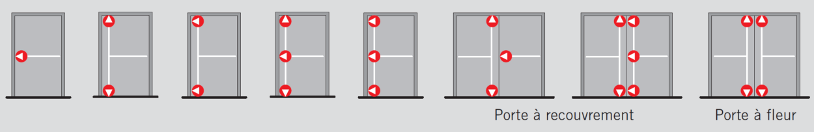
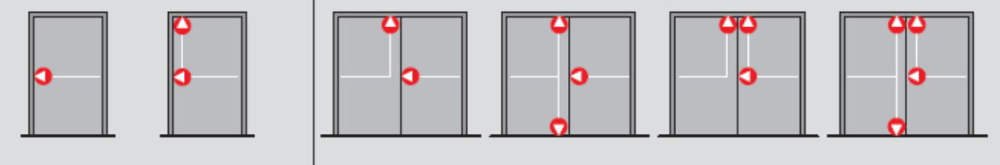

##### 55.62.4 Système d'ouverture [[entities/cctb|CCTB]] 01.02 

###### 55.62.4 a Système d'ouverture mécanique [[entities/cctb|CCTB]] 01.02 

###### 55.62.4 b Système d'ouverture - barres anti-panique [[entities/cctb|CCTB]] 01.11

**DESCRIPTION** 

**Définition / Comprend** 

Il s’agit de la fourniture (hors matériaux récupérés du même site) et la pose de barres anti-panique . 

Le travail comprend notamment : 

- la prise de mesures ; 

- les plans de fabrication à soumettre à l’auteur de projet pour approbation ; 

- la fourniture (hors matériaux récupérés du même site) ; 

- la préparation de surface, l’adaptation de la porte, huisserie ; 

- la pose et le réglage ,  le placement des ensembles et des éléments de raccords ; 

- les éventuelles mesures de protection provisoires ; 

- le nettoyage de la surface. 

**MATÉRIAUX** 

**Caractéristiques générales** 

Les systèmes de fermeture anti-panique sont définis dans la norme [NBN EN 1125]. 

Les dispositifs anti-panique sont de : type A (par défaut) / type B 

**(Soit par défaut)** 

Type A :  le dispositif est muni d’une barre de poussée fixée entre des leviers support pivotants et qui fonctionne dans la direction de la sortie et/ou dans un arc de cercle vers le bas. 

**(Soit)** 

Type B :  le dispositif est muni d’une barre d’enfoncement conçue pour faire partie d’un support ou d’un autre système de montage et qui fonctionne dans la direction de la sortie. 

- Pêne(s) en acier (par défaut) / zinc / alliage d’aluminium chromé / ***. 

- Gâche(s) en acier (par défaut) / zinc / alliage d’aluminium chromé / ***. 

- Forme de la barre : ovale (par défaut)  / carrée (barre de pression). 

- Réversible (par défaut) / droite / gauche. 

- Dispositif de sécurité anti-intrusion empêchant de pousser le pêne de la serrure extérieur : oui (par défaut) / non. 

- Possibilité de maintenir la barre anti-panique déverrouillée : oui (par défaut) / non. 

- Nombre de points de verrouillage : 

**Portes à un vantail :** 

Nombre de points de verrouillage : 1 (par défaut) / 2 / 3. 

**(Soit par défaut)** 

1 point de verrouillage, orienté horizontalement. 

**(Soit)** 

2 points de verrouillage (haut et bas), orientés horizontalement / verticalement. 

_**(Soit)**_ 

3 points de verrouillage (central, haut et bas), orientés horizontalement pour le central, horizontalement / verticalement aux extrémités. 

**Portes à deux vantaux :**

- Vantail secondaire (semi-fixe) : 2 points de verrouillage (haut et bas), orientés verticalement. 

- Vantail principal (de service) : 

Nombre de points de verrouillage : 1 (par défaut) / 2 / 3. 

**(Soit par défaut)** 

1 point de verrouillage, orienté horizontalement. 

**(Soit)** 

2 points de verrouillage (haut et bas), orientés horizontalement. 

**(Soit)** 

3 points de verrouillage (central, haut et bas), orientés horizontalement 

Les dispositifs anti-panique sont : 

- Le dispositive est muni de système anti-pincement. 

- Les dispositifs de fixations sont non-visibles (par défaut) / visibles. 

- La gâche de sol est réglable pour verrouillage de la crémone basse. 

- Pour les portes à deux vantaux, la gâche de sol pour verrouillage de la crémone basse est prévue sur le vantail semi-fixe. 

- Fonctions de la serrure : accès contrôlé / passage libre / accès commutable (par défaut) / ***. 

Les systèmes d’ouverture anti-panique sont neufs (par défaut) / de réemploi. 

_**(Soit par défaut)**_ 

Neufs : 

Barre horizontale de man **œ** uvre anti-panique avec une barre de poussée fixée sur des leviers de supports pivotants et qui fonctionne dans la direction de la sortie et/ou dans un arc de cercle vers le bas.  Les portes neuves sont conformes à la norme [NBN EN 1125] 

Les dispositifs automatiques d’empennage répondent à une résistance à l’endurance grade 6 (100 000 cycles) (par défaut) / grade 7 (200 000 cycles) 

Résistance à la surcharge: la barre résiste à une force de 1000N ; la tringle verticale montée en applique résiste à une force de traction de 500 N. 

Sécurité des biens: la fermeture d’urgence reste en position verrouillée et  conserve la porte en position verrouillée lorsqu’elle est soumise à une force de 1000 N pour atteindre le grade 2 conformément à la [NBN EN 1125]. 

Résistance à la corrosion: Les béquilles ou plaque de poussée résiste à la corrosion telle que définie dans la norme [NBN EN 179]. 

**Béquille :** Dispositif d’ouverture d’urgence avec manœuvre par béquille. Il s’agit du dispositif de type A selon la norme [NBN EN 179]. 

**Plaque de poussée :** Dispositif d’ouverture d’urgence avec manœuvre par plaque de poussée. Il s’agit du dispositif de type B selon la norme [NBN EN 179]. 

- Les dispositifs béquilles ou plaque de poussée répondent à une résistance à l’endurance grade 6 (100 000 cyles) (par défaut) / grade 7 (200 000 cycles). 

- Fermeture d’urgence manœuvrée: l’élément résiste à une force perpendiculaire de 1000 N et à une force verticale de 500 N.

- La tringle verticale est montée en applique sans capot (par défaut) / en applique sans capot / intégrée à l’élément / ***. 

- Sécurité des biens: la fermeture d’urgence reste en position verrouillée et  conserve la porte en position verrouillée lorsqu’elle est soumise à une force de  1000 N pour atteindre le grade 2 (par défaut) / 2000 N pour atteindre le grade 3 / 3000 N pour atteindre le grade 4 / 5000 N pour atteindre le grade 5. 

- Résistance à la corrosion: Les béquilles ou plaque de poussée résiste à la corrosion telle que définie dans la norme [NBN EN 179]. 

**(Soit)** 

Réemploi : il s’agit de barres antipaniques de réemploi comme alternative aux éléments neufs. 

Résistance à la surcharge: la barre résiste à une force de 1000N ; la tringle verticale montée en applique résiste à une force de traction de 500 N. 

Les références, fiches et déclarations d’aptitude à l’utilisation décrite au chapitre 02.42.1 Critères d'acceptabilité déposés dans le cadre du chantier initial sont soumis à l’analyse du maitre d’ouvrage avant validation 

Les barres antipanique de réemploi sont nettoyées et graissées avant mise en œuvre. 

Type de barre anti-panique : modulable ou de pression (par défaut) / encastré dans une porte. 

**(Soit par défaut)** 

Barre anti-panique modulable ou de pression : 

La barre anti-panique modulable ou de pression est montée en applique sur la porte avec les points de verrouillage. La commande du mécanisme se fait en poussant la barre horizontale ou de pression qui rétracte le(s) pêne(s) et déverrouille la porte. 

**(Soit)** 

- Dispositif anti panique encastré dans une porte : 

Le dispositif anti-panique avec serrure et crémone est encastré dans une porte à cadre tubulaire ou isoplane. La commande du mécanisme se fait en poussant la barre horizontale qui rétracte le(s) pêne(s) et déverrouille la porte. 

Il s’agit de la fourniture et de la pose (par défaut) / uniquement de la pose 

**(Soit par défaut)** 

Fourniture et pose : Les barres antipaniques sont fournies par l’entreprise. 

**(Soit)** 

Pose : Les barres antipaniques sont fournies par le Maitre d’ouvrage. Dans le cas d’un démontage sur chantier pour réutilisation du matériau, se référer aux éléments du 06.44.4 Démontages de menuiseries et vitrages intérieurs, 06.44.4b Démontages des portes et huisseries intérieures, 06.54.4 Démontages de menuiseries et vitrages intérieurs, 06.54.4b Démontages des portes et huisseries intérieures. 

**Finitions** 

Les tringles sont de couleur métallisée (par défaut) / grise / blanche / ***. 

Les dispositifs de manœuvre sont de couleur métallisée (par défaut) / grise / blanche / ***. 

Les pattes de fixation dans le vantail de la porte sont de couleur métallisée (par défaut) / noire / grise / blanche / ***. 

**Prescriptions complémentaires**

Le présent article comprend également : une poignée extérieure / un micro-interrupteur / une gâche électrique. 

**(Soit)** 

Poignée extérieure : À l’extérieur, une garniture avec béquille, prévue pour un ½ cylindre (par défaut) / béquille, sans verrouillage par clé / bouton fixe, sans verrouillage par clé / ***. 

**(Soit)** 

Micro interrupteur : pour commande d’information sonore ou visuelle. 

_**(Soit)**_ 

Gâche électrique : pour contrôle d’accès. 

Les alimentations électriques ne sont pas comprises dans cet article. Elles sont prévues dans les articles du 7 T7 Electricité. 

Cet article ne traite pas des serrures.. Elles sont décrites par défaut dans l’article [55.62.2a Serrures de portes](523_55.62.2_serrures_de_portes_cctb_01.02.md). 

**EXÉCUTION / MISE EN ŒUVRE** 

**Prescriptions générales** 

- Les fixations sont réalisées par vis (par défaut) / vis traversantes et munies de cache du côté opposé / ***. 

- 

- La fermeture anti-panique pour issues de secours est placée en saillie maximale de 150 mm (catégorie 1) (par défaut) / ou 100 mm (catégorie 2). 

Le réglage du dispositif de fermeture est réalisé afin de ne pas réduire la manœuvre des vantaux. 

- Fermetures anti-panique sont montées du côté du chemin de fuite 

- La fermeture permet à la porte de battre librement dans la direction de la sortie une fois la porte déverrouillée 

- La force de fermeture est spécifiée telle que : 

   - première ouverture, sans aucune charge sur le vantail. La porte s’ouvre avec un effort inférieur à de 80 N 

   - deuxième ouverture, avec  une charge de 1000 N est exercée sur le vantail. La force maximale nécessaire à l’ouverture est inférieure à 220 N 

   - 

- Force de réengagement: force requise pour enclencher un dispositif automatique d’empennage dans le but de réengager la fermeture anti-panique pour issues de secours en position verrouillée ≤ 50N 

- Force d’ouverture: la norme fixe la force requise pour déverrouiller les fermetures d’urgence manœuvrées par 

   - Béquille (type A) : max. 70 N 

   - Plaque de poussée (type B) : max. 150 N 

**DOCUMENTS DE RÉFÉRENCE COMPLÉMENTAIRES** 

**Matériau**

[NBN EN 179, Quincaillerie pour le bâtiment

- Fermetures d'urgence pour issues de secours manœuvrées par une béquille ou une plaque de poussée, destinées à être utilisées sur des voies d'évacuation

- Exigences et méthodes d'essai] 

[NBN EN 1125, Quincaillerie pour le bâtiment

- Fermetures anti-panique manœuvrées par une barre horizontale, destinées à être utilisées sur des voies d'évacuation

- Exigences et méthodes d'essai] 

**Exécution** 

[AR 1994-07-07, Arrêté royal fixant les normes de base en matière de prévention contre l'incendie et l'explosion, auxquelles les bâtiments nouveaux doivent satisfaire] 

[SWL GSI/T1/A, Guides sécurité incendie

- Tome 1 Prévention passive

- Guide A Organisation spatiale des bâtiments] 

[SWL GSI/T1/B, Guides sécurité incendie

- Tome 1 Prévention passive

- Guide B Réaction au feu] 

[SWL GSI/T1/C, Guides sécurité incendie

- Tome 1 Prévention passive

- Guide C Résistance au feu] 

[SWL GSI/T2/A, Guides sécurité incendie

- Tome 2 Prévention active

- Guide A Moyens de détection incendie] 

[SWL GSI/T2/B, Guides sécurité incendie

- Tome 2 Prévention active

- Guide B Moyens d'extinction] 

[SWL GSI/T2/C, Guides sécurité incendie

- Tome 2 Prévention active

- Guide C Eclairage de sécurité] 

[SWL CALA, Guide d’aide à la conception d’un logement adaptable] 

[GRU 2016-07-20, Guide Régional d'Urbanisme] (chapitre 4) 

MESURAGE 

**unité de mesure:** 

- (par défaut) / pc 

_**(Soit par défaut)**_ 

**1.  -** 

**(Soit)** 

**2.  pc** 

**code de mesurage:** 

Sauf indications spécifique contraire dans le cahier spécial des charges et./ou le métré récapitulatif, le prix de toute la quincaillerie sera compris dans le prix unitaire de la menuiserie extérieure (profilés ) 

Exceptionnellement et moyennant mention expresse dans le cahier spécial des charges et le métré récapitulatif, la quincaillerie spéciale peut être reprise comme poste séparé (par ex. ferme-porte / barre anti-panique / serrures électriques / ...). 

Distinction faite entre barres neuves et de réemploi, avec ou sans fourniture pour ces dernières. 

Compris (par défaut) / Quantité nette 

**(Soit par défaut)** 

1. Compris dans l'article *** y compris les accessoires, tringlerie, fixations, et caches. 

_**(Soit)**_

2. Quantité nette y compris les accessoires, tringlerie, fixations, et caches. 

**nature du marché:** 

PM (par défaut) / QF 

**(Soit par défaut)** 

1.PM 

**(Soit)** 

2.QP 

**AIDE** 

Nombre de points de fermeture des systèmes en applique : 

Nombre de points de fermeture des systèmes encastrés dans une porte : 

**Fonction accès contrôlé :** 

Pour les portes exigeant un contrôle d’accès systématique de l’extérieur. 

Un demi-tour de la clé dans le cylindre empêche l’ouverture de la porte depuis l’extérieur. 

L’ouverture de la porte de l’intérieur, par action sur la barre anti-panique, est toujours possible. 

Suite à un déverrouillage anti-panique, le pêne dormant est maintenu rétracté et peut être à nouveau verrouillé par action de la clé dans le cylindre. Le demi-tour empêche toujours l’ouverture de la porte depuis l’extérieur. 

**Fonction passage libre :** 

Pour les portes à passage temporaire nécessaire de l’extérieur. L’ouverture de la porte de l’intérieur, par action sur la barre anti-panique, est toujours possible. Un bouton de porte fixe se trouve côté extérieur. 

Après l’activation de la fonction anti-panique, l’accès libre et temporaire du côté extérieur est automatiquement rendu possible. Suite à un déverrouillage anti-panique, le pêne dormant est maintenu rétracté et peut être verrouillé à nouveau par action de la clé dans le cylindre. Une béquille est située côté extérieur, le demi-tour se rétracte systématiquement grâce à l’action sur la béquille. 

**Fonction accès commutable :**

Pour les portes à contrôle d’accès temporaire de l’extérieur. L’ouverture de la porte de l’intérieur, par action sur la barre anti-panique, est toujours possible. Un bouton de porte fixe se trouve côté extérieur. 

Suite à un déverrouillage anti-panique, le pêne dormant est maintenu rétracté et peut être verrouillé à nouveau par action de la clé dans le cylindre. Une béquille est située côté extérieur. La béquille peut être couplée/découplée, à l’aide d’une action spéciale dans la serrure, via la clé. L’accès depuis l’extérieur est alors autorisé, soit en passage libre temporaire, soit en passage contrôlé. La béquille reste couplée en passage libre temporaire jusqu’à ce qu’un nouveau verrouillage ait lieu. 

###### 55.62.4 c Système d'ouverture électronique [[entities/cctb|CCTB]] 01.11 

**DESCRIPTION** 

**Définition / Comprend** 

Il s’agit de la fourniture et la pose de systèmes d’ouverture électronique. 

Le travail comprend notamment : 

- l’établissement du bordereau des portes pourvues du système d’ouverture électronique ; 

- la fourniture du programme de gestion du système d’ouverture électronique ; 

- la formation du gestionnaire du bâtiment ; 

- la fourniture et pose des serrures / cylindres / lecteurs de badge ; 

- le raccordement à l’installation de contrôle d’accès : oui / non ; 

- fourniture des moyens de commande : badges / clés / compris au 76.26 Contrôle d’accès ; 

- la formation, par l’entreprise, du gestionnaire du bâtiment / du personnel de l’utilisateur final. 

Un contrat d’entretien et de gestion est proposé par l’entreprise : oui / non 

**MATÉRIAUX** 

**Caractéristiques générales** 

Usage : intérieur (par défaut) / IP54 / IP56 / *** 

Système compatible avec portes suivant [NBN EN 1634-1 :2014+A1] : EI1 00 / EI1 30 / EI1 60 

Système : hors ligne / en ligne commandé par le contrôle d’accès suivant 72.26 Contrôles d'accès - équipements 

Fonctionnement : application PC / application web / application smartphone / relié au contrôle d'accès 

Communication par : Wifi / RFID / Bluetooth / NFC / câblage 

Possibilité d’ouverture à distance : oui / non 

Alarme intégrée : non (par défaut) / oui 

**(soit par défaut)** 

Non : pas d’application 

**(soit)** 

Oui : report d’alarme vers : la centrale de contrôle d’accès (par défaut) / un numéro de téléphone / plusieurs numéros de téléphone en cascade. 

Système :  serrure (par défaut) / cylindre avec clé électronique / cylindre avec lecteur intégré / béquille à code / serrure électrique commandée suivant 72.26 Contrôles d'accès - équipements 

**(soit par défaut)** 

**Serrure :** 

- Type de serrure : à pile (par défaut) / à batterie rechargeable en usb-C 

- Serrure avec projection automatique du pêne dormant : oui / non 

- Fonction antipanique : oui / non

- Lecteur dans : la rosace longue (par défaut) / la poignée / un boîtier à proximité de la porte / *** 

- Signal : led (par défaut) / led et sonore / sonore 

- Commande par : badge (par défaut) / code / smartphone 

- Nombre de badges par serrure : 3 (par défaut) / pas d’application / *** 

- Finition : inox mat (par défaut) / laiton mat / *** 

**(soit)** 

**Cylindre avec clé électronique :** 

- Type de cylindre : double avec clé électronique côté sécurisé (par défaut) / double avec clé électronique des 2 côtés / à bouton du côté non sécurisé / *** 

- Signal : led (par défaut) / led et sonore / sonore 

- Moyen de programmation des clés : application smartphone (par défaut) / local / mural / *** 

- Nombre de clés par cylindre : 3 (par défaut) / *** 

- Intégré dans la serrure telle que décrite au [55.62.2a Serrures de portes](523_55.62.2_serrures_de_portes_cctb_01.02.md) 

**(soit)** 

**Cylindre avec lecteur intégré :** 

- Type : double avec lecteur côté sécurisé (par défaut) / double avec lecteur des 2 côtés / à bouton du côté non sécurisé / *** 

- Signal : led (par défaut) / led et sonore / sonore 

- Commande par : badge (par défaut) / smartphone 

- Nombre de badges par cylindre : 3 (par défaut) / pas d’application / *** 

- Intégré dans la serrure telle que décrite au [55.62.2a Serrures de portes](523_55.62.2_serrures_de_portes_cctb_01.02.md) 

**(soit)** 

**Béquille à code :** 

- Type : à piles 

- Signal : led (par défaut) / led et sonore 

- Finition : acier inox brossé (par défaut) / *** 

- Placée sur la serrure telle que décrite au [55.62.2a Serrures de portes](523_55.62.2_serrures_de_portes_cctb_01.02.md) 

**Serrure électrique commandée par le contrôle d’accès :** 

- Type de serrure : solénoïde / motorisée 

- Serrure avec projection automatique du pêne dormant : oui / non 

- Point de fermeture : 1 (par défaut) / 3 points 

- Fonctionnement : par rupture de courant (par défaut) / par impulsion de courant 

- Serrure avec projection automatique du pêne dormant : oui / non 

- Fonction antipanique : oui / non 

- Commande par contrôle d’accès suivant 72.26 Contrôles d'accès

- équipements 

- Finition : inox mat (par défaut) / laiton mat / *** 

**EXÉCUTION / MISE EN ŒUVRE** 

**Prescriptions générales** 

Le système d’ouverture électronique est configuré par l’entrepreneur dans le programme de gestion fourni avec le système. 

**DOCUMENTS DE RÉFÉRENCE COMPLÉMENTAIRES** 

**Matériau** 

[NBN EN 1634-1 :2014+A1, Essais de résistance au feu et d'étanchéité aux fumées des portes, fermetures, fenêtres et éléments de quincailleries - Partie 1: Essais de résistance au feu des portes, fermetures et fenêtres]

**MESURAGE** 

**unité de mesure:** 

pc (par défaut) / fft 

**(soit par défaut)** 

1. pc 

**(soit)** 

2. fft 

**code de mesurage:** 

A la pièce (par défaut) / Pour l'ensemble 

**(soit par défaut)** 

1. A la pièce : quantité nette : système d’ouverture électronique : pièce distinction faite du type 

**(soit)** 

2. Pour l'ensemble : contrat d’entretien 

**nature du marché:** 

QF (par défaut) / PG 

**(soit par défaut)** 

1. QF 

**(soit)** 

2. PG : prix global / an du contrat d’entretien 

###### 55.62.4 d Système d'ouverture électromagnétique [[entities/cctb|CCTB]] 01.13 

**DESCRIPTION** 

**Définition / Comprend** 

Il s’agit de la fourniture, de la pose et du raccordement d’un système électromagnétique qui une fois déverrouillé permet l’ouverture de la porte intérieure sur laquelle il est posé. 

Le travail comprend notamment : 

- Le dispositif électromagnétique proprement dit 

- Les équipements qui y sont associés (contre-plaque, capots, équerres, …) 

- Les éventuels accessoires décrits ci-après. 

L’alimentation électrique du système est décrite et comptée aux 7 T7 Electricité.et suivants. 

Le dispositif de commande associé au système électromagnétique à mettre en place est notamment décrit et compté aux 66 Lutte contre l'incendie (LCI) et/ou 72.26 Contrôles d'accès - équipements et suivants. 

**MATÉRIAUX** 

**Caractéristiques générales** 

Le dispositif d’ouverture (par libération du verrouillage électromagnétique) présente notamment les caractéristiques suivantes : 

**Généralités :** 

- Principe de fonctionnement : système à rupture de tension. 

- Pour montage : encastré / en applique ; frontal / latéral 

- Pour une porte : 

   - simple action / coulissante / va et vient / selon les indications aux plans / *** 

   - avec 1 / 2 vantail(aux) 

- Modèle destiné à une : 

   - issue de secours : oui / non

- porte résistante au feu : oui / non 

- Corps symétrique, pour montage réversible gauche – droite. 

- Avec protection contre le magnétisme résiduel / effets de self. 

- *** 

**Spécifications :** 

- Tension d’alimentation : 12 – 24 / *** Vcc 

- Consommation ± : 370 / 500 / *** mA à 12 Vcc ; 185 / 250 / *** mA à 24 Vcc 

- Dispositif pré-raccordé : avec un câble ≥ 1 / 5 / *** m / non 

- Force de rétention magnétique ≥ : 1800 / 3000 / 7500 / *** N 

- Type à cisaillement (shearlock) : oui / non 

- *** 

**Equipements :** 

- Signalisation de l’état : oui, rouge-vert / non / *** 

- Temporisation : oui / non 

- Contacts relais : oui, C-NF–NO / non / *** 

- *** 

**Accessoires :** 

- Plaque de montage pour porte coupe-feu : oui / non 

- Equerre de montage : oui, en L / Z / *** / non 

- Cavalier en U pour portes en verre : oui, pour une épaisseur de verre de 8 / 10 / 12 / *** mm / non 

- *** 

**Dimensions ± :** 

- Corps ventouse (LxlxP) : 165x40x22 / 225x65x45 / *** mm 

- Contre-plaque (LxlxP) : 135x30x8 / 190x60x16 / *** mm 

**Matériau :** 

- Boîtier : aluminium anodisé / acier inox AISI 316 / métal peint / *** 

- Contre-plaque : acier haute qualité supprimant toute rémanence, même à long terme / *** 

**Finitions** 

- Boîtier : matériau naturel / anodisé bronze / ton au choix de la direction des travaux dans la gamme standard du fabricant / *** 

- Contre-plaque : matériau naturel / ton au choix de la direction des travaux dans la gamme standard du fabricant / *** 

**EXÉCUTION / MISE EN ŒUVRE** 

**Prescriptions générales** 

L’entrepreneur s’assure que le dormant et l’ouvrant soient adaptés au dispositif électromagnétique à placer. 

Le dispositif électromagnétique n’entrave en rien les mouvements du(des) vantail(aux). 

Le câblage est entièrement dissimulé. 

Les fixations sont adaptées aux matériaux de la menuiserie et réalisées selon la documentation technique qui accompagne le produit. 

Porte fermée, la contreplaque est parfaitement alignée à l'électro-aimant et y adhère entièrement. 

Raccordement / mise en service / tests / réglages : 

L’entrepreneur :

- coordonne ses prestations avec les différents intervenants et notamment avec l’entreprise chargée de la mise à disposition de l’alimentation électrique. 

- réalise les raccordements nécessaires. 

- met le dispositif en service. 

- effectue tous les tests et réglages nécessaires au parfait fonctionnement. 

**DOCUMENTS DE RÉFÉRENCE COMPLÉMENTAIRES** 

**Matériau** 

[NBN EN 13637, Quincaillerie pour le bâtiment

- Systèmes de fermeture contrôlés électriquement destinés à être utilisés sur des voies d'évacuation

- Exigences et méthodes d'essai] 

[NBN EN 14637, Quincaillerie pour le bâtiment

- Systèmes de retenue contrôlés électriquement pour blocs-portes, coupe-feu ou pare-fumée

- Exigences, méthode d'essai, mise en oeuvre et maintenance] 

**MESURAGE** 

**unité de mesure:** 

pc (par défaut) / - 

**(soit par défaut)** 

1.2. pc 

**(soit)** 

3. - 

**code de mesurage:** 

Quantité nette (par défaut) / Compris 

**(soit par défaut)** 

1.2. Quantité nette : 

Comptée selon le nombre d’éléments à placer. 

Eventuellement scindée dans différents postes selon le type. 

**(soit)** 

3. Compris : 

Tous les frais liés à ces prestations sont compris dans le prix de l’installation électrique (par défaut) / compris dans le prix de(s) l’article(s) *** 

**nature du marché:** 

QF (par défaut) / QP / PM 

**(soit par défaut)** 

1. QF 

**(soit)** 

2. QP 

**(soit)** 

3. PM
