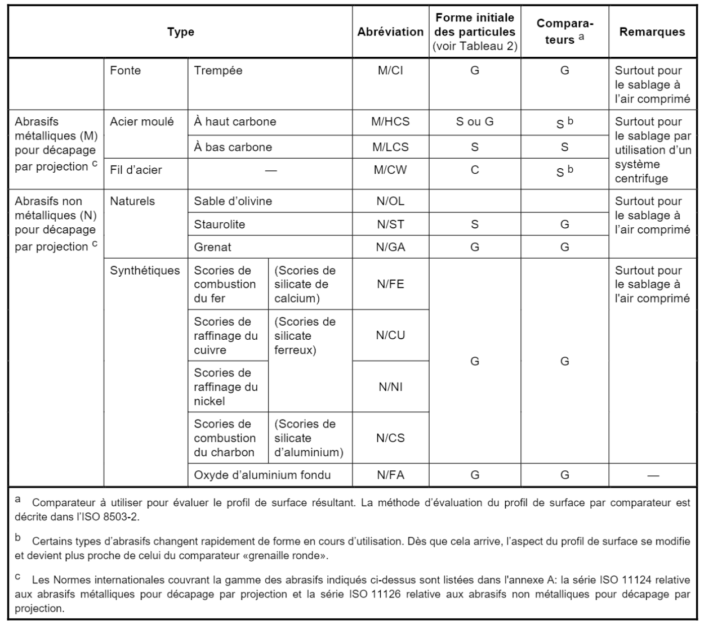
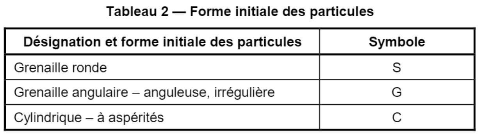

##### 81.31.2 Grenaillage - Sablage / Ponçage / Dérouillage [[entities/cctb|CCTB]] 01.02 

[81.31.2 a Grenaillage - sablage intérieur sur supports métalliques ferreux [[entities/cctb|CCTB]] 01.11](61_81.31.2_grenaillage_-_sablage_ponçage_dérouillage_cctb_01.02.md)

**DESCRIPTION** 

**Définition / Comprend** 

Il s’agit des prescriptions de décapage par projection d'abrasif pour la préparation des subjectiles métalliques ferreux avant application de peintures et de produits assimilés, conformément aux prescriptions de la norme [NBN EN ISO 8504-2]. 

**Localisation** 

*** Référence support : . 

Voir plans et métrés détaillés. 

MATÉRIAUX

**Caractéristiques générales** 

**Abrasif** 

Nature : au choix de l’entrepreneur (par défaut) / M/CI / M/HCS / M/LCS / M/CW / N/OL / N/ST / N/GA / N/FE / N/CU / N/NI / N/CS / N/FA. 

Les abrasifs sont conformes aux exigences énoncées dans les séries de normes [NBN EN ISO 11124 série] et [NBN EN ISO 11126 série], et est exempts de constituants corrosifs et d'agents contaminants diminuant l'adhérence. 

Les abrasifs contaminés en permanence, par exemple ceux qui ne sont pas nettoyés avant recyclage, et les abrasifs produits à partir de scories granulées par refroidissement dans l'eau salée (eau de mer) doivent être écartés, à cause de leurs effets nocifs sur les subjectiles d’acier décapés. 

**EXÉCUTION / MISE EN ŒUVRE** 

**Prescriptions générales** 

En cas d’application de peintures décoratives couvertes par la [NIT 249], ces opérations ne sont pas prévues pour être effectuées par défaut par le peintre décorateur. Elles sont effectuées en atelier. 

**Préparation avant grenaillage-sablage** 

Un contrôle visuel est opéré pour détecter la présence d'huile, de graisse, de sels ou d’agents contaminants similaires. Tout dépôt est éliminé par un procédé de dégraissage ou de lavage conformément aux articles [81.31.1a Nettoyage intérieur des supports métalliques ferreux](60_81.31.1_nettoyage_dégraissage_cctb_01.10.md), [81.31.1b Dégraissage intérieur des supports métalliques ferreux](60_81.31.1_nettoyage_dégraissage_cctb_01.10.md)ou  [81.31.1c Élimination intérieure des sels de zinc (aciers galvanisés) sur supports métalliques ferreux](60_81.31.1_nettoyage_dégraissage_cctb_01.10.md). 

Ces articles sont compris dans le présent article. 

Les couches épaisses de rouille et de calamine qui adhèrent fermement sont d’abord éliminées par nettoyage manuel ou mécanique conformément à l’article [81.31.2b Ponçage - dérouillage intérieur sur supports métalliques ferreux](61_81.31.2_grenaillage_-_sablage_ponçage_dérouillage_cctb_01.02.md). 

Les zones qui ne sont pas décapées sont masquées et protégées. 

Degré de préparation des imperfections des soudures, arêtes et subjectiles en général [NBN EN ISO 8501-3] : 

_Soudures :_ 

- Projections de soudure : P1 / P2 (par défaut) / P3. 

- Cordons / profils de soudure : P1 / P2 (par défaut) / P3. 

- Scories : P1 / P2 (par défaut) / P3. 

- Pores : P1 / P2 (par défaut) / P3. 

- Cratères de fin de cordon : P1 / P2 (par défaut) / P3. 

_Arêtes :_ 

- Arêtes arrondies : P1 / P2 (par défaut) / P3. 

- Arêtes par poinçonnage, cisaillage, sciage ou forage : P1 / P2 (par défaut) / P3. 

- Arêtes par découpe thermique : P1 / P2 (par défaut) / P3. 

**Subjectiles en général :** 

- Piqûres et cratères : P1 / P2 (par défaut) / P3. 

- Ecaillage : P1 / P2 (par défaut) / P3. 

- Défauts de laminage : P1 / P2 (par défaut) / P3. 

- Corps étrangers incrustés : P1 / P2 (par défaut) / P3. 

- Entailles et rainures produites par action mécanique : P1 / P2 (par défaut) / P3. 

- Indentations et traces de rouleaux : P1 / P2 (par défaut) / P3. 

**Grenaillage-sablage**

Il est procédé au sablage en fonction de la technique choisie ci-dessous, pour obtenir le degré de préparation requis. 

La distribution granulométrique d'abrasif est laissée au choix de l’entrepreneur, en fonction de la pièce à traiter, des caractéristiques de l'appareillage et du degré de préparation requis. 

II est recommandé de procéder à des essais préliminaires de décapage pour déterminer l’abrasif le plus efficace, le degré de préparation du subjectile et le profil de surface obtenus. 

Si l’entrepreneur utilise un abrasif recyclé pour la préparation du subjectile, il est nécessaire d’effectuer un essai préliminaire avec le même matériau, car un nouvel abrasif donne des résultats erronés. 

Le niveau de préparation de surface (Sa2,5 ou Sa3) et la nécessité d’un sablage sont liés par défaut au système de finition spécifié dans l’élément

[81.31 Préparations de surface des métaux ferreux (aciers ordinaires, galvanisés, inoxydables, métallisés, alliés, spéciaux, fonte).](59_81.31_préparations_de_surface_des_métaux_ferreux_aciers_ordinaires_galvanisés_inoxydables_métallisés_alliés_spéciaux_fonte_cctb_01.11.md)

- Technique de sablage [NBN EN ISO 8504-2] : au choix de l’entrepreneur (par défaut) / sablage à sec par système centrifuge (uniquement en atelier) / sablage à sec par système à air comprimé / sablage à sec par système à air comprimé avec récupération par aspiration / sablage à l’abrasif par air comprimé humide / sablage par air comprimé à l’abrasif humide / sablage humide à grains très fins / sablage par liquide sous pression / ***. 

- Degré de préparation primaire (total) des subjectiles après traitement de sablage, suivant l’annexe A de la  [NBN EN ISO 12944-4] et [NBN EN ISO 8501-1] : Sa 2,5 (pour peinture) / Sa 3 (pour la métallisation) (par défaut) / ***. 

- Profil de surface (rugosité) [NBN EN ISO 8503-1] : grossier (G ou S) / moyen (G ou S) (par défaut) / fin (G ou S). 

**Après grenaillage-sablage** 

Après grenaillage-sablage, le subjectile est nettoyé. 

Méthode de nettoyage : au choix de l’entrepreneur (par défaut) / après sablage à sec / après sablage humide. 

**(soit par défaut)** 

**Au choix de l’entrepreneur** 

Le nettoyage après sablage des subjectiles est laissé au choix de l’entrepreneur, en fonction de la technique qu’il a utilisée, suivant les prescriptions ci-dessous, ou toute autre technique moyennant une attestation de l’entrepreneur certifiant un résultat équivalent. 

**(soit)** 

**Après sablage à sec** 

La poussière qui adhère peu, les débris et l'abrasif sont éliminés du subjectile par aspiration, par brossage ou par un jet d'air comprimé exempt d'huile et d'humidité. 

Le subjectile est ensuite nettoyé à l'aide d'un jet de vapeur, à l'eau chaude et propre, contenant un nettoyant adéquat. 

Pour terminer, un rinçage à l'eau claire et un séchage immédiat sont réalisés. De l'air comprimé exempt d'huile et d'humidité ou d'autres moyens (par exemple de l'air chauffé) peuvent être utilisés pour accélérer le séchage du subjectile. 

**(soit)** 

**Après sablage humide** 

Le subjectile est lavé à l'eau propre, pour éliminer les abrasifs et résidus qui adhèrent peu, suivi d’un séchage immédiat. De l'air comprimé exempt d'huile et d'humidité ou d'autres moyens (par exemple de l'air chauffé) sont utilisés pour accélérer le séchage du subjectile. 

**Notes d’exécution complémentaires** 

Le présent article comprend également : un détergent dans le sablage humide.

- Détergent dans le sablage humide 

Un détergent adéquat est ajouté au liquide pour aider à éliminer les graisses, huiles, salissures et sels solubles pendant l'opération de grenaillage-sablage. 

**CONTRÔLES PARTICULIERS** 

Tous les subjectiles nettoyés sont évalués conformément aux normes [NBN EN ISO 8501-1] et [NBN EN ISO 8501-2] et leurs suppléments informatifs qui contiennent des photographies illustrant les changements de couleur subis par l'acier décapé à sec, avec différents abrasifs métalliques et non métalliques. 

En cas de non-conformité, l'opération est répétée. 

**DOCUMENTS DE RÉFÉRENCE COMPLÉMENTAIRES** 

**Matériau** 

[NBN EN ISO 8504-2, Préparation des subjectiles d'acier avant application de peintures et de produits assimilés

- Méthodes de préparation des subjectiles

- Partie 2: Décapage par projection d'abrasif (ISO 8504-2:2019)] 

[NBN EN ISO 11124 série, Préparation des supports d'acier avant application de peintures et de produits assimilés - Spécifications pour abrasifs métalliques destinés à la préparation par projection] 

[NBN EN ISO 11126 série, Préparation des subjectiles d'acier avant application de peintures et de produits assimilés - Spécifications pour abrasifs non métalliques destinés à la préparation par projection] 

**Exécution** 

[NBN EN ISO 8501-1, Préparation des subjectiles d'acier avant application de peintures et de produits assimilés

- Evaluation visuelle de la propreté d'un subjectile

- Partie 1: Degrés de rouille et degrés de préparation des subjectiles d'acier non recouverts et des subjectiles d'acier après décapage sur toute la surface des revêtements précédents (ISO 8501-1:2007)] 

[NBN EN ISO 8501-2, Préparation des subjectiles d'acier avant application de peintures et de produits assimilés

- Evaluation visuelle de la propreté d'un subjectile

- Partie 2: Degrés de préparation des subjectiles d'acier précédemment revêtus après décapage localisé des couches (ISO 8501-2:1994)] 

[NBN EN ISO 8501-3, Préparation des subjectiles d'acier avant application de peintures et de produits assimilés

- Evaluation visuelle de la propreté d'un subjectile

- Partie 3: Degrés de préparation des soudures, arêtes et autres zones présentant des imperfections (ISO 8501-3:2006)] 

[NBN EN ISO 8504-2, Préparation des subjectiles d'acier avant application de peintures et de produits assimilés

- Méthodes de préparation des subjectiles

- Partie 2: Décapage par projection d'abrasif (ISO 8504-2:2019)] 

[NBN EN ISO 12944-4, Peintures et vernis

- Anticorrosion des structures en acier par systèmes de peinture

- Partie 4: Types de surface et de préparation de surface (ISO 12944-4:2017)] 

[NBN EN ISO 8503-1, Préparation des subjectiles d'acier avant application de peintures et de produits assimilés

- Caractéristiques de rugosité des subjectiles d'acier décapés

- Partie 1: Spécifications et définitions des comparateurs viso-tactiles ISO pour caractériser les surfaces décapées par projection d'abrasif (ISO 8503-1:2012)] 

**MESURAGE** 

**unité de mesure:** 

- 

**code de mesurage:** 

Compris dans les prix unitaires respectifs des profilés à traiter. 

- nature du marché:

**PM** 

**AIDE** 

Type d’abrasifs suivant le tableau 1 de la [NBN EN ISO 8504-2]: 

[81.31.2 b Ponçage - dérouillage intérieur sur supports métalliques ferreux [[entities/cctb|CCTB]] 01.10](61_81.31.2_grenaillage_-_sablage_ponçage_dérouillage_cctb_01.02.md)

**DESCRIPTION** 

- Définition / Comprend

Il s’agit des prescriptions de préparation des subjectiles métalliques ferreux par ponçage ou dérouillage, mécanique ou manuel, avant application de peintures et de produits assimilés, conformément aux prescriptions de la norme [NBN EN ISO 8504-3]. 

**Localisation** 

*** Référence support : . 

Voir plans et métrés détaillés. 

**EXÉCUTION / MISE EN ŒUVRE** 

**Prescriptions générales** 

**Préparation avant ponçage-dérouillage** 

Un contrôle visuel est opéré pour détecter la présence d'huile, de graisse, de sels ou d’agents contaminants similaires. Tout dépôt est éliminé par un procédé de dégraissage ou de lavage conformément aux articles [81.31.1a Nettoyage intérieur des supports métalliques ferreux](60_81.31.1_nettoyage_dégraissage_cctb_01.10.md), [81.31.1b Dégraissage intérieur des supports métalliques ferreux](60_81.31.1_nettoyage_dégraissage_cctb_01.10.md)ou [81.31.1c Élimination intérieure des sels de zinc (aciers galvanisés) sur supports métalliques ferreux](60_81.31.1_nettoyage_dégraissage_cctb_01.10.md). 

Ces articles sont compris dans le présent article. 

Les zones qui ne sont pas traitées sont masquées et protégées. 

Degré de préparation des imperfections des soudures, arêtes et subjectiles en général [NBN EN ISO 8501-3] : 

_Soudures_ : 

- Projections de soudure : P1 / P2 (par défaut) / P3. 

- Cordons / profils de soudure : P1 / P2 (par défaut) / P3. 

- Scories : P1 / P2 (par défaut) / P3. 

- Pores : P1 / P2 (par défaut) / P3. 

- Cratères de fin de cordon : P1 / P2 (par défaut) / P3. 

**Arêtes :** 

- Arêtes arrondies : P1 / P2 (par défaut) / P3. 

- Arêtes par poinçonnage, cisaillage, sciage ou forage : P1 / P2 (par défaut) / P3. 

- Arêtes par découpe thermique : P1 / P2 (par défaut) / P3. 

**Subjectiles en général :** 

- Piqûres et cratères : P1 / P2 (par défaut) / P3. 

- Ecaillage : P1 / P2 (par défaut) / P3. 

- Défauts de laminage : P1 / P2 (par défaut) / P3. 

- Corps étrangers incrustés : P1 / P2 (par défaut) / P3. 

- Entailles et rainures produites par action mécanique : P1 / P2 (par défaut) / P3. 

- Indentations et traces de rouleaux : P1 / P2 (par défaut) / P3. 

**Ponçage-dérouillage** 

Le ponçage-dérouillage est exécuté en fonction de la technique choisie ci-dessous, pour obtenir le degré de préparation requis. 

Le type et la distribution granulométrique d'abrasif sont laissés au choix de l’entrepreneur en fonction de la pièce à traiter, des caractéristiques de l'appareillage et du degré de préparation requis. 

**Spécifications :** 

- Degré de préparation primaire (total) des subjectiles après traitement, suivant l’annexe A de la [NBN EN ISO 12944-4] et [NBN EN ISO 8501-1], pour des conditions initiales de

subjectiles d’acier non revêtus B, C ou D suivant la [NBN EN ISO 8501-1]  : St 2,5 (par défaut) / St 3 / ***. 

- Profil de surface (rugosité) [NBN EN ISO 8503-1] : grossier (G ou S) / moyen (G ou S) (par défaut) / fin (G ou S). 

- Technique de ponçage-dérouillage : au choix de l’entrepreneur (par défaut) / manuel / mécanique. 

**(soit par défaut)** 

**Au choix de l’entrepreneur** 

Le choix de la méthode est laissé à l’entrepreneur parmi les prescriptions ci-dessous, ou toute autre technique moyennant une attestation de l’entrepreneur certifiant un résultat équivalent. 

**(soit)** 

**Manuel** 

Le ponçage-dérouillage à la main s’effectue principalement à l’aide d’outils manuels tels que : marteaux à piquer, grattoirs à mains, brosses métalliques manuelles, papiers abrasifs et rubans d'abrasif, etc. 

La rouille est d’abord retirée grossièrement à l’aide d’outils manuels à impact, de grattoirs à mains et de brosses métalliques manuelles. 

Un ponçage manuel est ensuite réalisé à l’aide de papiers abrasifs ou rubans d'abrasif jusqu’à atteindre le degré de préparation souhaité du subjectile. 

**(soit)** 

Mécanique 

Le ponçage-dérouillage mécanique s’effectue principalement à l’aide d’outils manuels électriques ou pneumatiques, tels que : appareils à décalaminer rotatifs, brosses métalliques rotatives, ponceuses, meuleuses, ponceuses rotatives à disques en papier abrasif, ponceuses à rubans abrasifs, pistolets à aiguilles, etc., à l’exclusion des outils de sablages (repris dans l’article [81.31.2a Grenaillage - sablage intérieur sur supports métalliques ferreux](61_81.31.2_grenaillage_-_sablage_ponçage_dérouillage_cctb_01.02.md). 

La rouille est d’abord retirée grossièrement à l’aide d’outils mécaniques à impact, de brosses métalliques rotatives, meuleuse, etc. 

Un ponçage mécanique est ensuite réalisé à l’aide de ponceuses rotatives à disques en papier abrasif, ou ponceuse à rubans abrasifs jusqu’à atteindre le degré de préparation souhaité du subjectile. 

Le nettoyage à la machine doit être effectué de façon à ne pas rendre le subjectile d'acier trop rugueux. Les arêtes et barbes sont à l'origine de défauts de peinturage, car souvent les bords saillants ne sont pas recouverts de l'épaisseur de peinture prescrite. De même, un traitement mécanique trop énergique par brosse métallique ou disque nuit également à l'adhérence de la peinture, par exemple, des restes de calamine sont facilement polis jusqu'à obtenir une surface lisse à laquelle la peinture adhérera mal. L’entrepreneur veille à ne pas polir le subjectile. 

Il convient de limiter l’utilisation de pistolets à aiguilles aux soudures, coins, bords irréguliers, etc., car l'impact des aiguilles peut engendrer un profil inacceptable sur des surfaces planes. 

**Après Ponçage-dérouillage** 

La poussière, les débris et l'abrasif sont éliminés du subjectile par aspiration, par brossage ou par un jet d'air comprimé exempt d'huile et d'humidité. 

Le subjectile est ensuite nettoyé à l'aide d'un jet de vapeur, à l'eau chaude et propre, contenant un nettoyant adéquat. 

Enfin, un rinçage à l'eau claire et un séchage immédiat sont réalisés. De l'air comprimé exempt d'huile et d'humidité ou d'autres moyens (par exemple de l'air chauffé) sont utilisés pour accélérer le séchage des supports.

**Notes d’exécution complémentaires** 

Le présent article prévoit également l’usage d’outils antiétincelants (zones présentant des risques de feu ou d'explosion), comme des brosses à poils en plastique recouverts d’abrasif, etc. 

**CONTRÔLES PARTICULIERS** 

Tous les subjectiles nettoyés sont évalués conformément aux normes [NBN EN ISO 8501-1] et [NBN EN ISO 8501-2] et leurs suppléments informatifs qui contiennent des photographies illustrant les changements de couleur subis par l'acier décapé à sec, avec différents abrasifs métalliques et non métalliques. 

En cas de non-conformité, l'opération est répétée. 

**DOCUMENTS DE RÉFÉRENCE COMPLÉMENTAIRES** 

**Exécution** 

[NBN EN ISO 8501-1, Préparation des subjectiles d'acier avant application de peintures et de produits assimilés

- Evaluation visuelle de la propreté d'un subjectile

- Partie 1: Degrés de rouille et degrés de préparation des subjectiles d'acier non recouverts et des subjectiles d'acier après décapage sur toute la surface des revêtements précédents (ISO 8501-1:2007)] 

[NBN EN ISO 8501-2, Préparation des subjectiles d'acier avant application de peintures et de produits assimilés

- Evaluation visuelle de la propreté d'un subjectile

- Partie 2: Degrés de préparation des subjectiles d'acier précédemment revêtus après décapage localisé des couches (ISO 8501-2:1994)] 

[NBN EN ISO 8501-3, Préparation des subjectiles d'acier avant application de peintures et de produits assimilés

- Evaluation visuelle de la propreté d'un subjectile

- Partie 3: Degrés de préparation des soudures, arêtes et autres zones présentant des imperfections (ISO 8501-3:2006)] 

[NBN EN ISO 8504-3, Préparation des subjectiles d'acier avant application de peintures et de produits assimilés

- Méthodes de préparation des subjectiles

- Partie 3: Nettoyage à la main et à la machine (ISO 8504-3:2018)] 

[NBN EN ISO 12944-4, Peintures et vernis

- Anticorrosion des structures en acier par systèmes de peinture

- Partie 4: Types de surface et de préparation de surface (ISO 12944-4:2017)] 

[NBN EN ISO 8503-1, Préparation des subjectiles d'acier avant application de peintures et de produits assimilés

- Caractéristiques de rugosité des subjectiles d'acier décapés

- Partie 1: Spécifications et définitions des comparateurs viso-tactiles ISO pour caractériser les surfaces décapées par projection d'abrasif (ISO 8503-1:2012)] 

**MESURAGE** 

**unité de mesure:** 

- 

**code de mesurage:** 

Compris dans les prix unitaires respectifs des profilés à traiter. 

- nature du marché: 

PM
