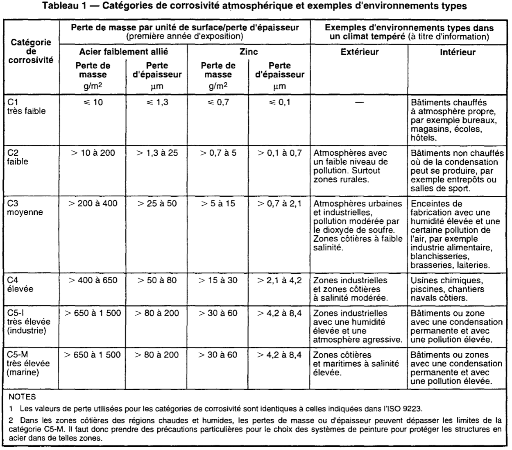

##### 81.32.2 Primaires / produits d'adhérence [[entities/cctb|CCTB]] 01.02 

###### 81.32.2 a Primaires / produits d'adhérence intérieurs sur supports métalliques non ferreux [[entities/cctb|CCTB]] 01.12 

**DESCRIPTION** 

**Définition / Comprend** 

Il s'agit des prescriptions du système de peinture primaire sur des supports métalliques non ferreux (acier zingué, cuivre et aluminium), y compris la préparation du subjectile. 

**Localisation** 

*** Les travaux sont localisés : . 

Voir plans et métrés détaillés. 

**MATÉRIAUX** 

**Caractéristiques générales** 

Choix du système de peinture : acrylique (par défaut) / époxy. 

**(Soit par défaut)** 

**Acrylique** 

Système de peinture à base de résines acryliques en solution, pigmentée au dioxyde de titane 

- En phase aqueuse, prêt à l’emploi. 

- Température d’application :de 5 à 35 °C (par défaut) / ***. 

- Humidité relative : ≤ 75 % (par défaut) / ***. 

- Température du support : ≥ de 3 °C au-dessus du point de rosée. 

- Mise en œuvre :au choix de l’entrepreneur (par défaut) / à la brosse / airless / au pistolet / ***. 

- Densité minimum : 1,2 (par défaut) / ***.   . 

- Extrait sec minimum : en poids 45 % (ou en volume 30 %) (par défaut) / ***. 

- Composants organiques volatils (COV)

- valeur limite en UE : ≤ 500 g/l (par défaut) / ***. 

**(Soit)** 

Époxy 

Système de peinture à base de résines époxy à deux composants, pigmentée au phosphate de zinc. 

Le composant B est ajouté graduellement au composant A, jusqu’à l’obtention d’un mélange homogène. 

- Température d’application: de 10 à 35 °C (par défaut) / ***. 

- Température du support :  ≥ de 3 °C au-dessus du point de rosée. 

- Humidité relative : ≤ 75 % (par défaut) / ***. 

- Mise en œuvre : au choix de l’entrepreneur (par défaut) / à la brosse / airless / au pistolet / *** . 

- Densité (produit mélangé) minimum : ≥1,40 (par défaut) / ***. 

- Extrait sec (produit mélangé) minimum : en poids 60 % (ou en volume 40 %) (par défaut) / ***. 

- Composants organiques volatils(COV)

- valeur limite en UE : ≤ 500 g/l (par défaut) / ***.

**EXÉCUTION / MISE EN ŒUVRE** 

**Prescriptions générales** 

**Conditions d’application** 

Les travaux de peinture primaire ne sont exécutés que lorsque la température est ≥ 10 °C, que l'humidité relative n’excède pas 75 % et lorsqu'il n'y a plus de risque de condensation. 

**Préparation du subjectile** 

Un contrôle visuel est opéré pour détecter la présence d'huile, de graisse, de sels ou d’agents contaminants similaires. Tout dépôt est éliminé par un procédé de dégraissage ou de lavage suivant les articles [81.32.1a Nettoyage intérieur des supports métalliques non ferreux](66_81.32.1_nettoyage_dégraissage_ponçage_cctb_01.02.md) ou [81.32.1b Dégraissage intérieur des supports métalliques non ferreux](66_81.32.1_nettoyage_dégraissage_ponçage_cctb_01.02.md). Ces articles sont compris dans le poste. 

Les éléments à peindre sont d'abord débarrassés des couches de peinture non adhérentes ou qui s'écaillent et/ou des éventuelles taches d’oxyde avec les moyens appropriés (ponçage) suivant l’article [81.32.1c Ponçage intérieur sur supports métalliques non ferreux](66_81.32.1_nettoyage_dégraissage_ponçage_cctb_01.02.md) 

Ces articles sont compris dans le poste. 

**Exécution** 

Le système de peinture et l’exécution comprennent l’application de la couche de fond « primaire » et ses retouches éventuelles, conformément aux prescriptions de la [NIT 249]. 

- Catégorie de corrosivité atmosphérique (intérieure) suivant les modèles énoncés dans la [NBN EN ISO 12944-2] : C1 / C2 (par défaut) / C3 / C4 / C5-I / C5-M. 

- Épaisseur du feuil sec minimum :  ≥ 60 / 80 (par défaut) / *** μm. 

**DOCUMENTS DE RÉFÉRENCE COMPLÉMENTAIRES** 

**Exécution** 

[NIT 249, Guide de bonne pratique pour l'exécution des travaux de peinture (révision de la NIT 159).] 

[NBN EN ISO 12944-2, Peintures et vernis

- Anticorrosion des structures en acier par systèmes de peinture

- Partie 2: Classification des environnements (ISO 12944-2:2017)] 

MESURAGE 

**unité de mesure:** 

- 

**code de mesurage:** 

Compris dans les prix unitaires respectifs des profilés à traiter. 

**nature du marché:** 

PM 

**AIDE** 

[NBN EN ISO 12944-2, Peintures et vernis

- Anticorrosion des structures en acier par systèmes de peinture

- Partie 2: Classification des environnements (ISO 12944-2:2017)]

