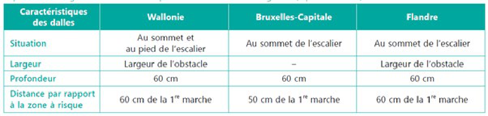

##### 93.13.4 Dalles de repérage [[entities/cctb|CCTB]] 01.09 

EXÉCUTION / MISE EN ŒUVRE 

Appareillage : 

L’aménagement correspond aux principes décrits dans le [SPW MI Gamah GBP Piétons Série]. 

**DOCUMENTS DE RÉFÉRENCE** 

**Exécution** 

[CCT Qualiroutes, Cahier des charges type Qualiroutes] G.5.5. pour les dalles en béton et en pierres naturelles. 

[SPW MI Gamah GBP Piétons Série, Guide de Bonnes Pratiques pour l’aménagement des cheminements piétons accessibles à tous] 

[SPW MI Gamah GBP Piétons

- I, Guide de Bonnes Pratiques pour l’aménagement des cheminements piétons accessibles à tous

- Cahier n°1 : Éléments théoriques] 

[SPW MI Gamah GBP Piétons

- II, Guide de Bonnes Pratiques pour l’aménagement des cheminements piétons accessibles à tous

- Références légales] 

[SPW MI Gamah GBP Piétons

- III, Guide de Bonnes Pratiques pour l’aménagement des cheminements piétons accessibles à tous

- Références légales : CWATUP] 

[SPW MI Gamah GBP Piétons

- IV, Guide de Bonnes Pratiques pour l’aménagement des cheminements piétons accessibles à tous

- Fiches techniques] 

###### 93.13.4 a Dalles de conduite Béton blanc [[entities/cctb|CCTB]] 01.09

**EXÉCUTION / MISE EN ŒUVRE** 

**Prescriptions générales** 

Indiquer la nature et l’épaisseur de la couche de pose. 

**DOCUMENTS DE RÉFÉRENCE COMPLÉMENTAIRES** 

**Exécution** 

[CCT Qualiroutes, Cahier des charges type Qualiroutes] G.5.5. 

**MESURAGE** 

**unité de mesure:** 

m² 

**nature du marché:** 

QF 

###### 93.13.4 b Dalles de conduite Pierre naturelle [[entities/cctb|CCTB]] 01.09 

**MATÉRIAUX** 

**Caractéristiques générales** 

- Type de pierre : pierre bleue (selon les [STS 45 série] 09.12.3) / *** 

- Origine : Belge (Soignies, Ecaussines, Neufvilles, Condroz, vallée du Bocq) / *** 

- Catégorie : C (selon les [STS 45 série] 09.12.3) 

- Texture et finition de la surface : poncée bleue / adoucie bleue / *** 

- Dimensions modulaires : 300 x 300 / 400 x 400 / 500 x 500 / 400 x 600 / *** mm 

• Epaisseur des dalles : minimum 20 (admissibles pour les dalles jusqu'à 500 x 500 mm) / 30 / 40 / *** mm 

**EXÉCUTION / MISE EN ŒUVRE** 

**Prescriptions générales** 

Indiquer la nature et l’épaisseur de la couche de pose. 

**DOCUMENTS DE RÉFÉRENCE COMPLÉMENTAIRES** 

**Exécution** 

[CCT Qualiroutes, Cahier des charges type Qualiroutes] G.5.5. 

**MESURAGE** 

**unité de mesure:** 

m² 

**nature du marché:** 

QF

###### 93.13.4 c Dalles de conduite Produits préformés [[entities/cctb|CCTB]] 01.09 

**MESURAGE** 

- unité de mesure: 

m² 

**nature du marché:** 

QF 

###### 93.13.4 d Dalles d'éveil à la vigilance Béton blanc [[entities/cctb|CCTB]] 01.09 

**EXÉCUTION / MISE EN ŒUVRE** 

**Prescriptions générales** 

Indiquer la nature et l’épaisseur de la couche de pose. 

**DOCUMENTS DE RÉFÉRENCE COMPLÉMENTAIRES** 

**Exécution** 

[CCT Qualiroutes, Cahier des charges type Qualiroutes] G.5.5. 

**MESURAGE** 

**unité de mesure:** 

m² 

**nature du marché:** 

QF 

###### 93.13.4 e Dalles d'éveil à la vigilance Pierre naturelle [[entities/cctb|CCTB]] 01.10 

**DESCRIPTION** 

**Définition / Comprend** 

Il s’agit de la fourniture (hors matériaux récupérés du site) et de la pose de dalles pour pavage dont l’épaisseur est définie en fonction de la classe d’utilisation et le type de pose. 

La portée des travaux est décrite dans l’élément

[93.13 Revêtement en dalles.](79_93.13_revêtement_en_dalles_cctb_01.11.md)

**MATÉRIAUX** 

**Caractéristiques générales** 

Les dalles de réemploi sont débarrassées des terres, sables et exemptes d’impuretés telles que mortier / colle / peinture / … 

Les dalles en pierre naturelle sont neuves (par défaut) / de réemploi / recyclées. 

- Nature et origine géologique (voir [NIT 228]) : pierre bleue (par défaut) / grès dur / granite / ’marbre rouge’ / ***.

- Façonnage : strié et à protubérance. 

- Format nominal :  fonction du type de dalle : guidage / éveil / information. 

- Classe d’épaisseur nominale; à calculer en fonction du format et de la classe d’utilisation 20 / 30 / 40 / *** mm. 

- Classes de tolérances dimensionnelles pour les 4 caractéristiques suivantes : dimensions en plan, épaisseur, démaigri des chants et irrégularités de surface. 

- Classe d’utilisation : 1 / 2 / 3 (par défaut) / 4 / 5 / 6. 

**Finitions** 

Finition de la face vue : [CEN/TS 15209] / [NBN ISO 21542] annexe A / *** 

**EXÉCUTION / MISE EN ŒUVRE** 

- Prescriptions générales 

Nature de la couche de pose : *** 

Epaisseur de la couche de pose : *** 

Sauf indication contraire, la pose est identique à celle des dalles adjacentes et s’effectue selon les principes suivants : 

- les dalles sont posées de manière à ce que les éléments en relief dépassent le niveau du sol environnant d’environ 0,5 cm 

- dans le cas des protubérances, celles-ci sont parfaitement alignées entre deux dalles adjacentes 

- il faut veiller à ce que la ligne de pose des dalles d’éveil à la vigilance soit toujours 

- perpendiculaire à celle des dalles de guidage 

- les dalles de guidage ne mènent en aucun cas à un escalator (des dalles d’éveil à la vigilance 

- sont prévues dans ce cas) 

- les dalles d’éveil à la vigilance sont placées à 40 cm de la bordure d’un quai, à 60 cm de la première marche d’un escalier et directement contre la plaque du mécanisme d’un escalator 

- une dalle d’information est placée à une distance comprise entre 40 et 60 cm de la porte d’un ascenseur. 

Appareillage : droit uniquement 

L’appareillage est défini dans le cahier spécial des charges. À défaut, il correspond aux principes  du  [CCT Qualiroutes] (RW) décrits aux figures G. 5.5.1.2.1. A à F. 

**DOCUMENTS DE RÉFÉRENCE COMPLÉMENTAIRES** 

**Exécution** 

[CEN/TS 15209, Surfaces tactiles d'indication au sol en béton, terre cuite et pierre naturelle] 

[NBN ISO 21542, Construction immobilière — Accessibilité et facilité d'utilisation de l'environnement bâti (ISO 21542:2011)] 

[CCT Qualiroutes, Cahier des charges type Qualiroutes] 

[SPW MI Gamah GBP Piétons

- I, Guide de Bonnes Pratiques pour l’aménagement des cheminements piétons accessibles à tous

- Cahier n°1 : Éléments théoriques] 

[SPW MI Gamah GBP Piétons

- II, Guide de Bonnes Pratiques pour l’aménagement des cheminements piétons accessibles à tous

- Références légales]

[SPW MI Gamah GBP Piétons

- III, Guide de Bonnes Pratiques pour l’aménagement des cheminements piétons accessibles à tous

- Références légales : CWATUP] 

[SPW MI Gamah GBP Piétons

- IV, Guide de Bonnes Pratiques pour l’aménagement des cheminements piétons accessibles à tous

- Fiches techniques] 

[SPW MI Gamah GBP Piétons Série, Guide de Bonnes Pratiques pour l’aménagement des cheminements piétons accessibles à tous] . 

**MESURAGE** 

**unité de mesure:** 

m² 

**code de mesurage:** 

Selon [NBN B 06-001] 

**Surface nette exécutée** . Les réservations inférieures à 1 m² ne seront pas déduites. Distinction faite entre matériaux neufs, de réemploi ou recyclés – avec ou sans fourniture pour ces derniers. 

**nature du marché:** 

QF 

**AIDE** 

Se référer à la [NIT 220] pour le choix de la catégorie pour la pierre bleue 

Pour les roches litées, la pose d’éléments en délit n’est pas autorisée. 

Le matériau est contrasté. 

Actuellement, on utilise plusieurs types de revêtements podotactiles qui expriment différentes informations. Il s’agit de dalles ayant un relief ou un matériau particulier permettant aux malvoyants et aux aveugles de s’orienter à pied à savoir : 

- **Les revêtements de guidage** (encore appelés _revêtements striés_ ) : ils ont pour but d’orien-ter la personne. Pour ce faire, l’axe des stries mène à l’endroit où on souhaite guider la personne. Ils permettent d’orienter la personne dans des espaces ouverts telle une gare où une désorientation complète est possible. 

- **Les revêtements d’éveil à la vigilance** (encore appelés _revêtements à protubé­rances_ ) : ils ont pour but d’attirer l’attention de la personne sur la proximité d’une zone à risque. 

Différences régionales en matière de pose de dalles d’éveil à la vigilance (à protubérances) dans un escalier. 

[Buildwise Article Dossier (2019/02.07), Dalles podotactiles en pierre naturelle : quelle est la marche à suivre ?] 

###### 93.13.4 f Dalles d'éveil à la vigilance Produits préformés [[entities/cctb|CCTB]] 01.09 

MESURAGE

- unité de mesure: 

m² 

- nature du marché: 

QF 

###### 93.13.4 g Dalles en caoutchouc (dimensions à définir) [[entities/cctb|CCTB]] 01.09 MESURAGE 

- unité de mesure: 

m² 

- nature du marché: 

QF 

###### 93.13.4 h Supplément pour pose particulière de dalles [[entities/cctb|CCTB]] 01.09 

MESURAGE 

- unité de mesure: 

m² 

- nature du marché: 

QF
