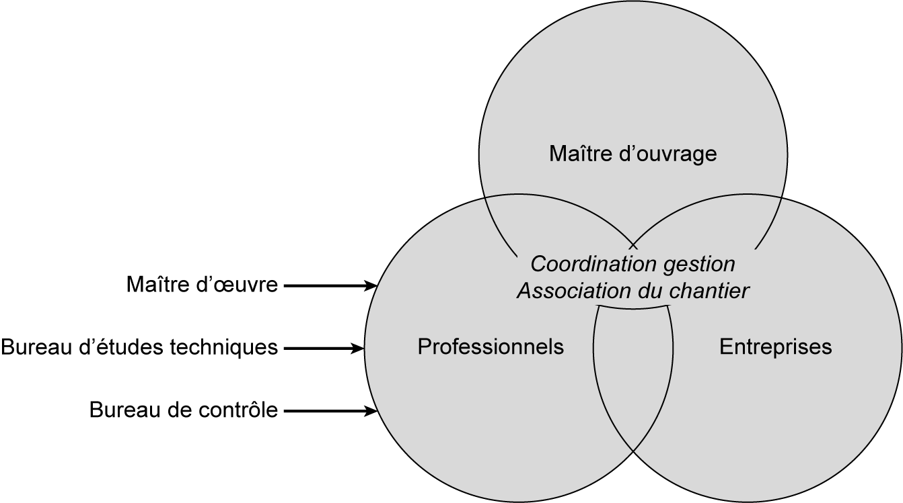
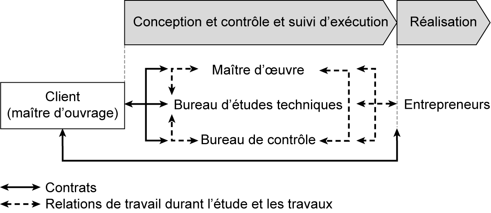

## 1.3 Les parties prenantes d’un projet 

Les parties prenantes sont toutes les personnes qui interviennent dans l’étude et l’exécution d’un projet. Selon leurs missions, les intervenants se divisent en trois catégories : le maître d’ouvrage, les professionnels du domaine de la construction (maître d’œuvre, bureau d’études techniques, bureau de contrôle), et les entreprises. Ils ont tous des responsabilités communes de coordination, de gestion et d’association du chantier ( **fg. [1.1](03_1.1_introduction.md)** ).

_**Figure [1.1](03_1.1_introduction.md) Principaux intervenants dans l’acte de construction**_ 

Ces intervenants ont des responsabilités mutuelles dans leurs actions. Le maître d’ouvrage doit signer des contrats ou des marchés avec les professionnels et les entreprises avant le démarrage du chantier. D’autres liaisons existent entre les différents intervenants ( **fg. [1.2](04_1.2_définition_dun_projet.md)** ).

_**Figure [1.2](04_1.2_définition_dun_projet.md) Relation entre les principaux intervenants dans l’acte de construction**_ 

**Maître d’ouvrage** 

Le maître d’ouvrage, ou client, est la personne, individu ou groupement d’individus, physique ou morale, qui conclut un (ou plusieurs) contrat(s) avec un (ou plusieurs) professionnel(s) de la construction, afin qu’ils édifient un ouvrage pour son compte. Le maître d’ouvrage est donc celui qui commande des travaux à un architecte, à une ou plusieurs entreprises, à un ou plusieurs bureaux d’études techniques ou société d’ingénieurs, et qui les rémunère. 

**Maître d’œuvre** 

Le maître d’œuvre est la personne, ou l’équipe, qui conçoit le projet selon les spécifications données par le maître d’ouvrage. Il supervise le déroulement du chantier afin que la réalisation soit conforme aux plans. Il conçoit les plans, les programmes de réalisation, les cahiers des charges, et doit demander les permis de construire et toutes les

**autres autorisations administratives.** 

Le maître d’œuvre est le représentant du client. À ce titre, il assure l’appel d’offres, dirige et surveille l’exécution des travaux qu’il coordonne, et contrôle notamment le respect des prescriptions légales, des règlements, des règles de l’art et des conditions du marché. Le maître d’œuvre peut être l’architecte pour les travaux de bâtiment et le bureau d’études techniques pour les travaux publics. 

**Bureau d’études techniques** 

Un bureau d’études techniques (BET) est une association d’ingénieurs-conseils qui ont, selon les cas, des spécialités identiques ou complémentaires. En fonction de leurs spécialités, les missions essentielles des bureaux d’études sont : l’élaboration des plans, des détails d’exécution, les notes de calcul et le suivi d’exécution. Les études concernent les éléments de structure (béton armé, construction métallique, charpente en bois) et des équipements divers (acoustique, thermique, hydraulique, éclairage, mécanique des sols, route, VRD, etc.). Il existe des bureaux d’études spécialisés dans le domaine de la géotechnique, des routes et des ouvrages d’infrastructure. 

**Bureau de contrôle** 

Le bureau de contrôle contribue à la prévention des différents aléas techniques susceptibles d’être rencontrés dans la réalisation de l’ouvrage. Il intervient à la demande du maître d’ouvrage et donne son avis sur des problèmes d’ordre technique, notamment en ce qui concerne la solidité de l’ouvrage, le bon fonctionnement des équipements et la sécurité des personnes. Le bureau de contrôle technique intervient dès la conception du projet et jusqu’à l’achèvement des travaux. Il est lié contractuellement au maître d’ouvrage. 

**Entreprise** 

L’entrepreneur est l’homme de l’art qui exécute les travaux pour le compte du maître d’ouvrage sous la direction et la surveillance du

maître d’œuvre. Il est juridiquement lié au maître d’ouvrage par un contrat d’exécution. Les principales obligations de l’entrepreneur sont l’exécution des travaux selon les prescriptions définies dans le marché et le respect du délai fixé dans la soumission. 

Selon le type de projet et l’importance des travaux, on peut avoir soit un seul entrepreneur général avec divers sous-traitants, soit plusieurs entreprises qui peuvent être séparées ou groupées, selon leurs spécialités et le type de projet.
