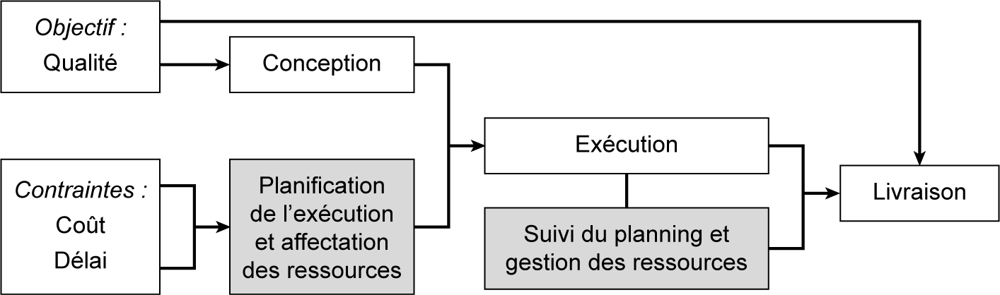
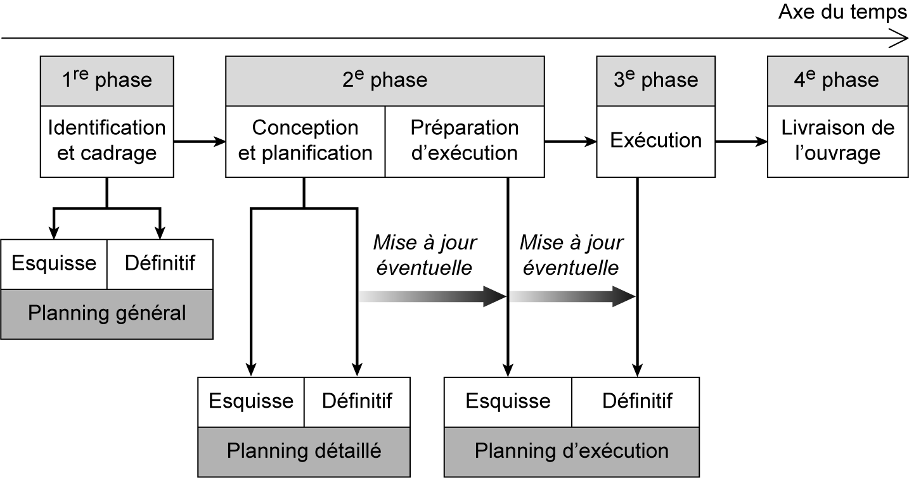
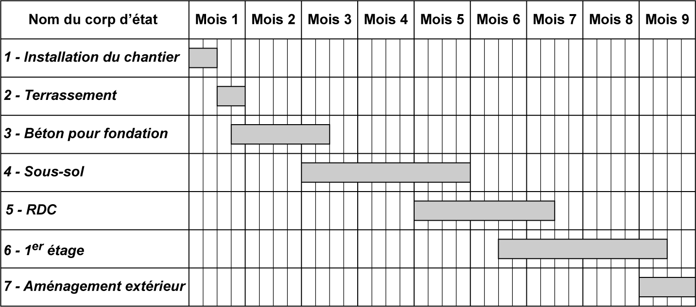
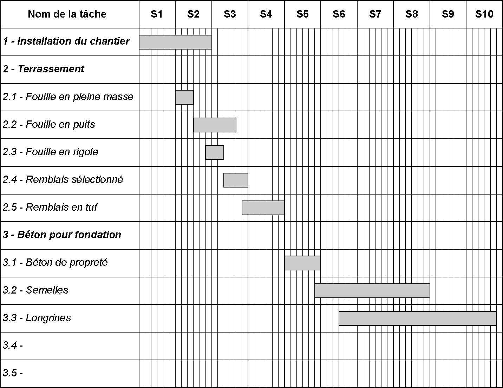
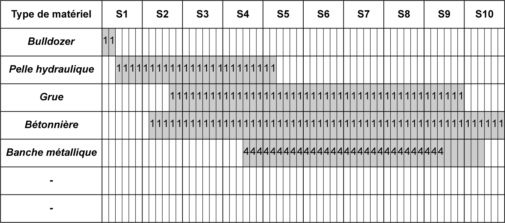

## 2.3 Planification

La planification consiste à déterminer et ordonnancer les tâches et prévoir l’utilisation des ressources. Le chef de projet est tenu de mettre en place l’organisation la plus adaptée pour réaliser l’ouvrage. Il établit un ensemble de graphes et de tableaux qui concrétisent à l’avance le déroulement réel des travaux et les prévisions d’utilisation des ressources humaines, matérielles et financières dans le temps accordé. Il s’agit de calculer les dates d’exécution optimales des tâches. 

La planification a pour objectifs : 

de fournir à l’avance une vision globale du projet et de son déroulement afin d’effectuer un suivi précis et un contrôle régulier pour anticiper les éventuels dépassements de délais en phase d’exécution ; 

d’évaluer l’avancement du projet et de gérer les retards de manière agile ; d’affecter les ressources humaines, matérielles et financières nécessaires à la réalisation des tâches et de gérer le délai et les ressources pendant les travaux. 

La **fgure 2.6** situe la planification dans le processus de gestion du projet. 

_**Figure 2.6 Schéma du processus de planification et de gestion de projet**_

Les documents de base nécessaires à l’élaboration d’une planification sont : 

tous les plans d’exécution du projet ; les divers cahiers de clause : cahier des clauses administratives particulières (CCAP) et cahier de clauses techniques particulières (CCTP) ; la notice descriptive et les devis descriptif, quantitatif et estimatif. 

**Différents types de planning** 

À chaque phase d’étude et d’exécution, les intervenants du projet sont tenus de préparer divers plannings. Selon le niveau de découpage du projet et les détails à présenter dans la planification (lot, corps d’état ou tâche), on distingue trois types de planning : général, détaillé et d’exécution (voir **fg. 2.7** et **tab. [2.1](08_2.1_management_et_gestion_des_projets.md)** ).

_**Figure 2.7 Les différents niveaux de planning**_ 

_**Tableau [2.1](08_2.1_management_et_gestion_des_projets.md) Les caractéristiques des différents niveaux de planification**_ 

||| **_planifcation_**|||
|---|---|---|---|---|
|**Type**|**Stade** **d’élaboration**|**Auteur**|**Utilité**|**Documents** **ressources**|
|**Planning** **général** **TCE**|_Étude du projet_|_Maître d’œuvre_|_Date de début et_ _fn de chaque lot_|_Programme_|
|**Planning** **détaillé**|_Préparation de_ _chantier_|_Maître d’œuvre_ _aidé si possible_ _par le conducteur_ _de chaque lot_|_Suivi et paiement_ _des travaux_|_Planning général_ _TCE et dossier du_ _marché des_ _travaux_|

|**Planning** **d’exécution**|_Étude d’exécution_|_Entreprise par son_ _conducteur des_ _travaux, aidé si_ _possible par le_ _chef de chantier_|_Exécution des_ _travaux_|
|---|---|---|---|
|||||
|||||
|||||

**Planning général** 

Le planning général ou planning grosse maille (voir **fg. 2.8** ), appelé aussi planning tout corps d’état (TCE), est élaboré par le maître d’œuvre en phase de conception et de planification. Y sont présentées les dates de début et de fin de la réalisation de chaque lot ou corps d’état, la durée de réalisation du projet et la date de livraison de l’ouvrage. L’unité de temps utilisée est généralement le mois. 

**Planning détaillé** 

Dans le planning détaillé (voir **fg. 2.9** ), chaque lot est décomposé en corps d’état et/ou chaque corps d’état est décomposé en tâches ou activités. Il est mis au point par le maître d’œuvre et constitue une pièce contractuelle du marché qui sera utilisée pour le paiement de l’entreprise et le suivi des travaux. Ce planning permet d’assurer la coordination des phases d’étude de projet et de réalisation de l’ouvrage. L’unité de temps utilisée est généralement la semaine ou le jour.

**Planning d’exécution** 

Le planning d’exécution des travaux est l’instrument de pilotage du responsable de l’exécution. Il est élaboré sur la base du planning détaillé et définit le programme précis d’exécution des travaux. À partir de ce planning, l’entreprise prépare les plannings propres à la main-d’œuvre, à l’utilisation de matériels, à l’approvisionnement en matériaux, du financement et de la gestion de production. 

**Plannings particuliers** 

Les plannings particuliers sont des documents spécifiques élaborés par le conducteur de travaux en phase d’exécution du projet. Ils visent à guider le déroulement général des travaux et optimiser l’utilisation des différentes ressources. On peut distinguer plusieurs types de plannings particuliers. 

**Planning d’approvisionnement en matériaux** 

Ce planning définit les quantités des matériaux nécessaires pour l’exécution de chaque tâche en fonction du temps. Il influence directement le déroulement de chantier, étant donné que la réalisation de chaque tâche dépend des quantités des matériaux constructifs. Ce planning facilite la consultation des fournisseurs, permettant des commandes plus précises. Il permet aussi de contrôler la consommation en comparant le réel et le prévisionnel. 

**Planning d’utilisation, d’entretien et de rotation des matériels** 

De même, le planning d’utilisation de matériels permet de déterminer ceux nécessaires pour l’exécution de chaque tâche. C’est un diagramme formé du matériel en ligne comme bulldozer, pelle hydraulique, grue, bétonnière, etc., et des durées en colonne (jour ou semaine). Dans les cases, on fait apparaître une barre indiquant la durée d’utilisation et un chiffre indiquant le nombre de matériel. Dans l’exemple (voir **fg. 2.10** ), nous avons besoin d’un seul bulldozer sur les deux premiers jours et d’une pelle hydraulique du

début du 3[e] jour jusqu’au 24[e] jour. 

Le planning de rotation des matériels est réservé aux matériels de coffrage afin d’optimiser leurs utilisations, comme les banches. Pour la rotation des banches, on prépare un planning qui définit l’ordre d’utilisation des banches disponibles suivant l’avancement d’exécution des voiles. 

_**Figure 2.10 Planning d’utilisation du matériel**_ 

**Planning de main-d’œuvre** 

La planification de la main-d’œuvre consiste à déterminer le nombre optimal de main-d’œuvre nécessaire pour l’exécution du projet. L’affectation du type et du nombre de la main-d’œuvre aux différentes tâches se fait en fonction de la durée d’exécution et de la quantité de travail à réaliser. Elle doit ainsi élaborer la courbe effectif-temps.

**Plannings de gestion budgétaire** 

Le budget prévisionnel de construction est déterminé par l’entreprise en phase d’étude de l’offre. À partir de ce document et du planning d’exécution, et en connaissant le délai du projet et ses recettes, l’entreprise est tenue d’établir ses prévisions mensuelles pour tracer les courbes financières des dépenses et recettes et en déduire les plannings de chaque mois pour organiser les opérations budgétaires. 

**Plannings de production** 

Pour visualiser les cycles des travaux répétitifs et les cadences d’exécution, on utilise un planning de type chemin de fer, comme pour les opérations de fabrication, de stockage et de pose des éléments préfabriqués sur chantier. Par exemple, pour visualiser la production des cycles de préfabrication, on trace les courbes de fabrication, de stockage et de pose dans un système d’axes formé du nombre de pièces (unités ou éléments) en ordonnées et du temps en abscisses.
