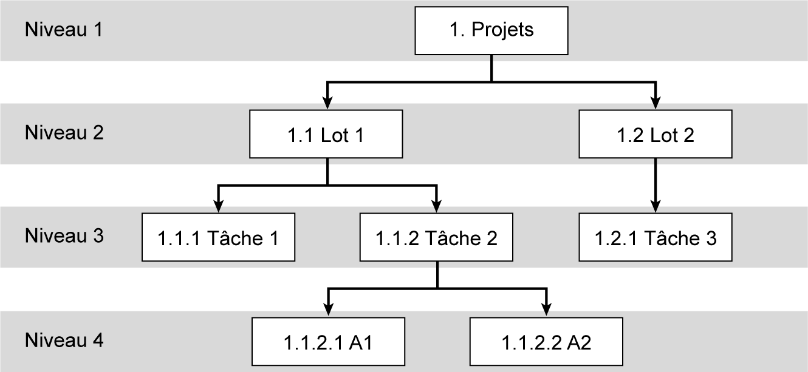

## 3.2 Découpage du projet 

Avant de planifier l’exécution du projet, le concepteur est tenu de le découper en sous-ensembles. Cette décomposition hiérarchique des travaux prend la forme d’un organigramme des tâches, appelé aussi WBS ( _Works Breakdown Structure_ ). Cette méthode consiste à recenser et identifier l’ensemble des activités d’un projet et de les décomposer sous la forme d’une arborescence. Chaque niveau permet de développer et détailler les éléments du niveau précédent jusqu’à la fin du projet (voir **fg. [3.1](13_3.1_les_étapes_de_la_planification.md)** ).

_**Figure [3.1](13_3.1_les_étapes_de_la_planification.md) Modèle de structure de découpage d’un projet**_ 

1[er] niveau : ensemble du projet 

2[e] niveau : les phases de projet ou les lots 

3[e] niveau : les tâches composant chaque lot 

4[e] niveau : les livrables de chaque tâche
