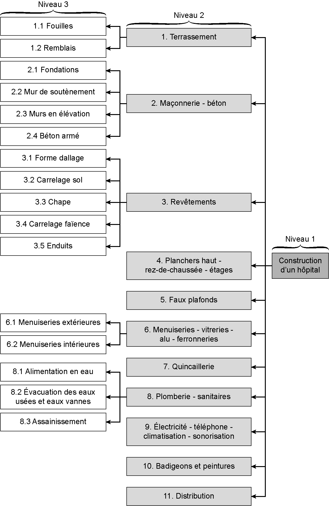
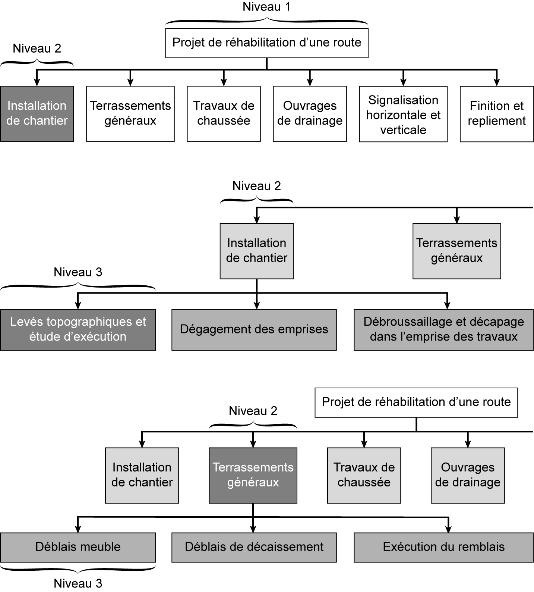

## 3.4 Exemple n° 2 : Découpage d’un projet de réhabilitation d’une route

_**Figure [3.2](14_3.2_découpage_du_projet.md) Organigramme WBS d’un projet de construction d’un hôpital**_

**de réhabilitation d’une route** 

Le projet de réhabilitation d’une route (niveau 1) est subdivisé en six corps d’état (niveau 2). L’installation de chantier est subdivisée en trois tâches (niveau 3) : levés topographiques et étude d’exécution, dégagement des emprises, débroussaillage et décapage dans l’emprise des travaux. Le corps d’état « terrassement généraux » est aussi subdivisé en trois tâches : déblais meuble, déblais de décaissement et exécution du remblai. La décomposition détaillée de ce projet et l’organigramme des tâches sont présentés dans le **tableau [3.2](14_3.2_découpage_du_projet.md)** et la **fgure [3.3](15_3.3_exemple_n_1_découpage_dun_projet_de_construction_dun_hôpital.md)** . 

_**Tableau [3.2](14_3.2_découpage_du_projet.md) Exemple de découpage d’un projet de réhabilitation d’une route**_ 

|| **_réhabilitation d’une route_**||
|---|---|---|
|**Code**|**Désignation**|**Niveau**|
|**_0_**|**_Projet de réhabilitation d’une_** **_route_**|**_1_**|
|_1_|_Installation de chantier_|_2_|
|_1.1_|_Levés topographiques et étude_ _d’exécution_|_3_|
|_1.2_|_Dégagement des emprises_|_3_|
|_1.3_|_Débroussaillage et décapage_ _dans l’emprise des travaux_|_3_|
|_2_|_Terrassements généraux_|_2_|
|_2.1_|_Déblais meuble_|_3_|
|_2.2_|_Déblais de décaissement_|_3_|
|_2.3_|_Exécution des remblais_|_3_|
|_3_|_Travaux de chaussée_|_2_|
|_3.1_|_Couche de fondation en_ _GC0/31,5 sur remblai_|_3_|
|_[3.2](14_3.2_découpage_du_projet.md)_|_Couche de base en GC0/20_ _+ Finition_|_3_|
|_[3.3](15_3.3_exemple_n_1_découpage_dun_projet_de_construction_dun_hôpital.md)_|_Accotements en TV0/40_|_3_|
|_3.4_|_Fourniture et mise en œuvre_ _d’une couche d’accrochage_|_3_|
|_3.5_|_Fourniture et mise en œuvre_ _d’une couche d’imprégnation_ _sablée_|_3_|
|_3.6_|_Couche de roulement en BB_ _0/14_|_3_|
|_3.7_|_Revêtement superfciel en_ _bicouche_|_3_|

|_4_|_Ouvrages de drainage_|_2_|
|---|---|---|
|_4.1_|_Fossés en terre_|_3_|
|_4.2_|_Fossé trapézoïdal bétonné_|_3_|
|_4.3_|_Fourniture, transport et pose de_ _conduite Ø 800_|_3_|
|_4.4_|_Ouvrage de tête pour buse en_ _béton armé Ø 800_|_3_|
|_4.5_|_OH9 dalot 4(2,00 x1,50)_|_3_|
|_4.6_|_OA4 Cassis 100 ml_|_3_|
|_4.7_|_Dalot 25 x (2,00 x1,00)_|_3_|
|_4.8_|_Fouille + coulage béton de_ _propreté_|_3_|
|_4.9_|_Cofrage, Ferraillage, Coulage_ _du radier_|_3_|
|_4.10_|_Cofrage, Ferraillage, Coulage_ _voile_|_3_|
|_4.11_|_Cofrage, Ferraillage, Coulage_ _traverse_|_3_|
|_4.12_|_OH2 Dalot 2x (2,00x1,50)_|_3_|
|_4.13_|_OD2 Dalot (2,00x1,00)_|_3_|
|_4.14_|_OD1 Dalot (1,00x1,00)_|_3_|
|_4.13_|_Cofrage, Ferraillage, Coulage_ _voile_|_3_|
|_4.14_|_Cofrage, Ferraillage, Coulage_ _traverse_|_3_|
|_4.15_|_Mur para-fouille_|_3_|
|_5_|_Signalisation horizontale et_ _verticale_|_2_|
|_6_|_Finition et repliement_|_2_|

_**Figure [3.3](15_3.3_exemple_n_1_découpage_dun_projet_de_construction_dun_hôpital.md) Organigramme WBS d’un projet de réhabilitation d’une route**_
