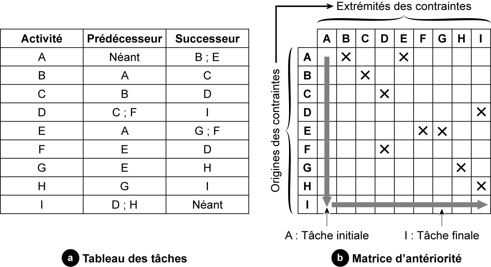
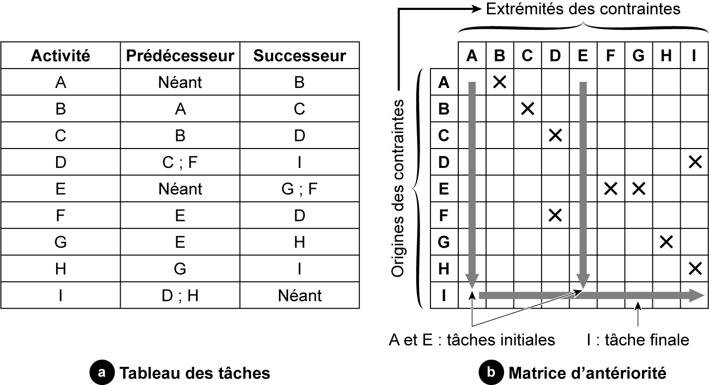

## 3.8 Représentation matricielle 

**Principes** 

La dépendance des tâches les unes par rapport aux autres peut se présenter sous deux formes, soit par un graphe soit par une « matrice d’antériorité ». Pour élaborer cette matrice, on construit un tableau à deux entrées identiques, puis on place des croix indiquant les liaisons d’antériorité. La matrice permet de visualiser d’une manière succincte et claire les liens entre les tâches et facilite le traçage du planning, soit sous forme linéaire soit en réseau. 

**Représentation matricielle de l’exemple n° 1** 

Pour dresser la matrice d’antériorité de l’exemple n° 1 présenté dans le **tableau 3.8** , nous allons créer la matrice à deux entrées identiques présentée dans la **fgure [3.4](16_3.4_exemple_n_2_découpage_dun_projet_de_réhabilitation_dune_route.md)** . Les lignes représentent l’origine des contraintes, et les colonnes les extrémités des contraintes. 

Pour élaborer la matrice, on part des origines des contraintes : 

La tâche A est antérieure aux deux tâches B et E. Sur la matrice, on place deux croix, aux croisements de la ligne de la tâche A avec les colonnes correspondantes aux tâches B et E. La tâche B est antérieure à la tâche C, on place une croix entre le croisement de la ligne de la tâche B et la colonne de la tâche C.

Il n’y a pas de croix dans la colonne « A » des extrémités contraintes, cela signifie que la tâche A est une tâche initiale. De même, il n’y a pas de croix dans la ligne « I » des origines des contraintes, cela signifie que la tâche I est une tâche finale. 

Il faut noter qu’il doit y avoir au minimum une tâche initiale et une tâche finale. 

On procède de la même manière que pour l’exemple n° 1 pour élaborer la matrice de l’exemple n° 2 du **tableau [3.10](22_3.10_construction_des_graphes.md)** . La nouvelle matrice est présentée dans la **fgure [3.5](17_3.5_calcul_des_durées_dexécution_des_tâches.md)** . 

Il y a un changement de la matrice au niveau de : la tâche « E », qui est devenue une tâche initiale puisqu’elle n’a pas de prédécesseur ; la tâche « A » a un seul successeur. 

