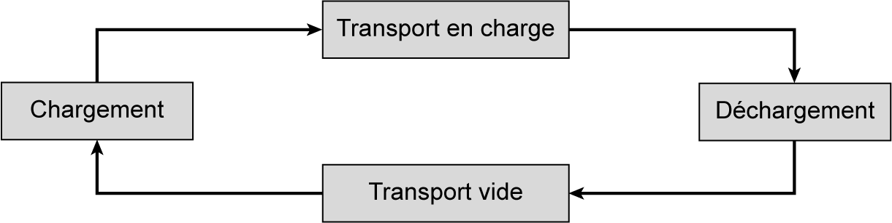
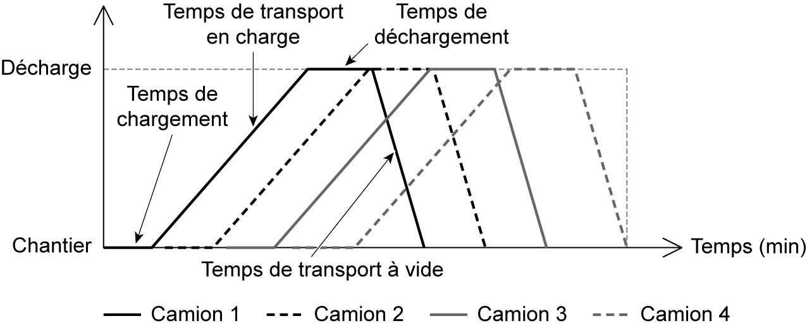
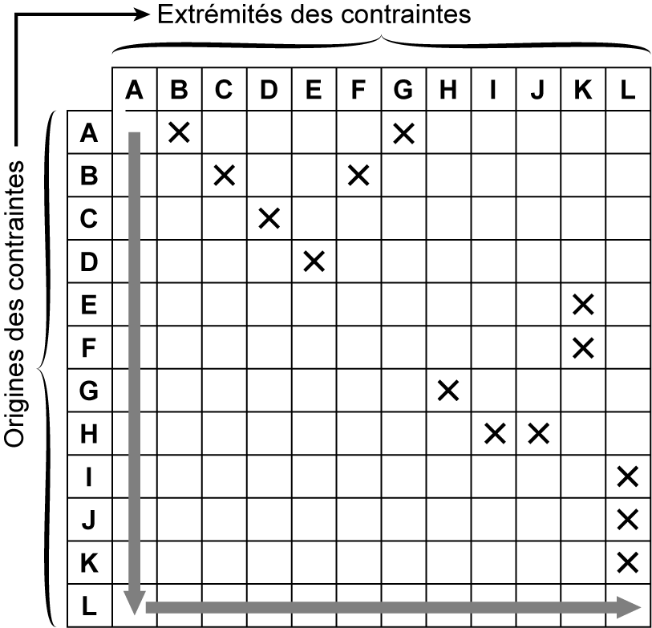
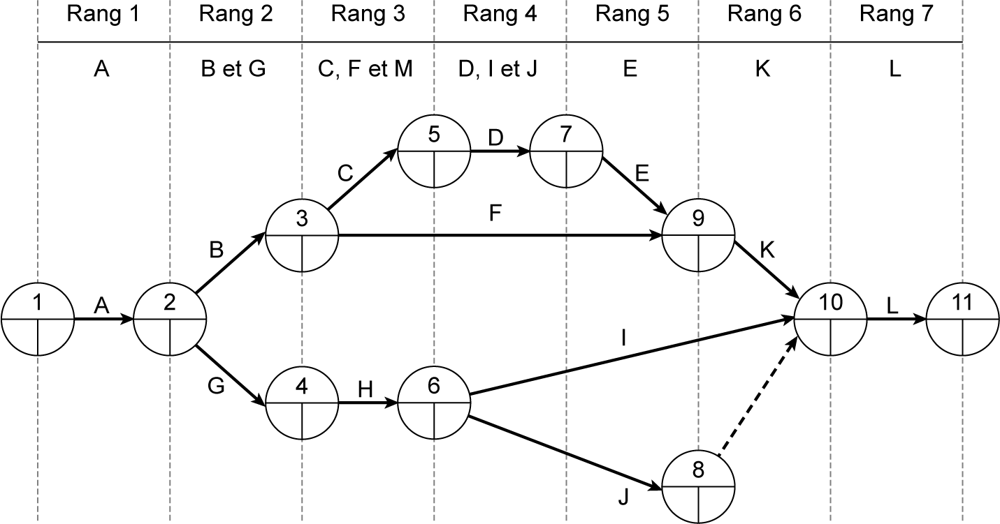
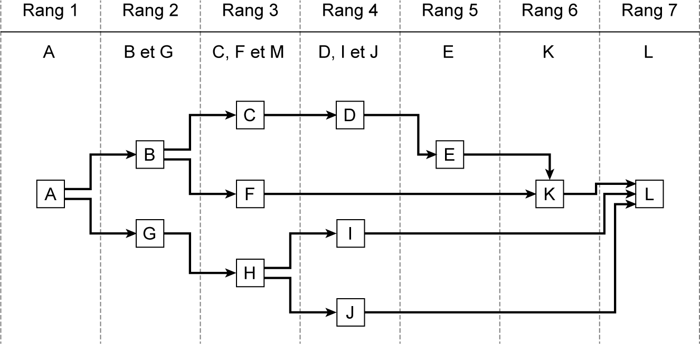

## 3.11 Application 3-2

_**Figure 3.14 Composantes d’un cycle de travaux de terrassement en déblai**_ 

Dans un système d’axes formé de la distance à parcourir entre le chantier et la décharge en ordonnées, et du temps en abscisses, on trace les cycles des camions de terrassement en faisant apparaître la notion de temps et d’espace. Dans la **fgure 3.15** , on présente le cycle de rotation de quatre camions de transport de déblai. 

_**Figure 3.15 Présentation du planning chemin de fer des travaux de terrassement**_

**Énoncé de l’application 3-2** 

On présente, dans le **tableau 3.13** , un exemple de projet formé de douze tâches. On demande de déterminer les rangs des tâches, d’élaborer la matrice et de tracer les réseaux de la méthode PERT et de la méthode des antécédents PDM. 

_**Tableau 3.13 Données des tâches de l’application 3-2**_ 

|**N°**|**Tâche**|**Prédécesseur**|
|---|---|---|
|_1_|_A_|_Néant_|
|_2_|_B_|_A_|
|_3_|_C_|_B_|
|_4_|_D_|_C_|
|_5_|_E_|_D_|
|_6_|_F_|_B_|
|_7_|_G_|_A_|
|_8_|_H_|_G_|
|_9_|_I_|_H_|
|_10_|_J_|_H_|
|_11_|_K_|_E ; F_|
|_12_|_L_|_I ; J ; K_|

**Corrigé de l’application 3-2** 

On présente les rangs des différentes tâches dans le **tableau 3.14** et la matrice d’antériorité dans la **fgure 3.16** . 

_**Tableau 3.14 Détermination des rangs des tâches de l’application 3-2**_ 

|**N°**|**Tâche**|**Prédécesseur**|**Rang**|
|---|---|---|---|
|_1_|_A_|_Néant_|_1_|
|_2_|_B_|_A_|_2_|
|_3_|_C_|_B_|_3_|
|_4_|_D_|_C_|_4_|

||_5_|_5_|||_E_|_E_||_D_|_D_|||_5_|_5_||
|---|---|---|---|---|---|---|---|---|---|---|---|---|---|---|
||_6_||||_F_|||_B_||||_3_|||
||_7_||||_G_|||_A_||||_2_|||
||_8_||||_H_|||_G_||||_3_|||
||_9_||||_I_|||_H_||||_4_|||
||_10_||||_J_|||_H_||||_4_|||
||_11_||||_K_|||_E ; F_||||_6_|||
||_12_||||_L_|||_I ; J_|_; K_|||_7_|||
||||||||||||||||
|**Rang**|||_1_|_2_|||_3_|_4_||_5_|_6_|||_7_|
|**Tâche**|||_A_|_B et E_|||_C, F et M_|_D, I et J_||_E_|_K_|||_L_|

À partir des tableaux des tâches et de la matrice d’antériorité on remarque que : 

- on a sept rangs ;

- on a une seule tâche initiale, la tâche A, qui n’a pas de 

- prédécesseur ; 

- on a une seule tâche finale, la tâche L, qui n’a pas de 

- successeur ; 

- les tâches L et K sont précédées de plusieurs tâches : 

   - la tâche K a deux flèches d’entrée dans le graphe provenant des tâches E et F, 

la tâche L a trois flèches d’entrée dans le graphe provenant des tâches I, J et K ; 

- les tâches B et H sont des prédécesseurs de plus qu’une tâche : la tâche B a deux flèches de sortie dans le graphe allant vers les tâches C et F, 

la tâche H a deux flèches de sortie dans le graphe allant vers les tâches I et J. 

Les réseaux de la méthode PERT et des antécédents sont présentés respectivement dans les **fgures 3.17** et **3.18** .

_**Figure 3.17 Réseau PERT de l’application 3-2**_

_**Figure 3.18 Réseau des antécédents de l’application 3-2**_
