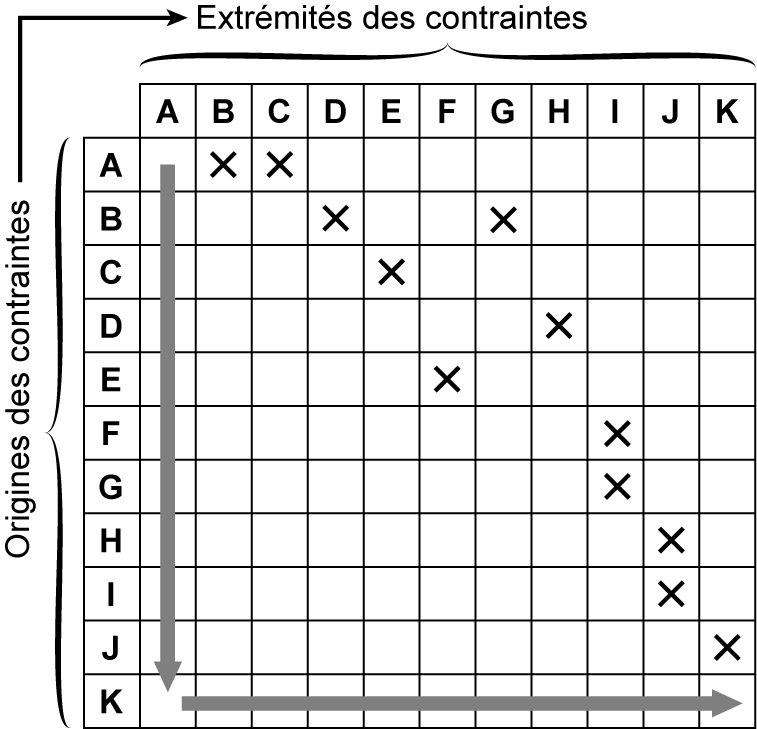
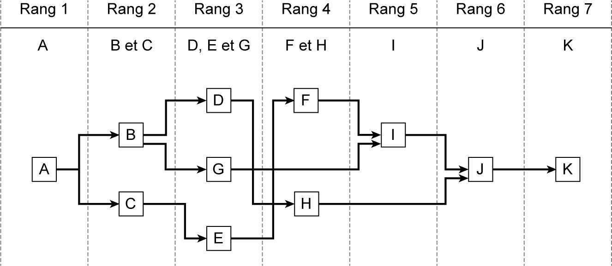

## 3.12 Application 3-3 

**Énoncé de l’application 3-3** 

On se propose d’étudier la planification d’exécution des travaux d’un corps d’état formés de 11 tâches dont les caractéristiques sont présentées dans le **tableau 3.15** . 

_**Tableau 3.15 Données des tâches de l’application 3-3**_ 

|**Désignation des tâches**|**Durée en jours**|**Tâche antérieure**|
|---|---|---|
|_A_|_4_|_Néant_|

|_B_|_6_|_A_|
|---|---|---|
|_C_|_10_|_A_|
|_D_|_6_|_B_|
|_E_|_3_|_C_|
|_F_|_7_|_E_|
|_G_|_5_|_B_|
|_H_|_9_|_D_|
|_I_|_5_|_F-G_|
|_J_|_7_|_H-I_|
|_K_|_7_|_J_|

On demande de déterminer le rang des différentes tâches, d’élaborer la matrice d’antériorité et de tracer le réseau des antécédents. 

**Corrigé de l’application 3-3** 

Les rangs des différentes tâches sont présentés dans le **tableau 3.16** . Les **fgures 3.19** et **3.20** représentent respectivement la matrice d’antériorité et le réseau des antécédents. 

_**Tableau 3.16 Détermination des rangs des tâches de l’application 3-3**_ 

|**Désignation des** **tâches**|**Désignation des** **tâches**||**Durée en jours**|**Durée en jours**|**Tâche antérieure**|**Tâche antérieure**|**Tâche antérieure**|**Rang**|**Rang**|
|---|---|---|---|---|---|---|---|---|---|
|_A_|||_3_|||_Néant_|||_1_|
|_B_|||_6_|||_A_|||_2_|
|_C_|||_10_|||_A_|||_2_|
|_D_|||_6_|||_B_|||_3_|
|_E_|||_3_|||_C_|||_3_|
|_F_|||_7_|||_E_|||_4_|
|_G_|||_5_|||_B_|||_3_|
|_H_|||_9_|||_D_|||_4_|
|_I_|||_15_|||_F-G_|||_5_|
|_J_|||_7_|||_H – I_|||_6_|
|_K_|||_7_|||_J_|||_7_|
|||||||||||
|**Rang 1**|**Rang 2**||**Rang 3**|**Rang 4**||**Rang 5**||**Rang 6**|**Rang 7**|
|_A_|_B – C_||_D – E – G_|_F – H_||_I_||_J_|_K_|

_**Figure 3.19 Matrice d’antériorité de l’application 3-3**_

_**Figure 3.20 Réseau des antécédents de l’application 3-3**_
