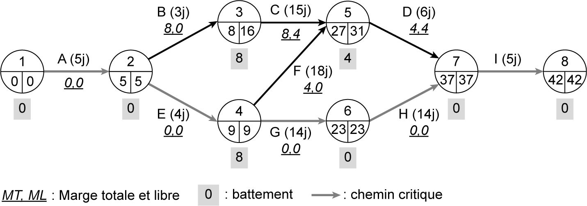
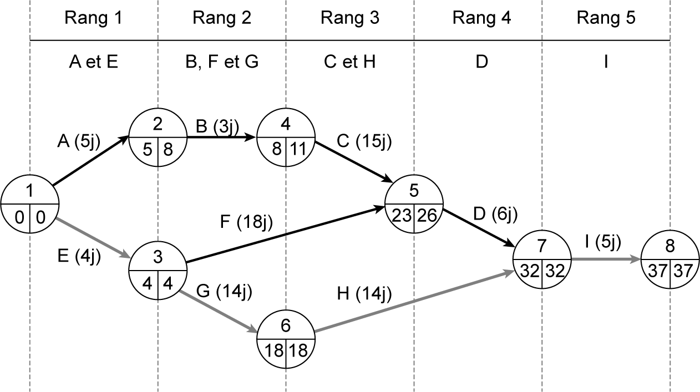
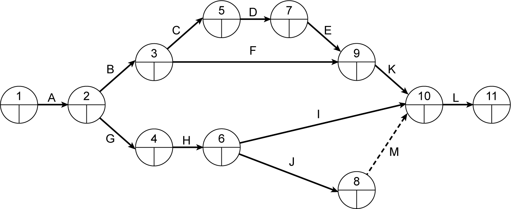

## 4.2 Application 4-1 

**Énoncé de l’application 4-1** 

Une entreprise est chargée de la construction d’un ouvrage hydraulique. Pour la planification des travaux d’exécution, le projet a été décomposé en douze tâches dont les caractéristiques sont présentées dans le **tableau [4.5](30_4.5_technique_gantt.md)** . 

_**Tableau [4.5](30_4.5_technique_gantt.md) Données des tâches de l’application 4-1**_ 

|**N°**|**Tâche**|**Durée en semaines**|**Tâche antérieure**|
|---|---|---|---|
|_1_|_A_|_3_|Néant|
|_2_|_B_|_2_|_A_|
|_3_|_C_|_1_|_B_|
|_4_|_D_|_2_|_C_|
|_5_|_E_|_2_|_D_|
|_6_|_F_|_3_|_B_|
|_7_|_G_|_24_|_A_|
|_8_|_H_|_4_|_G_|
|_9_|_I_|_6_|_H_|
|_10_|_J_|_2_|_H_|
|_11_|_K_|_2_|_E ; F_|
|_12_|_L_|_7_|_I ; J ; K_|

**On demande de :** 

1. Compléter le réseau PERT de la **fgure 4.17** en calculant les dates au plus tôt et au plus tard des différentes tâches. Calculer les marges totales et les marges libres des tâches et en déduire le chemin critique et la durée d’exécution du projet. 

2. Quelle sera la nouvelle durée du projet si la durée d’exécution de la tâche I devient 1 semaine au lieu de 6 semaines ? Justifier la réponse.

_**Figure 4.17 Graphe PERT de l’application 4-1**_ 

**Corrigé de l’application 4-1** 

1. On présente, dans la **fgure 4.18** et le **tableau [4.6](31_4.6_application_4-3.md)** , les résultats de calcul des dates, de la durée d’exécution et des marges des différentes tâches constitutives du réseau PERT du projet.

_**Figure 4.18 Réseau PERT avec calcul des dates, de l’application 4-1**_ 

_**Tableau [4.6](31_4.6_application_4-3.md) Tableau de calcul des marges de l’application 4-1**_ 

|**Tâche**|**Tâche**|**Dates d’arrivée**|**Dates d’arrivée**|**Dates d’arrivée**|**Dates d’arrivée**|**Valeur des marges**|**Valeur des marges**|
|---|---|---|---|---|---|---|---|
|**_Nom_**|**_Durée_**|**_Étape de début (i)_**||**_Étape de fn (j)_**||**_MT_**|**_ML_**|
|||**_TE_**|**_TL_**|**_TE_**|**_TL_**|||
|_A_|_3_|_0_|_0_|_3_|_3_|_0_|_0_|
|_B_|_2_|_3_|_3_|_5_|_30_|_25_|_0_|
|_C_|_1_|_5_|_30_|_6_|_31_|_25_|_0_|
|_D_|_2_|_6_|_31_|_8_|_33_|_25_|_0_|
|_E_|_2_|_8_|_33_|_10_|_35_|_25_|_0_|
|_F_|_3_|_5_|_30_|_10_|_35_|_27_|_2_|
|_G_|_24_|_3_|_3_|_27_|_27_|_0_|_0_|
|_H_|_4_|_27_|_27_|_31_|_31_|_0_|_0_|
|_I_|_6_|_31_|_31_|_37_|_37_|_0_|_0_|
|_J_|_2_|_31_|_31_|_33_|_37_|_4_|_0_|
|_K_|_2_|_10_|_35_|_37_|_37_|_25_|_25_|
|_L_|_7_|_37_|_37_|_44_|_44_|_0_|_0_|

À partir du réseau PERT et du tableau de calcul des marges, on en déduit : 

La durée de projet est de 44 semaines. Le chemin critique est formé des tâches A, G, H, I et L. La tâche M est une tâche fictive, elle a été créée pour marquer la dépendance entre les tâches L et J. La tâche L ne peut commencer que si les tâches K, I et J sont terminées. On remarque que toutes les marges libres sont toujours inférieures ou égales aux marges totales. 

2. Si la durée d’exécution de la tâche I devient 1 semaine au lieu de 6 semaines, la durée du projet va changer, puisque la tâche I est une tâche critique. Les changements sont : 

   - La durée de projet devient 40 semaines. 

   - Le chemin critique passe à la tâche J au lieu de la tâche I. Il y a un changement au niveau des dates d’arrivée au plus tard de la majorité des tâches, puisque la durée du projet a changé. 

Tous les changements sont présentés dans la **fgure 4.19** et le **tableau [4.7](32_4.7_application_4-4.md)** . 

_**Tableau [4.7](32_4.7_application_4-4.md) Tableau de calcul des marges de l’application 4-1 avec le changement de la durée de la tâche I**_ 

||| **_avec le changement de la durée de la tâche I_**| **_avec le changement de la durée de la tâche I_**| **_avec le changement de la durée de la tâche I_**| **_avec le changement de la durée de la tâche I_**|||
|---|---|---|---|---|---|---|---|
|**Tâche**||**Dates d’arrivée**||||**Valeur des marges**||
|**_Nom_**|**_Durée_**|**_Étape de début (i)_**||**_Étape de fn (j)_**||**_MT_**|**_ML_**|
|||**_TE_**|**_TL_**|**_TE_**|**_TL_**|||
|_A_|_3_|_0_|_0_|_3_|_3_|_0_|_0_|
|_B_|_2_|_3_|_3_|_5_|_26_|_21_|_0_|
|_C_|_1_|_5_|_26_|_6_|_27_|_21_|_0_|
|_D_|_2_|_6_|_27_|_8_|_29_|_21_|_0_|
|_E_|_2_|_8_|_29_|_10_|_31_|_21_|_0_|
|_F_|_3_|_5_|_26_|_10_|_31_|_23_|_2_|
|_G_|_24_|_3_|_3_|_27_|_27_|_0_|_0_|
|_H_|_4_|_27_|_27_|_31_|_31_|_0_|_0_|
|_I_|_1_|_31_|_31_|_33_|_33_|_1_|_1_|
|_J_|_2_|_31_|_31_|_33_|_33_|_0_|_0_|
|_K_|_2_|_10_|_31_|_33_|_33_|_21_|_21_|
|_L_|_7_|_33_|_33_|_40_|_40_|_0_|_0_|
