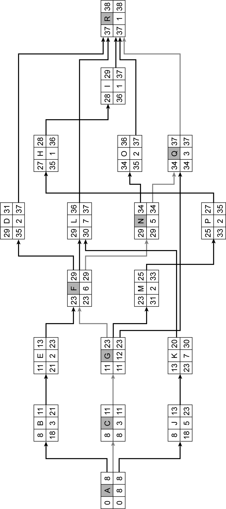
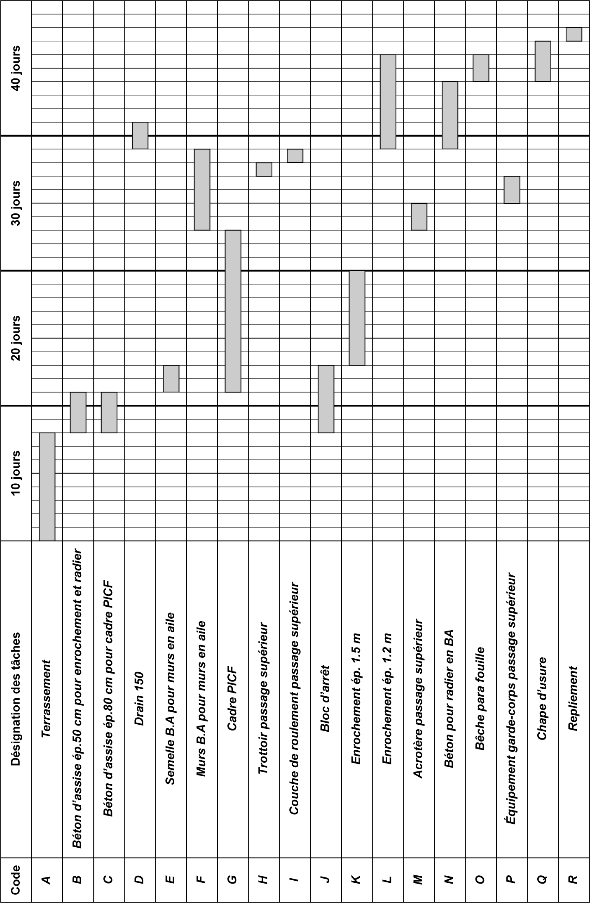
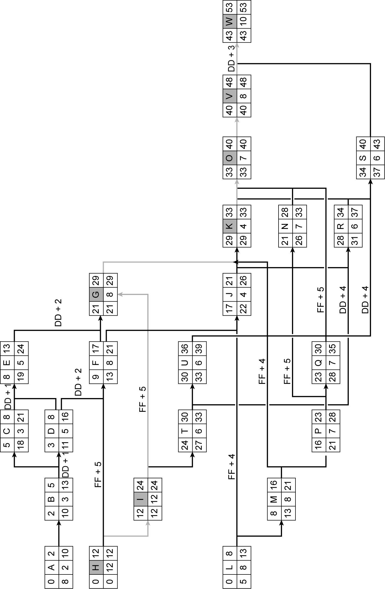

## 4.8 Application 4-5

_**Figure 4.49 Diagramme GANTT de l’application 4-4**_

La construction de deux bâtiments industriels nécessite la préfabrication et la pose de nombreux éléments. Les informations sur les différentes tâches constitutives du projet sont présentées dans le **tableau 4.19** . 

**On demande de :** 

**1. Déterminer le rang de chaque tâche.** 

2. Tracer le réseau des antécédents et déterminer la date de commencement au plus tôt, au plus tard et les marges de chaque tâche et en déduire le chemin critique. 

3. Construire le planning GANTT en faisant apparaître le chemin critique. 

_**Tableau 4.19 Données des tâches de l’application 4-5**_ 

|**N°**|**Désignation des** **tâches**|**Durée**|**Tâche antérieure**|
|---|---|---|---|
|**_A_**|_Implantation générale_|_2_|_/_|
|**_B_**|_Terrassement bât A_|_3_|_A_|
|**_C_**|_Terrassement bât B_|_3_|_B_|
|**_D_**|_Fondation bât A_|_5_|_B(DD + 1)_|
|**_E_**|_Fondation bât B_|_5_|_D, C(DD + 1)_|
|**_F_**|_Pose poteaux_ _préfabriqués bât A_|_8_|_D(DD + 2), H (FF_ _+ 5)_|
|**_G_**|_Pose poteaux_ _préfabriqués bât B_|_8_|_E (DD + 2), I(FF_ _+ 5), F_|
|**_H_**|_Préfabrication des_ _poteaux bât A_|_12_|_/_|
|**_I_**|_Préfabrication des_ _poteaux bât B_|_12_|_H_|
|**_J_**|_Pose des poutres_ _préfabriquées bât A_|_4_|_F, L(FF + 4)_|
|**_K_**|_Pose des poutres_ _préfabriquées bât B_|_4_|_G, M(FF + 4), J_|
|**_L_**|_Préfabrication des_ _poutres bât A_|_8_|_/_|
|**_M_**|_Préfabrication des_ _poutres bât B_|_8_|_L_|

|**_N_**|_Pose des pannes_ _préfabriquées du bât A_|_7_|_J, P(FF + 5)_|
|---|---|---|---|
|**_O_**||_7_|_K, Q(FF + 5), N_|
||_Pose des pannes_ _préfabriquées du bât B_|||
|**_P_**|_Préfabrication des_ _pannes bât A_|_7_|_M_|
|**_Q_**|_Préfabrication des_ _pannes bât B_|_7_|_P_|
|**_R_**|_Pose des lisses_ _préfabriqués bâts A_|_6_|_J, T(DD + 4)_|
|**_S_**|_Pose des lisses_ _préfabriqués bât B_|_6_|_K, U(DD + 4), R_|
|**_T_**|_Préfabrication des lisses_ _bâts A_|_6_|_I_|
|**_U_**|_Préfabrication des lisses_ _bâts B_|_6_|_T_|
|**_V_**|_Mise en place bacs des_ _aciers pour les_ _bâtiments A et B_|_8_|_O_|
|**_W_**|_Mise en place des_ _bardages pour les_ _bâtiments A et B_|_10_|_V(DD + 3), S_|

**Corrigé de l’application 4-5** 

1. On présente dans le **tableau 4.20** les rangs des tâches. Au total, il y a 9 rangs. 

2. La **fgure 4.50** présente le réseau des antécédents dans lequel sont présentées les dates de début et de fin au plus tôt et au plus tard. La durée de projet obtenue est de 53 jours, les marges totales et libres sont présentées dans le **tableau 4.21** . Le chemin critique est formé des tâches : H, I, G, K, O, V et W. 

3. Les **fgures 4.51** et **4.52** présentent le diagramme de GANTT et le diagramme de GANTT élaboré par MS Project. 

_**Tableau 4.20 Tableau des rangs de l’application 4-5**_ 

|**Rang 1**|**Rang 2**|**Rang 3**|**Rang 4**|**Rang 5**|**Rang 6**|**Rang 7**|**Rang 8**|**Rang 9**|
|---|---|---|---|---|---|---|---|---|
|_A_ _H_ _L_|**_B_** **_I_** **_M_**|_C_ _D_ _T_ _P_|_E_ _F_ _U_ _Q_|_G_ _J_|_K_ _N_ _R_|_O_ _S_|_V_|_W_|

|**N°**|**Désignation des** **tâches**|**Durée (jours)**|**Marge totale** **(jours)**|**Marge libre** **(jours)**|
|---|---|---|---|---|
|**_A_**|_Implantation_ _générale_|_2_|_8_|_0_|
|**_B_**|_Terrassement bât_ _A_|_3_|_8_|_0_|
|**_C_**|_Terrassement bât_ _B_|_3_|_13_|_2_|
|**_D_**|_Fondation bât A_|_5_|_8_|_0_|
|**_E_**|_Fondation bât B_|_5_|_11_|_11_|
|**_F_**|_Pose poteaux_ _préfabriqués bât A_|_8_|_4_|_0_|
|**_G_**|_Pose poteaux_ _préfabriqués bât B_|_8_|_0_|_0_|
|**_H_**|_Préfabrication des_ _poteaux bât A_|_12_|_0_|_0_|
|**_I_**|_Préfabrication des_ _poteaux bât B_|_12_|_0_|_0_|
|**_J_**|_Pose des poutres_ _préfabriquées bât_ _A_|_4_|_5_|_0_|
|**_K_**|_Pose des poutres_ _préfabriquées bât_ _B_|_4_|_0_|_0_|
|**_L_**|_Préfabrication des_ _poutres bât A_|_8_|_5_|_0_|
|**_M_**|_Préfabrication des_ _poutres bât B_|_8_|_5_|_0_|
|**_N_**|_Pose des pannes_ _préfabriquées du_ _bât A_|_7_|_5_|_5_|
|**_O_**|_Pose des pannes_ _préfabriquées du_ _bât B_|_7_|_0_|_0_|
|**_P_**|_Préfabrication des_ _pannes bât A_|_7_|_5_|_0_|
|**_Q_**|_Préfabrication des_ _pannes bât B_|_7_|_5_|_5_|
|**_R_**|_Pose des lisses_ _préfabriqués bâts_ _A_|_6_|_3_|_0_|
|**_S_**|_Pose des lisses_ _préfabriqués bât B_|_6_|_3_|_3_|
|**_T_**|_Préfabrication des_ _lisses bâts A_|_6_|_3_|_0_|

|**_U_**|_Préfabrication des_ _lisses bâts B_|_6_|_3_|_0_|
|---|---|---|---|---|
|**_V_**||_8_|_0_|_0_|
||_Mise en place bacs_ _des aciers pour les_ _bâtiments A et B_||||
|**_W_**|_Mise en place des_ _bardages pour les_ _bâtiments A et B_|_10_|_0_|_0_|

_**Figure 4.50 Réseau des antécédents de l’application 4-5**_

