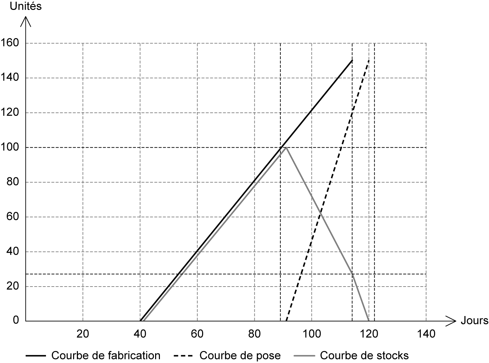
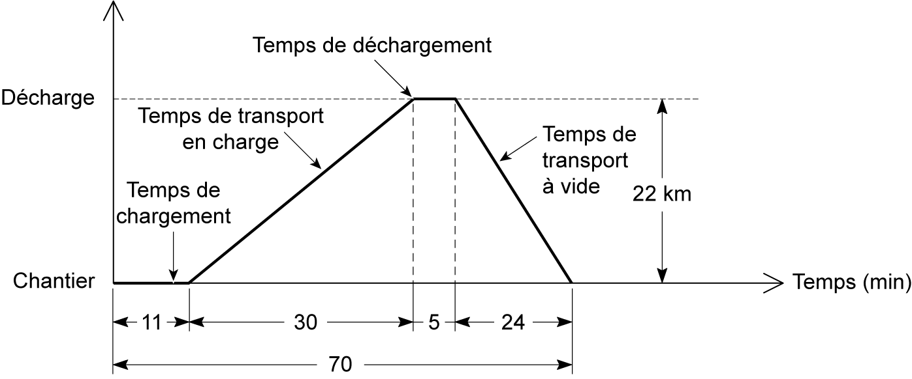
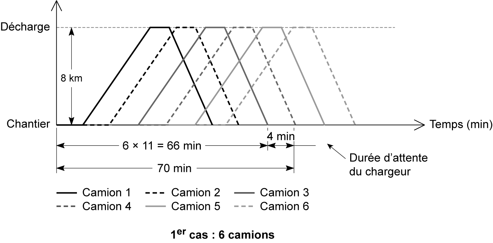

## 4.11 Application 4-7 

**Énoncé de l’application 4-7** 

Une entreprise veut étudier la rotation de camions de terrassement d’un chantier avec un volume de déblais en place de 4 000 m[3] . Les conditions des travaux et les caractéristiques de matériel sont les suivantes : 

Les terres sont excavées par un chargeur ayant un rendement de 60 m[3] /h de terre foisonnée et l’efficience est de 82 %. Les matériaux seront évacués dans une décharge publique se trouvant à 22 km du chantier. 

Les camions de chargement ont une capacité de 9 m[3 ] chacun. Le temps de déchargement d’un camion est de 5 minutes et les vitesses en charge et à vide sont respectivement 45 km/h et 55 km/h. 

Le temps de travail journalier est de 7 heures. 

On demande de : 

1. Calculer la durée d’un cycle. 

2. Déterminer le nombre de camions nécessaires et tracer le planning de rotation des camions retenus. 

3. Calculer la durée du chantier sachant qu’on veut travailler les camions à 100 % et que le coefficient de foisonnement des terres est de 1,2. 

**Corrigé de l’application 4-7** 

**1. Détermination du cycle de travail des camions de terrassement** 

- Temps de chargement « Tch » : 

rendement théorique du chargeur « Rth » : 60 m[3] /h efficience « K » : 82 % 

facteur de remplissage : 100 %

capacité de chaque camion : 9 m[3] de terre foisonnée 

Tch=Capacité du camionRth×K×FR=960×0,82×1=0,183 h Tch=11 min ↠ 

- Temps de transport Distance à parcourir : la décharge se situe à 22 km du chantier. Les vitesses en charge et à vide sont respectivement 45 et 55 km/h. → Temps de transport à vide : 22×6055=24 min → Temps de transport en charge : 22×6045=30 min

- Temps de déchargement d’un camion 

Les vitesses en charge et à vide sont respectivement 45 et 55 km/h. 

- Ce temps est égal à 5 min. 

- Durée de cycle de camion 

Elle est égale à la somme des temps de chargement, de transport en charge et à vide et de déchargement. Dans notre cas, le temps d’un cycle est égal à 70 min (voir **tab. 4.25** ). 

Le schéma d’un cycle de camion est présenté dans la **fgure 4.63** . 

_**Tableau 4.25 Durée d’un cycle de camion de l’application 4-7**_ 

|**Composante du cycle**|**Temps (min)**|
|---|---|
|_Chargement_ _Transport en charge_ _Déchargement_ _Transport à vide_|_11_ _30_ _5_ _24_|
|_Total_|_70 min_|

_**Figure 4.63 Schéma de la détermination d’un cycle de camion de l’application 4-7**_ 

**2. Détermination du nombre nécessaire de camions** 

Le nombre optimal de camion pour un chantier de terrassement avec une durée de cycle de 70 minutes et une durée de chargement de 11 minutes est : 

- 1[er] cas : cas de 6 camions 

- On prend l’entier immédiatement inférieur à la valeur trouvée : 6 camions (voir **fg. 4.64** ). On choisit dans ce cas de faire travailler les camions à 100 %, et le chargeur va attendre un temps de : 70 – 6 × 11 = 4 min.[e] cas : cas de 7 camions 

On prend l’entier immédiatement supérieur à la valeur trouvée : 7 camions (voir **fg. 4.65** ). Dans ce cas, on choisit de faire travailler le chargeur à 100 %, ce sont donc les camions

_**Figure 4.64 Schéma du planning chemin de fer des travaux de terrassement de l’application 4-7 (1[er] cas)**_

_**Figure 4.65 Schéma du planning chemin de fer des travaux de terrassement de l’application 4-7 (2[e] cas)**_ 

**3. Détermination de la durée du chantier,** 

Sachant que l’on souhaite travailler les camions à 100 % et que le coefficient de foisonnement des terres est de 1,2 : Volume des déblais en place : 4 000 m[3] Volume des déblais à transporter (terre foisonnée) : 4  000×1,2=4800 m3 Nombre de camions : 6 camions Capacité : 9 m[3] de terre foisonnée Temps de rotation du camion : temps d’un cycle complet : 70 min Capacité des convois : 6 camions×9 m3=54 m3

Nombre de rotations des camions « Nr » : 

Détermination de la durée de chantier : la durée de chantier de terrassement est le produit de la valeur de l’entier supérieur le plus proche de Nr et du temps de rotation des camions. 

Durée=Nr×Temps de rotation du camion 

Durée=90×70=6  300 min=105 h Le temps de travail journalier et de 7 heures → Durée=1057=15 jours
