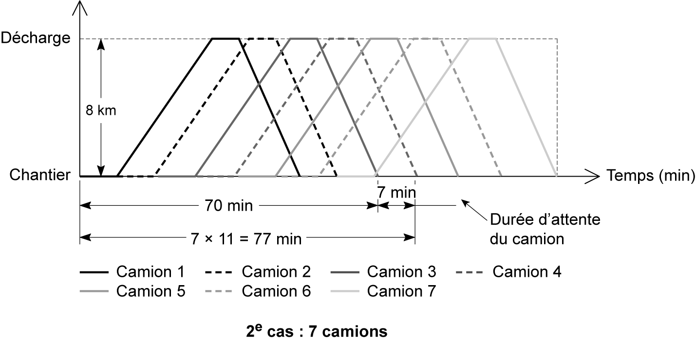

## 5.1 Planification de main-d’œuvre

La main-d’œuvre productive désigne le personnel du chantier directement affecté à la réalisation des ouvrages. La détermination des besoins totaux en main-d’œuvre nécessite de calculer des quantités d’ouvrage, et de déterminer le crédit d’heure, la durée d’exécution des tâches et l’effectif nécessaire pour effectuer ce travail. 

**Quantité d’ouvrage à réaliser** 

Pour estimer la quantité d’ouvrage à réaliser, on calcule l’avantmétré de chaque ouvrage élémentaire à partir des plans d’exécution et des détails, puis on établit le devis quantitatif de l’ouvrage à réaliser. 

**Crédit d’heures « CH » ou budget d’heures** 

Pour chaque tâche élémentaire, on détermine le budget d’heures par le produit de la quantité à réaliser et le temps unitaire d’exécution : Crédits d’heures=Quantité×TU 

**Durée d’exécution des tâches** 

La durée de réalisation des différents éléments d’ouvrage est estimée à partir du planning général fourni par le maître d’œuvre. 

**Effectif nécessaire** 

L’effectif représente le nombre d’ouvriers nécessaire à l’exécution d’une tâche. Il est calculé à partir du crédit d’heures, de l’horaire journalier et de la durée d’exécution : 

Effectif=Crédits d’heures Horaire journalier×Durée d’éxecution 

**Composition de chaque équipe** 

La composition d’une équipe est déterminée en fonction du nombre et de la qualification de la main-d’œuvre nécessaire pour réaliser la

**quantité d’ouvrage élémentaire.** 

Les calculs des durées et des temps unitaires ont été présentés dans le chapitre 2. 

**Courbes d’effectif-temps** 

Une fois que l’on connaît l’effectif général attribué à chaque tâche, on peut tracer la courbe d’effectif-temps en s’appuyant sur le diagramme GANTT. On reporte, pour chaque jour du planning GANTT réalisé, le nombre d’ouvriers nécessaire à la réalisation de chaque tâche. On cumule par la suite les effectifs de toutes les tâches en cours à une date donnée, sous la forme d’un histogramme. 

La courbe d’effectif-temps permet de connaître l’effectif global présent sur le chantier suivant l’avancement des travaux, ainsi que l’effectif de pointe pour dimensionner les cantonnements nécessaires dans l’étude du plan d’installation de chantier. 

Pour expliquer le traçage de cette courbe, on reprend l’exemple n° 1 du chapitre 3, dans lequel on ajoute l’effectif nécessaire pour la réalisation de chaque tâche (voir **tab. 5.1** ). En suivant le diagramme GANTT de la **fgure 4.42** , on trace l’histogramme de main-d’œuvre en cumulant jour par jour la main-d’œuvre nécessaire. 

Cet histogramme est présenté dans la **fgure 5.1** . On en déduit que l’effectif de pointe est de 12 ouvriers et se trouve du 9[e] au 23[e] jour. 

_**Tableau 5.1 Données d’effectif de l’exemple N° 1**_ 

|**Activité**|**Prédécesseur**|**Rang**|**Durée (j)**|**Efectifs**|
|---|---|---|---|---|
|_A_ _B_ _C_ _D_ _E_ _F_ _G_ _H_ _I_|_Néant_ _A_ _B_ _C ; F_ _A_ _E_ _E_ _G_ _D ; H_|_1_ _2_ _3_ _4_ _2_ _3_ _3_ _4_ _5_|_5_ _3_ _15_ _6_ _4_ _18_ _14_ _14_ _5_|_4_ _6_ _3_ _8_ _5_ _4_ _5_ _2_ _7_|

_**Figure 5.1 Histogramme d’utilisation de la main-d’œuvre**_
