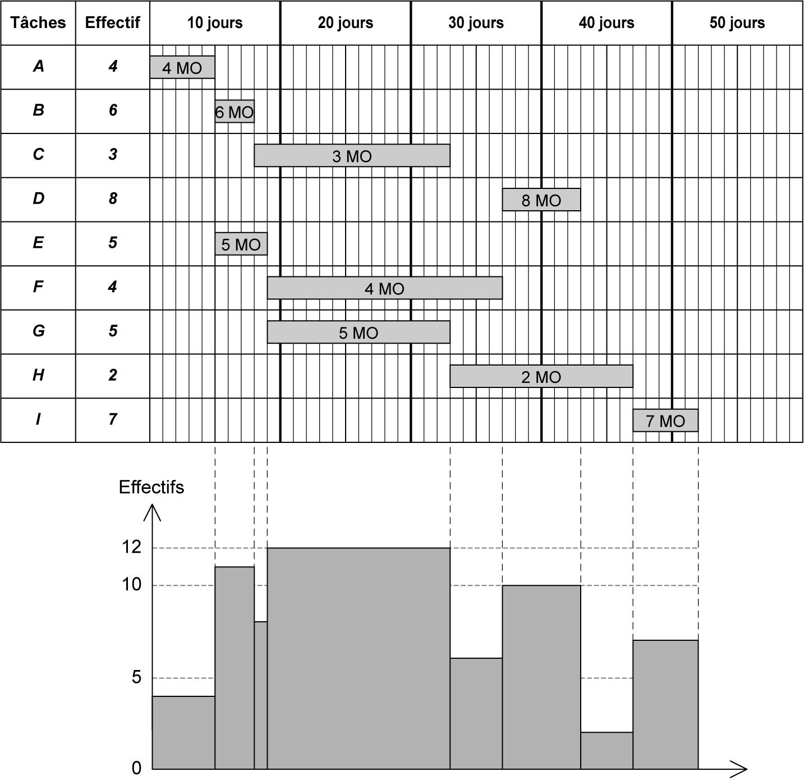

## 5.3 Planification d’utilisation du matériel et des engins 

**Détermination des besoins en matériels** 

Les besoins en matériels sont déterminés en fonction du mode de construction retenu pour réaliser les éléments d’ouvrage, des quantités à réaliser selon l’avant-métré et du temps d’utilisation du matériel qui dépend de ses caractéristiques. 

Les étapes à suivre dans la détermination des besoins en matériels sont les suivantes :

Déterminer la quantité de travail à réaliser à partir des résultats de l’avant-métré. 

Déterminer les caractéristiques des matériels nécessaires et leurs durées d’utilisation en fonction de la durée d’exécution et des quantités à réaliser. 

Analyser la disponibilité ou non des matériels dans le parc de l’entreprise et définir les caractéristiques du matériel à louer (type, rendement, nombre). Réserver le matériel prévu et le planifier en fonction de l’avancement des travaux. Déterminer les besoins en matières consommables nécessaires pour le fonctionnement du matériel. Évaluer les coûts d’utilisation des matériels et des matières consommables. 

**Planning d’utilisation du matériel** 

Le planning d’utilisation de matériel doit suivre le planning d’exécution des différentes tâches élémentaires. Il définit le matériel, en type et en nombre, nécessaire à l’exécution de chaque tâche d’un ouvrage. Ce planning permet de : Vérifier la disponibilité du matériel et des engins dans le parc de l’entreprise ou la possibilité de location. Comparer les dépenses réelles d’amortissement ou de location avec le crédit accordé pour le chantier. 

On présente dans la **fgure 5.2** un exemple de planning d’utilisation de matériel. En ligne, on indique les matériels ou les engins ; en colonne, les dates. À l’intérieur des cases relatives à des tâches, on indique le nombre de matériel à utiliser dans son exécution.

_**Figure 5.2 Exemple de planning d’utilisation de matériel**_
