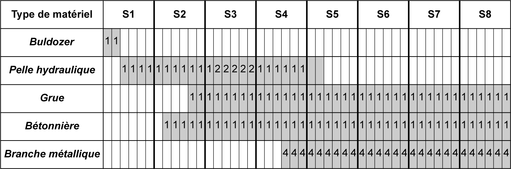
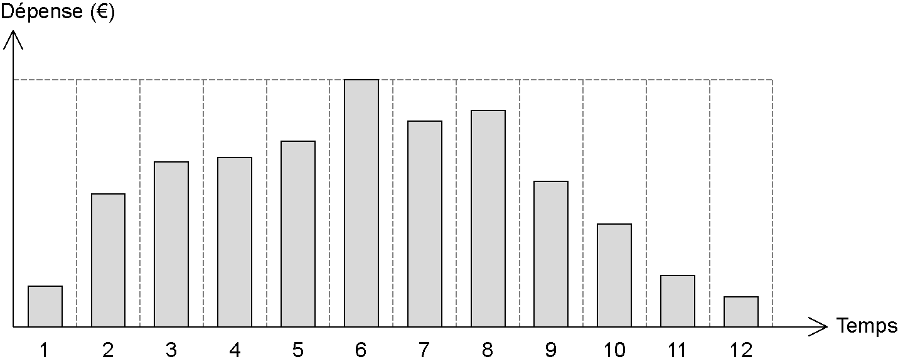
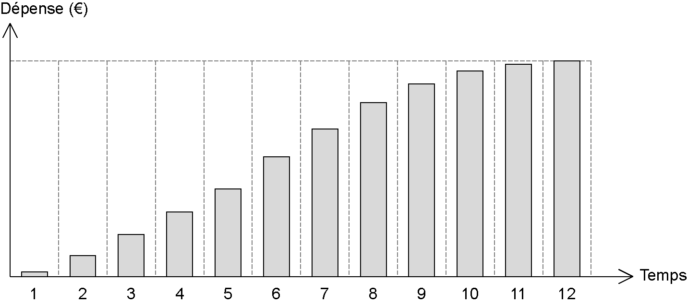
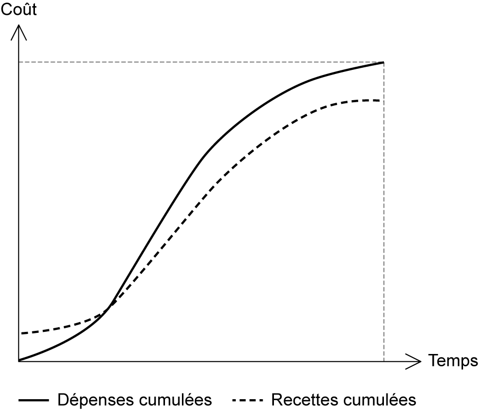

## 5.4 Planification financière 

Pendant la phase de préparation de l’offre de prix, l’entreprise a déterminé le prix sec formé des dépenses de matériaux, matériels et main-d’œuvre. Puis elle a établi le prix de l’offre formé du prix sec, de l’ensemble des frais, des bénéfices et aléas et de la taxe à la valeur ajoutée (TVA). Pour gérer le budget, l’entreprise est tenue de prévoir et planifier ses dépenses et ses recettes avant l’exécution des travaux, pour établir le diagramme financier. 

La planification financière a pour but de gérer les besoins de la trésorerie afin de régler la main-d’œuvre, les fournisseurs et toutes autres dépenses prévues dans l’exécution des travaux. Le planning financier permet au maître d’ouvrage de suivre les dépenses sur une base mensuelle. La **fgure [5.3](40_5.3_planification_dutilisation_du_matériel_et_des_engins.md)** présente un exemple de courbe prévisionnelle des dépenses mensuelles et la **fgure 5.4** montre un exemple de courbe de dépenses cumulées.

_**Figure [5.3](40_5.3_planification_dutilisation_du_matériel_et_des_engins.md) Courbe prévisionnelle de dépenses mensuelles**_

_**Figure 5.4 Courbe de dépenses cumulées**_ 

**Prévision mensuelle des dépenses** 

Sur la base des quantités des ouvrages élémentaires déterminées dans l’avant-métré et les prix unitaires déterminés dans le sous détail de prix, on détermine les dépenses allouées au projet. Avec le planning d’exécution et les plannings particuliers, on détermine les prévisions mensuelles par catégorie : dépenses relatives à la main-d’œuvre, aux matériaux de construction et à la location ou l’amortissement de matériels. Les frais de chantier et les frais généraux et spéciaux déterminés en phase d’étude de prix seront divisés sur le nombre de mois pour les répartir sur la totalité de la durée du projet.

Les recettes de l’entreprise et les modalités de paiement sont fixées dans le contrat. Le plus souvent, le paiement se fait après évaluation des situations mensuelles d’avancement des travaux qui seront présentées au maître d’œuvre. 

**Diagramme financier** 

À partir des prévisions des dépenses et des recettes mentionnées dans le contrat, on peut tracer le diagramme financier. On établit d’abord l’histogramme des dépenses et des recettes prévisionnelles mensuelles, puis on évalue les dépenses et recettes cumulées. On effectue alors le diagramme financier formé des courbes des dépenses et des recettes cumulées dans le même système d’axe, formé en abscisses des mois et en ordonnées des coûts (voir **fg. [5.5](42_5.5_application_5-1.md)** ).

_**Figure [5.5](42_5.5_application_5-1.md) Exemple de diagramme financier (recettes-dépenses)**_ 

La gestion budgétaire se fait par catégorie de dépenses. Ainsi, l’entreprise évalue dès le début les dépenses prévisionnelles séparées. On construit parallèlement un planning des acomptes mois par mois, pour voir les charges mensuelles et prévoir les besoins de la trésorerie. 

Le diagramme financier permet de gérer et de contrôler le budget, en comparant le prévisionnel et le réel. Pour ce faire, on trace une courbe en forme de « S », qui représente graphiquement l’état d’avancement du projet afin d’informer sur sa situation économique en fonction du temps. Cette courbe permet de suivre l’avancement

des coûts et des délais. Sur un système d’axe formé en abscisses du temps et en ordonnées du pourcentage des dépenses par rapport au montant du marché (le pourcentage d’évolution du projet), on trace : la courbe prévisionnelle des dépenses cumulées. Cette estimation du budget global du projet a été déterminée en phase d’étude de prix ; la courbe des dépenses réelle au long de la duée d’exécution du projet. Cette courbe se trace au fur et à mesure de l’avancement des travaux. 

L’analyse de ces courbes, présentées dans la **fgure 5.6** , permet de faire des corrections en cas de décalage entre les deux courbes. 

