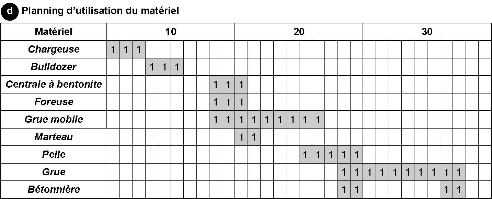

# Chapitre 6 - Planification d’un chantier en Lean Construction

Le Lean Construction tire son nom et ses principes de la méthodologie du Lean Management (inspirée du système de production de Toyota – TPS). Ce système d’organisation et de gestion de projet a initialement été créé pour l’industrie. Il permet de lisser la production et de travailler en flux continu et en juste-à-temps (on ne produit que ce qui est commandé). Adapté au monde de la construction, ce système repose sur les thèmes suivants : 

la réduction des gaspillages (attentes, déplacement, stockage, etc.) ; la planification et l’anticipation systématique ; 

la collaboration entre tous les acteurs ; l’amélioration continue. 

Le Lean Construction peut se résumer à une gestion pragmatique et rigoureuse des projets de construction. La satisfaction du client est au centre des préoccupations afin de garantir le triptyque qualité, coût, délai. 

Cette méthodologie innovante n’est pas basée sur une pléthore d’outils mais se concentre sur l’atteinte des objectifs communs. 

De plus en plus de maîtrises d’ouvrage, de promoteurs et de

constructeurs utilisent la méthode Lean Construction, séduits par la démarche d’amélioration continue. L’objectif est de ne plus commettre les mêmes erreurs d’un chantier à l’autre. Il est impensable aujourd’hui de livrer des projets de construction en retard ou avec une qualité médiocre à cause de l’impréparation de l’ensemble de la chaîne de valeur. 

La préparation et l’anticipation sont au cœur de la philosophie de l’excellence opérationnelle prônée par la démarche Lean Construction. Un projet de construction performant est un projet qui apprend vite. Ce n’est pas lors du coup de feu de départ qu’il faut se demander si les ouvriers possèdent les bons plans ou si la livraison est bien arrivée. Se tenir prêt revient à chercher en amont tous les points de blocage qui pourraient remettre en cause le respect des objectifs fixés (qualité, coût, délai).

_**Figure [6.1](44_6.1_la_planification_globale_en_chemin_de_fer.md) Cible de l’attention dans une planification en Lean Construction**_
