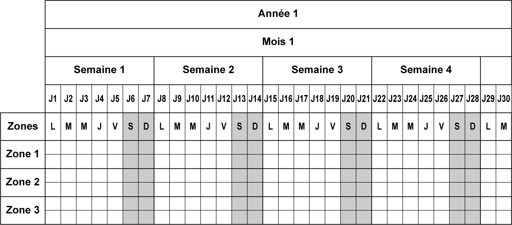
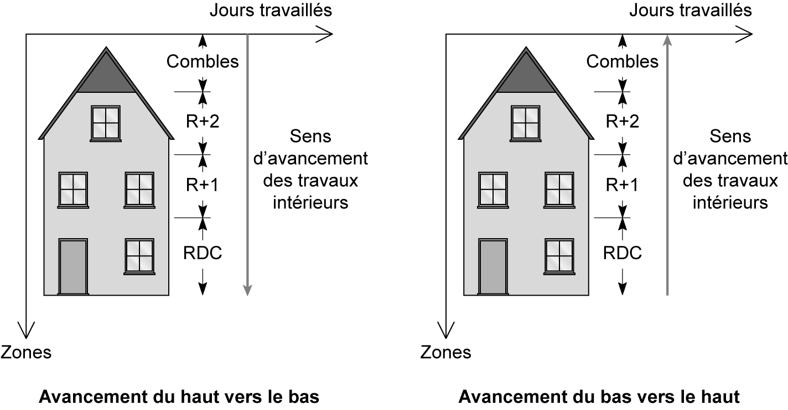
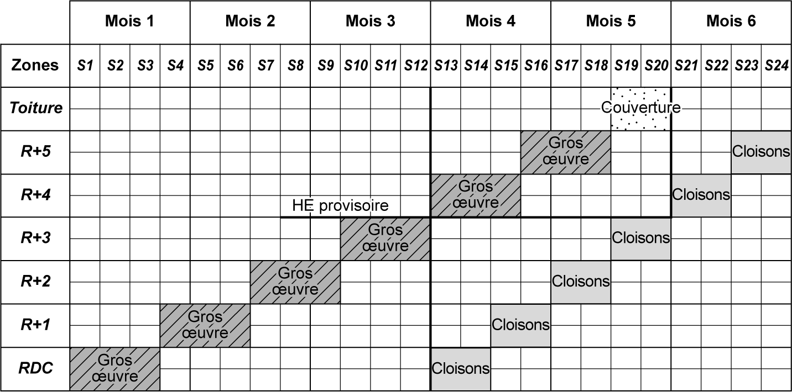
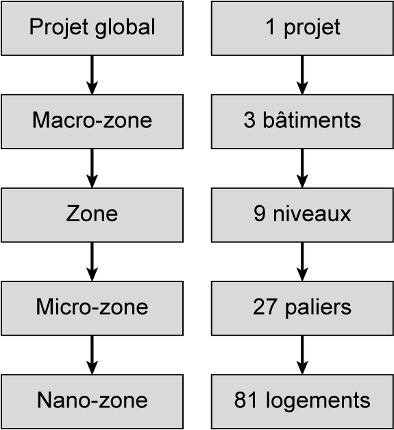

## 6.3 Le micro-zoning du projet 

La création d’un zoning cohérent est l’une des premières étapes essentielles à la planification d’un projet en Lean Construction. Elle est décisive dans la construction du planning chemin de fer, car elle est la donnée indiquée en ordonnées sur le planning. Elle structure l’ensemble des tâches qui seront visualisées par les lecteurs du document. L’information doit être simple, optimisée et facilement pilotable par l’encadrement du chantier. 

La convention veut que la représentation des zones sur le planning (donnée indiquée en ordonnées) respecte la physique des bâtiments (les étages les plus élevés se trouvent en haut du planning). Et ceci qu’importe si l’avancement des travaux se déroule du haut vers le bas ou du bas vers le haut (voir **fg. [6.8](51_6.8_application_6-3.md)** ). 

Cette visualisation « logique » permet d’anticiper et d’optimiser le planning et ses contraintes. En effet, avec une visualisation respectant la physique du bâtiment, les besoins en hors d’eau provisoire sautent aux yeux. Avec une planification GANTT, il est difficile de trouver des optimisations avec une lecture par tâche et non par zone. La **fgure [6.9](52_6.9_le_calcul_des_effectifs_etp.md)** présente un planning chemin de fer avec l’indication (trait gras) du hors d’eau (HE) provisoire qui permet de débuter les travaux de cloisons au RdC. 

Un projet dans le bâtiment correspond à une multitude de zones assemblées entre elles (un bureau, un bloc sanitaire, un hall, une cage d’escalier, un logement, etc.). À partir de ce constat, il est possible de regrouper ces zones par typologie pour ensuite trouver un dénominateur commun pour chaque séquence de travaux. 

Voici une liste non exhaustive des typologies courantes qu’on retrouve dans le bâtiment : logement/appartement/chambre (étudiante/d’hôpital/ d’EHPAD) ; bureau ; restaurant ; cuisine ; hall/accueil/réception ; commerce ; bloc sanitaire/vestiaire ; circulation/coursive ; garage/parking/sous-sol ; local technique/sous station. 

Ces typologies permettent de comprendre les différentes strates spatiales du projet, en passant du macro au micro et au nano (voir **fg. [6.10](53_6.10_application_6-4.md)** ). 

Cela permet d’anticiper et d’orienter le pilotage futur du projet.

_**Figure [6.10](53_6.10_application_6-4.md) Différentes strates temporelles dans le zoning d’un projet de bâtiment**_ 

**Du macro-zoning au micro-zoning** 

Le plus souvent, le pilotage s’effectue au niveau des micro-zones (ensemble de nano-zones) comme un ensemble de logements (de deux à cinq suivant les surfaces) pour un projet d’habitat résidentiel. 

La taille des zones devient un enjeu pour rythmer correctement le planning et faciliter le pilotage. Un zoning facile et cohérent (respectant notamment la géométrie de l’ouvrage) sera plus facilement assimilable pour l’ensemble des acteurs (voir **fg. [6.11](54_6.11_la_gestion_de_laléas.md)** ).

Par convention, la surface d’une micro-zone est comprise entre 150 et 250 m[2] . Ceci permet de fournir des zones de travail aux différentes entreprises avec un temps de travail supérieur à la journée et en général inférieur à la semaine.
