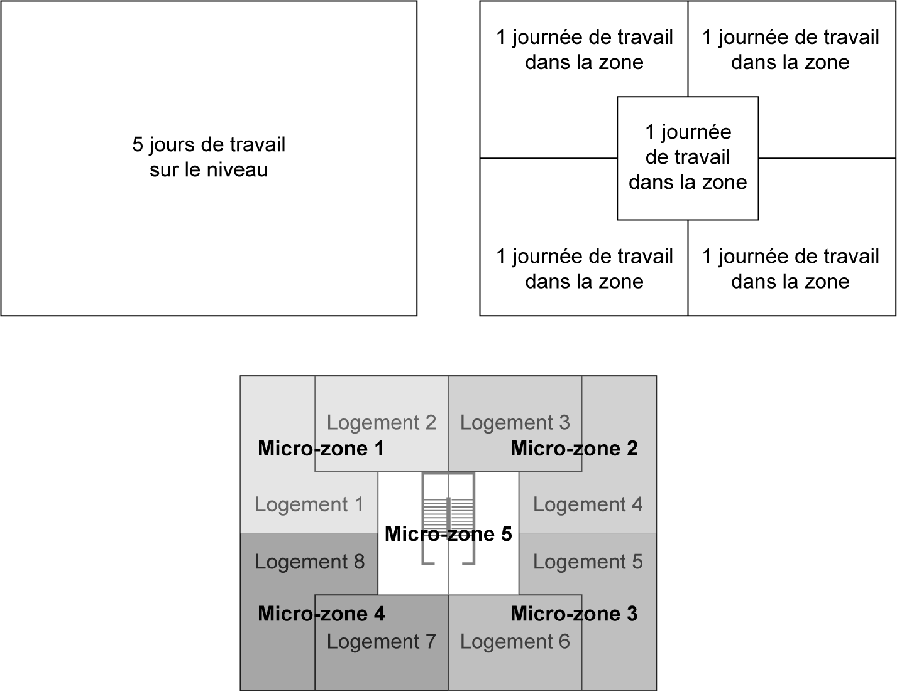
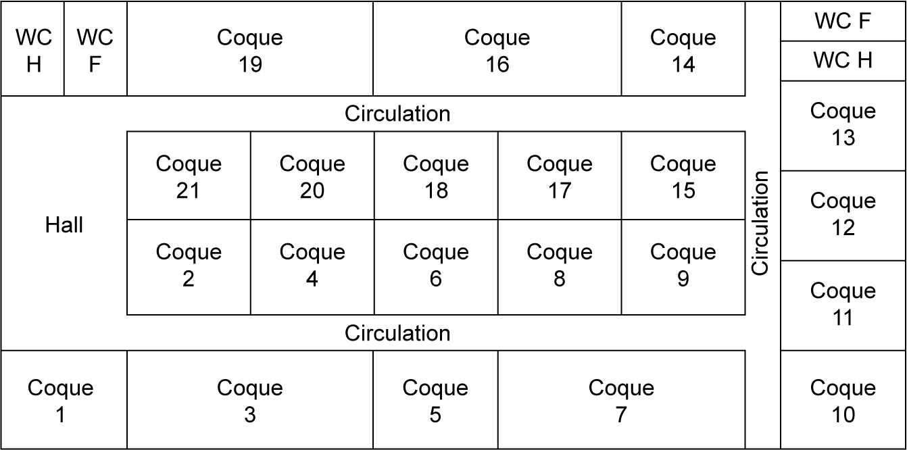
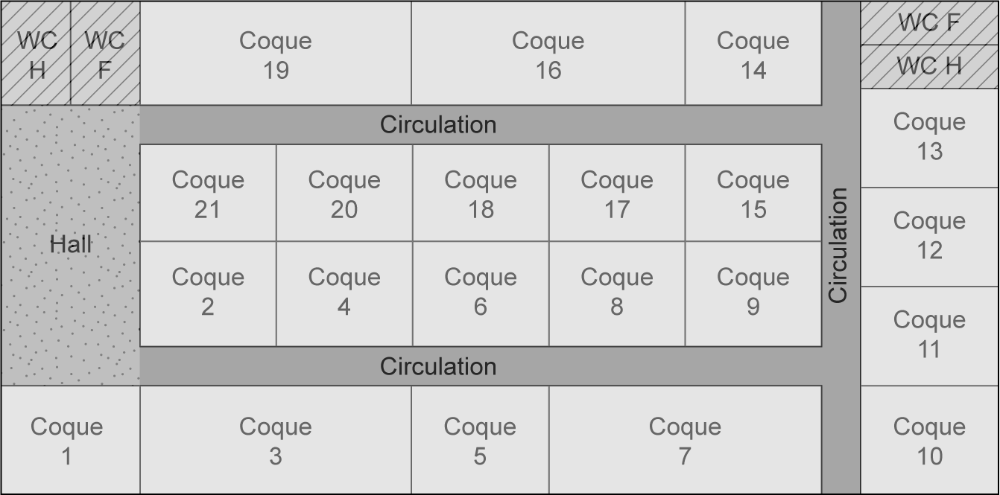

## 6.4 Application 6-1 

**Énoncé de l’application 6-1** 

Le promoteur d’un futur centre commercial vous fournit les plans de son projet afin que vous puissiez réfléchir à un zoning cohérent pour rythmer correctement les travaux. 

On demande de : 

1. Lister les différentes typologies de zone du projet. 

2. Définir le micro-zoning pour les zones concernant des locaux commerciaux (coques). Pour information, la coque 1 possède une surface d’environ 60 m[2] . La coque 3 fait le double de surface de la coque 1.

_**Figure 6.12 Plan du centre commercial à étudier**_ 

**Corrigé de l’application 6-1** 

1. Il y a quatre typologies différentes : local commercial (coque) ; bloc sanitaire ; circulation ; hall.

_**Figure 6.13 Plan du centre commercial avec les différentes typologies de zone**_ 

2. Deux solutions sont possibles. En s’appuyant sur la convention qui définit la surface d’une micro-zone entre 150 m[2] et 250 m[2] , on trouve 3 ou 4 équivalents petites coques (type coque 1). Pour information, il est fréquent que les dernières micro-zones soient plus grandes ou plus petites que les zones précédentes.

_**Figure 6.14 Plan du centre commercial avec les micro-zones des locaux commerciaux**_
