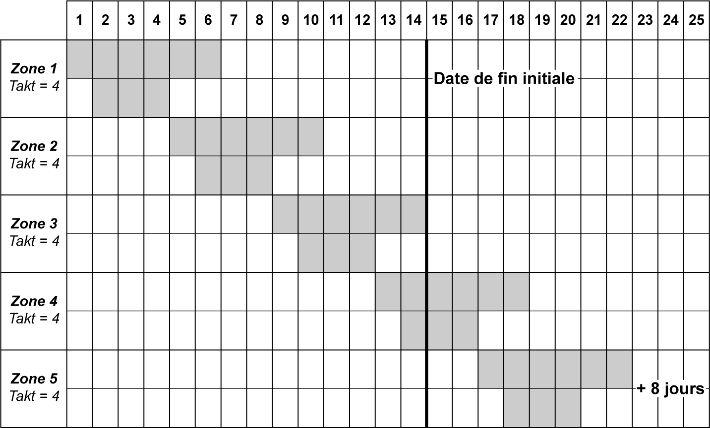
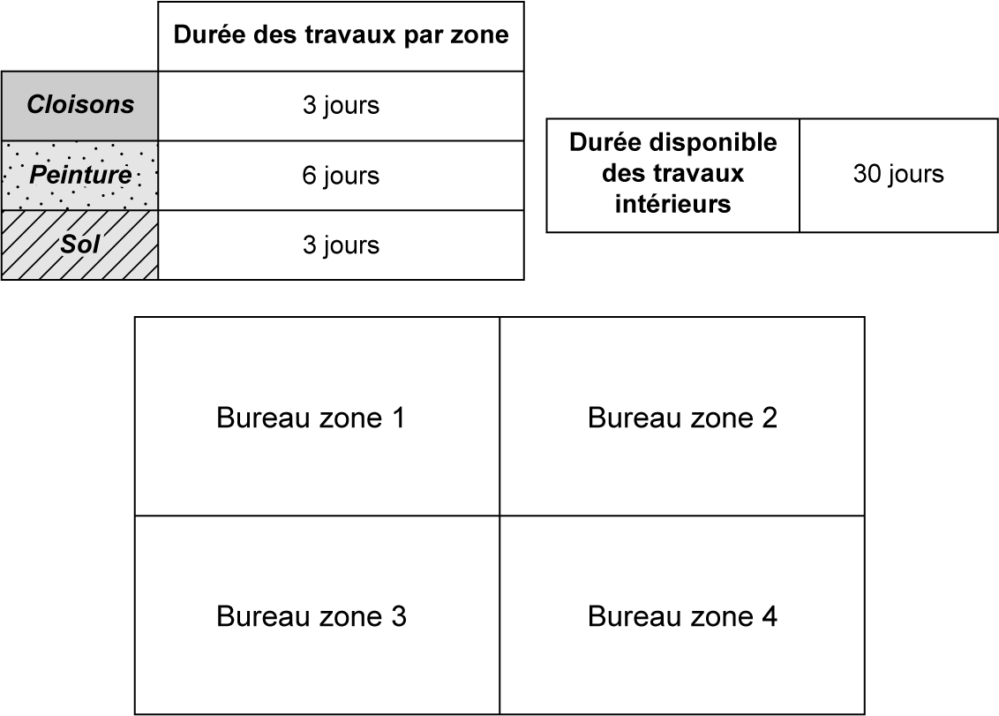
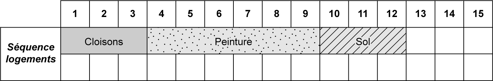
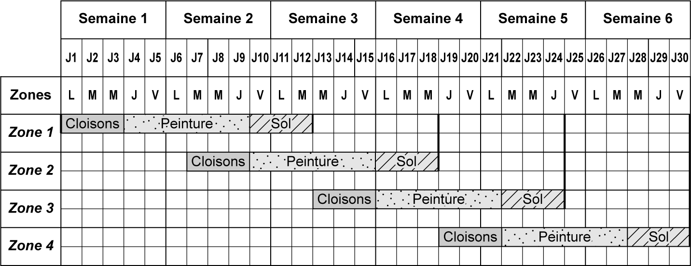
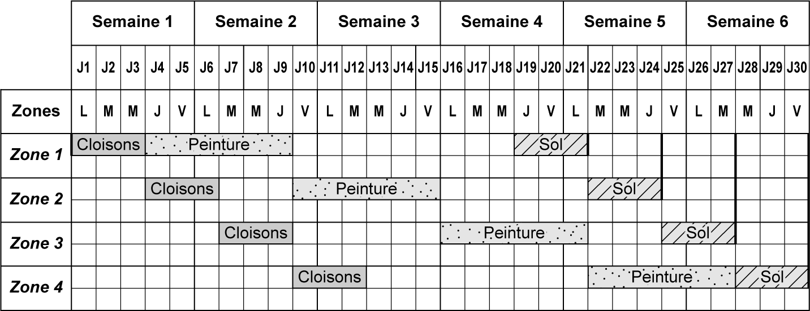

## 6.8 Application 6-3 

**Énoncé de l’application 6-3**

immeuble de bureau. Le directeur travaux vous confie comme mission de calculer le rythme des travaux actuels à partir des documents fournis. 

On demande de : 

1. Créer la séquence travaux à partir des informations données. 

2. Calculer le takt time disponible, une fois la durée de la séquence travaux déterminée. 

3. Insérer la séquence travaux créée dans une trame chemin de fer en respectant le takt time trouvé. 

4. Citer les lots qui n’ont pas de continuité dans l’exécution de leurs travaux d’une zone à l’autre. 

5. Modifier le chemin de fer en gardant la même séquence afin d’assurer une continuité de tâches pour l’ensemble des lots. 

6. En tant que planificateur Lean Construction, vous savez que les temps morts entre les interventions des entreprises sur une même zone sont un gaspillage. Afin de remédier à cela, trouvez quel lot est le maillon cadenceur du projet (durée différente des autres lots de la séquence). 

7. Afin d’optimiser le planning, vous contactez par téléphone le lot « maillon cadenceur » pour trouver des optimisations. Il vous indique qu’il peut mettre deux équipes en parallèle. À partir de cette nouvelle information, modifier le chemin de fer afin de mettre deux équipes tout en préservant la continuité des travaux pour les autres entreprises. 

8. Calculer le gain en jours entre la première version du planning chemin de fer et la version optimisée. Quel est le gain en % ?

_**Figure 6.26 Données d’entrée de l’application 6-3**_ 

**Corrigé de l’application 6-3**

_**Figure 6.27 Correction de la séquence travaux de l’application 6-3**_ 

2. 

3. 

_**Figure 6.28 Correction du planning chemin de fer 1 de l’application 6-3**_ 

4. Le lot « Cloisons » et le lot « Sol » n’ont pas de continuité de travaux dans les zones.

_**Figure 6.29 Correction du planning chemin de fer 2 de l’application 6-3**_ 

6. Le maillon cadenceur de la séquence est le lot « Peinture ». 

7.

_**Figure 6.30 Correction du planning chemin de fer 3 de l’application 6-3**_ 

8. Le gain est de 9 jours. Cela représente 30 % de gain sur le délai initial des travaux.
