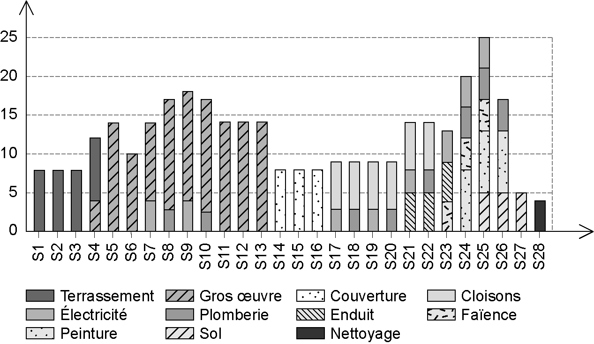
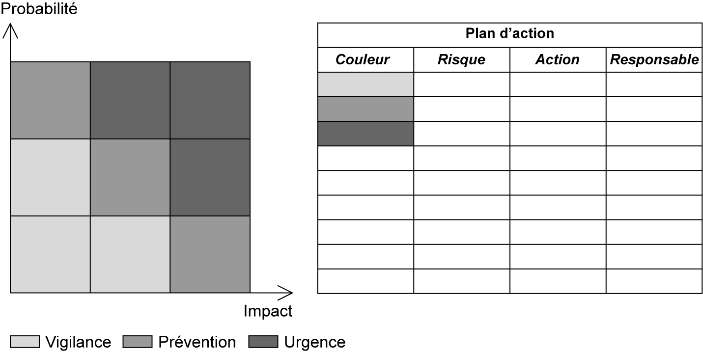

## 6.11 La gestion de l’aléas 

Un projet de construction, par sa nature et le nombre important d’interactions (internes et externes) peut se résumer à une succession d’aléas. La planification, bien qu’étant une étape initiale au projet, doit prendre en compte ces risques futurs. L’objectif reste pour le planificateur Lean d’assurer le triptyque qualité, coût, délai à son client. Pour cela, il doit être capable de se projeter dans le futur et de réfléchir à tous les événements qui pourraient apparaître. Ainsi, la gestion de l’aléa devient un pilier fondamental pour tout planificateur en Lean Construction. Réaliser le planning le plus abouti qu’il soit sans prendre en compte que de nombreux aléas vont

survenir est une erreur encore trop fréquente. C’est ainsi que nous voyons sur des chantiers de multiples versions du planning éditées chaque mois voire plusieurs fois par mois pour prendre en compte des changements qui aurait pu être anticipés. 

**La revue des risques** 

Un aléa, dans sa définition, est un événement imprévisible. Il peut surgir à n’importe quel moment et impacter durablement le projet si son traitement s’éternise. La revue des risques est une réunion collaborative en amont des études et de l’exécution avec l’équipe projet : maîtrise d’ouvrage, maîtrise d’œuvre, pilote du chantier (OPC), coordinateur sécurité (CSPS) et le représentant du bureau de contrôle. L’objectif de cette revue est de référencer les principaux risques du projet puis de répartir entre les acteurs les responsabilités des actions associées. Les participants écriront sur des Post-it[®] les risques associés au projet et ils viendront les coller sur une matrice dessinée sur un support mural. 

L’atelier se déroule ainsi : 

La première phase est d’écrire et coller un maximum de Postit[®] par les participants sans se préoccuper de la position des différents risques. 

La deuxième phase est une discussion ouverte avec tous les acteurs pour échanger sur chaque risque écrit et son placement sur la matrice. 

La troisième phase est la rédaction du plan d’actions associé aux risques avec la description de chaque action et le nom du responsable.

_**Figure 6.36 Matrice des risques et le plan d’action associé**_ 

**L’anticipation de l’exécution** 

Anticiper c’est adapter sa conduite dans le présent afin d’obtenir un résultat dans le futur. Cela revient à répertorier les problèmes, planifier les actions correctives et supposer les bénéfices futurs. La réalisation du planning permet de prévoir les travaux futurs mais il n’est pas assez utilisé pour guider dans le présent les actions à réaliser pour atteindre le résultat souhaité. 

Chaque « travaux » sur le chantier (et donc sur le planning) est associé à un matériau à utiliser pour réaliser l’ouvrage. On peut citer par exemple de l’enduit sur un mur ; la pose d’un rail pour le

montage d’une cloison ; un pot de peinture pour les revêtements muraux ; des tuiles pour la toiture ; une robinetterie de douche pour la salle de bain. 

Ainsi, en partant de la date de pose, nous pouvons monter un planning rétroactif des différentes actions à réaliser suivant les étapes nécessaires pour permettre cette pose. Des échéances au plus tard pourront être associées aux actions à réaliser en amont afin de permettre au pilote d’avoir la feuille de route de son chantier. 

_**Figure 6.37 Planning rétroactif depuis la pose pour chaque « travaux » à réaliser**_ 

**La marge pour aléas** 

Afin de garantir le respect de la date de livraison au client, il est nécessaire de prévoir une marge suffisante pour absorber les imprévus. En gestion de projet, prendre de la marge est usuel voire impératif. La construction n’échappe pas à ce besoin et on estime à 10 % du temps des travaux la marge à prévoir pour la gestion des aléas. Ce qui fait une demi-journée de marge par semaine de travaux

(en comptant 5 jours de travail par semaine). Des optimisations permettent de trouver des gains de temps et d’ainsi dégager une marge pour aléas suffisante pour le projet.
